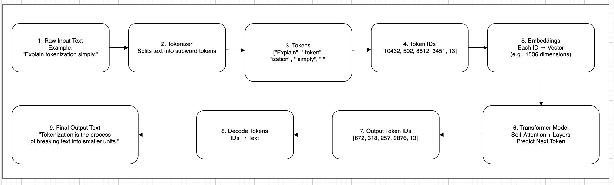

# Tokens & Tokenization

## About

Large Language Models (LLMs) do not read text the way humans do.

When we look at a sentence, we see words, meaning, grammar, and context.\
An LLM, however, sees **numbers**.

Before any model can understand or generate language, the text must be converted into a format the model can process mathematically. That format is built from **tokens**.

Tokens are the **fundamental unit of processing** in modern language models.

Every interaction with an LLM is measured in tokens:

* Your input is converted into tokens.
* The model processes tokens.
* The model generates output tokens.
* Pricing, limits, latency, and memory are all calculated in tokens.

If you are building production AI systems, understanding tokens is not optional. It directly affects:

* Context window limits
* API cost
* Latency
* Prompt quality
* Output stability
* System design decisions

Without understanding tokens, it is impossible to properly reason about:

* Why long prompts break
* Why some languages cost more
* Why code-heavy prompts are expensive
* Why context truncation happens
* Why some outputs behave unpredictably

In short:

> Tokens are the atomic building blocks of LLM communication.

## What is a Token?

A **token** is a chunk of text that a language model treats as a single unit during processing.

It is not exactly:

* A word
* A character
* A sentence

It is something in between.

Think of tokens as **model-readable fragments of text**.

#### Token vs Word vs Character

Let’s break this down clearly.

Example Sentence

```
ChatGPT is powerful.
```

Humans see:

* 3 words
* 22 characters (including spaces and punctuation)

A tokenizer might split it into something like:

```
["Chat", "GPT", " is", " powerful", "."]
```

Or even:

```
["Chat", "G", "PT", " is", " powerful", "."]
```

Depending on the model.

So:

* 3 words
* 22 characters
* 5–6 tokens (approximate)

Important:

> 1 word does NOT equal 1 token.

On average in English:

* 1 token ≈ 3–4 characters
* 1 token ≈ 0.75 words

But this varies by language and content type.

#### Why Models Don’t Use Words Directly ?

You might ask:

Why not just split by words?

Because language is too complex.

Consider:

* Uncommon words
* New slang
* Misspellings
* Compound words
* Emojis
* Code
* Multiple languages
* Scientific terms

If a model stored every possible word in its vocabulary, the vocabulary would become enormous and inefficient.

Instead, modern models use **subword tokenization**, which allows:

* Reusing common fragments
* Handling unseen words
* Supporting multiple languages
* Reducing vocabulary size
* Improving efficiency

For example:

```
unbelievable
```

Might be split as:

```
["un", "believ", "able"]
```

Even if “unbelievable” never appeared in training exactly that way, the model can still understand it using known subword pieces.

#### Tokens as Numbers

LLMs do not process text strings.

They process **token IDs**.

The pipeline looks like this:

```
Text → Tokenizer → Token IDs → Neural Network → Output Token IDs → Text
```

For example:

```
"Hello"
```

Might become:

```
[15496]
```

Internally, the model only sees:

```
15496
```

Not the word “Hello”.

Each token corresponds to:

* A unique integer ID
* A vector embedding representation
* A learned statistical meaning

This is how the model performs mathematical operations on language.

## Why Tokenization Exists ?

Tokenization is not just a preprocessing step.\
It is a fundamental design decision that makes modern language models possible.

To understand why tokenization exists, we need to understand the constraints of language modeling.

### The Core Problem: Computers Do Not Understand Text

Computers operate on numbers, not language.

Before any neural network can process text, the text must be converted into:

* Numerical representations
* Fixed-size input units
* Learnable patterns

Raw text like:

```
"Artificial Intelligence is transforming industries."
```

Cannot be directly processed.

It must first be transformed into discrete units → tokens → numeric IDs → embeddings.

Tokenization is the bridge between human language and mathematical computation.

### The Vocabulary Size Problem

Language is massive and constantly evolving.

Consider:

* Millions of words in English
* New slang every year
* Domain-specific terminology (medical, legal, finance)
* Misspellings
* Emojis
* Programming syntax
* Multilingual text

If we created a vocabulary containing every possible word:

* Vocabulary size would be enormous
* Memory requirements would explode
* Training would become inefficient
* Rare words would appear too infrequently to learn properly

This is called the **open vocabulary problem**.

Tokenization solves this by breaking text into smaller reusable units.

### Why Not Use Characters Only ?

One simple idea:

> Just tokenize every character.

Example:

```
H e l l o
```

Character-level tokenization solves the vocabulary problem because:

* There are only \~100–200 common characters
* Every word can be built from characters

However, this introduces new problems:

#### 1. Extremely Long Sequences

A sentence becomes very long:

* 100 characters = 100 tokens
* Computation cost increases
* Context window fills quickly

#### 2. Harder Pattern Learning

The model must learn:

* Words
* Word fragments
* Grammar
* Meaning

From individual characters.

This significantly increases training complexity.

### Why Not Use Words Only ?

Another idea:

> Tokenize by splitting on spaces.

Example:

```
["Artificial", "Intelligence", "is", "transforming", "industries"]
```

This works for common words but fails in many cases:

#### 1. Unknown Words (OOV Problem – Out Of Vocabulary)

What if the model sees:

```
hyperparameterization
```

If this word was not in training vocabulary:

* The model cannot process it
* It becomes unknown
* Meaning is lost

#### 2. Vocabulary Explosion

If every unique word is stored:

* Vocabulary becomes millions of entries
* Embedding matrix becomes huge
* Memory cost increases dramatically

#### 3. Poor Generalization

The model cannot reuse smaller patterns like:

* “hyper”
* “parameter”
* “ization”

It must learn each full word independently.

This reduces learning efficiency.

### The Solution: Subword Tokenization

Modern LLMs use **subword tokenization**.

This is a balance between:

* Character-level (too small)
* Word-level (too large)

Subword tokenization:

* Breaks rare words into smaller meaningful pieces
* Keeps common words intact
* Maintains manageable vocabulary size
* Enables better generalization

Example:

```
unbelievable
```

May become:

```
["un", "believ", "able"]
```

Even if “unbelievable” was never seen in training, the model understands the components.

This allows:

* Handling new words
* Handling typos
* Supporting multiple languages
* Efficient vocabulary size (\~30k–100k tokens typical)

### Computational Efficiency & Model Design

Transformers process input in parallel across tokens.

Computation complexity grows with:

```
O(n²)
```

Where:

* n = number of tokens

If token sequences are longer:

* Memory usage increases
* Latency increases
* Cost increases

Tokenization directly influences:

* Model efficiency
* Maximum context length
* Production performance

This is not just a linguistic decision — it is a system design constraint.

### Generalization & Statistical Learning

LLMs are statistical next-token predictors.

If we use subword tokens:

* Frequent fragments get strong statistical signals
* Rare combinations are built from common pieces
* Model can predict unseen words using known fragments

This dramatically improves:

* Robustness
* Adaptability
* Multilingual support

Without subword tokenization, large language models as we know them would not scale.

### Multilingual Support

Different languages behave very differently:

* English → space-separated words
* Chinese → no spaces
* German → compound words
* Code → symbols and indentation
* Emojis → unicode characters

A well-designed tokenizer must:

* Work across languages
* Avoid bias toward one language
* Efficiently handle mixed-language input

Subword tokenization allows:

* Unified vocabulary
* Cross-language sharing of patterns
* Better multilingual modeling

## LLM Tokenization Flow Diagram

<figure><figcaption></figcaption></figure>

## Types of Tokenization Approaches

1\. Character-Level Tokenization

2\. Word-Level Tokenization

3\. Subword Tokenization (Modern Standard)

* Byte Pair Encoding (BPE)
* WordPiece
* Unigram Language Model
* Byte-Level BPE

## How Modern LLM Tokenization Works ?


## Tokenization Examples (Practical Understanding)


## Special Tokens in LLMs


## Tokens in Chat-Based Models


## Tokenization and Model Performance


## Token Debugging & Observability


## Common Misconceptions


## Practical Engineering Guidelines


