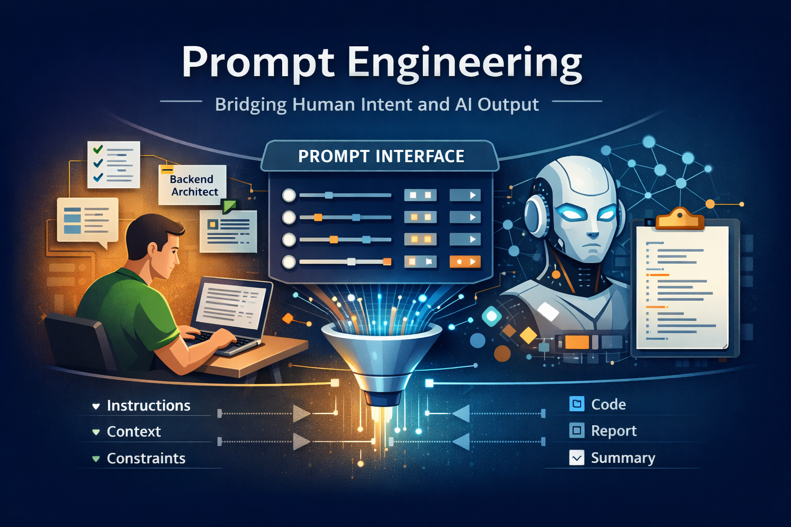

# Prompt Engineering

## About

<figure><figcaption></figcaption></figure>

### What is Prompt Engineering?

Prompt Engineering is the discipline of designing structured inputs that guide Large Language Models (LLMs) to produce reliable, accurate, and context-aware outputs.

At a basic level, a prompt is the text input provided to an AI model.\
At an engineering level, a prompt is a programmable control interface that influences model behavior.

In production environments, prompts are not casual instructions. They are:

* Carefully structured
* Context-aware
* Role-defined
* Constrained
* Tested and optimized

Prompt engineering transforms interaction with AI systems from informal conversation into a controlled, reproducible workflow.

### Why Prompt Engineering Exists ?

Modern LLMs such as OpenAI models, Anthropic systems, or Google DeepMind architectures are probabilistic systems.

They:

* Predict the next token based on probability distributions
* Do not inherently understand truth
* Do not verify factual correctness
* Do not maintain long-term state by default

Because they are probabilistic rather than deterministic systems, output quality depends heavily on how instructions are framed.

Prompt engineering exists to:

* Reduce ambiguity
* Improve reasoning quality
* Constrain output format
* Minimize hallucination
* Increase determinism
* Align responses with business logic

Without structured prompting, even powerful models produce inconsistent or unreliable outputs.

### Prompt as an Interface Layer

In traditional software systems:

* UI → interacts with user
* API → defines structured communication
* Database → stores structured data

In AI-driven systems:

* Prompt → acts as the behavioral control layer

You can think of prompt engineering as:

> The API contract between human intent and model behavior.

Well-designed prompts:

* Define role
* Define scope
* Define boundaries
* Define output expectations
* Define reasoning depth

This is why prompt engineering is closer to software architecture than casual usage.

### From Casual Prompts to Engineered Prompts

#### Casual Prompt

“Explain microservices.”

This produces a generic response.

#### Engineered Prompt

“Explain microservices architecture for backend developers.\
Include benefits, trade-offs, and real-world integration challenges.\
Limit response to 500 words.\
Use structured headings.\
Avoid marketing tone.”

This produces:

* Scoped output
* Controlled structure
* Targeted audience alignment
* Reduced verbosity
* Higher signal-to-noise ratio

The difference is not the model - it is the prompt design.

### Core Components of a Well-Engineered Prompt

A production-grade prompt usually contains:

#### 1. Role Definition

Defines perspective.\
Example:\
“You are a backend architect specializing in distributed systems.”

#### 2. Task Instruction

Defines what needs to be done.\
“Generate an OpenAPI specification from the following business description.”

#### 3. Context Injection

Provides supporting information.\
“Here is the existing API schema…”

#### 4. Constraints

Limits scope.

* Word limits
* Format requirements
* Language restrictions
* Tone control

#### 5. Output Specification

Defines structure.\
“Return output strictly in JSON format following this schema…”

These components transform a prompt into a structured command.

### Prompt Engineering vs Traditional Programming

Prompt engineering differs from traditional programming in key ways:

| Traditional Programming | Prompt Engineering                 |
| ----------------------- | ---------------------------------- |
| Deterministic logic     | Probabilistic reasoning            |
| Exact instructions      | Behavioral guidance                |
| Compiler validation     | Probabilistic evaluation           |
| Unit test validation    | Output testing & iteration         |
| Static structure        | Dynamic context-dependent behavior |

Prompt engineering requires:

* Iterative refinement
* Controlled experimentation
* Evaluation strategies
* Structured constraints

It is closer to system tuning than static coding.

### Prompt Engineering in Production Systems

In real-world engineering workflows, prompts are used for:

* Code generation
* Log analysis
* API test case creation
* Schema generation
* Documentation summarization
* CI/CD validation
* Automation agents

In these contexts:

* Prompts are versioned
* Prompts are tested
* Prompts are optimized for cost
* Prompts are secured against injection

This elevates prompting from experimentation to engineering practice.

## Why Prompt Engineering Matters ?

Prompt engineering matters because Large Language Models (LLMs) are probabilistic systems, not rule-based engines.

Unlike traditional software, LLMs do not execute fixed logic. They generate outputs based on learned probability distributions across massive datasets. As a result:

* The same input can produce slightly different outputs
* Ambiguous instructions produce inconsistent results
* Vague requests increase hallucination risk
* Output format is not guaranteed

Without structured prompting, AI systems behave unpredictably.

Prompt engineering exists to reduce that unpredictability.

### Accuracy and Hallucination Reduction

LLMs do not inherently verify factual correctness. They predict plausible text.

When instructions are vague:

* The model fills missing context
* It may fabricate details
* It may assume domain knowledge incorrectly

Well-engineered prompts:

* Inject explicit context
* Restrict scope
* Define knowledge boundaries
* Request citations or source constraints

This reduces hallucination and increases factual grounding.

In production systems, accuracy is not optional - it is mandatory.

### Determinism in Production Systems

Enterprise systems require predictable behavior.

Consider use cases like:

* Generating API test cases
* Producing JSON schemas
* Creating CI/CD validation reports
* Analyzing logs for error categorization

If output structure varies between runs, automation breaks.

Prompt engineering helps by:

* Enforcing structured output
* Defining strict formatting rules
* Constraining verbosity
* Reducing randomness

Deterministic prompting transforms AI from a conversational tool into an automation component.

### Cost Optimization and Performance Efficiency

LLMs are token-based systems.

Poor prompts often:

* Include unnecessary verbosity
* Duplicate context
* Request irrelevant explanations
* Trigger overly long responses

This increases:

* Token usage
* API cost
* Latency

Optimized prompts:

* Remove redundancy
* Focus only on necessary context
* Limit response size
* Specify concise output

Prompt design directly impacts system cost efficiency.

### Security and Risk Mitigation

Improper prompt design introduces risks:

* Prompt injection attacks
* Data leakage
* Context contamination
* Unintended instruction override

In enterprise environments, prompts must:

* Separate system instructions from user inputs
* Clearly define boundaries
* Restrict sensitive data exposure
* Prevent instruction hijacking

Prompt engineering becomes a security control layer in AI-enabled systems.

### Structured Automation and Workflow Integration

In engineering environments, AI is rarely used for casual Q\&A.

It is integrated into:

* API validation pipelines
* Documentation automation
* Code generation workflows
* Log analysis systems
* Testing frameworks
* DevOps toolchains

For automation to work:

* Output must be machine-readable
* Format must be consistent
* Errors must be detectable
* Behavior must be repeatable

Prompt engineering enables this transformation from conversational AI to system component.

### Scalability of AI Systems

At small scale, manual prompt tweaking is manageable.

At enterprise scale:

* Multiple teams reuse prompts
* Prompts must be versioned
* Changes must be tested
* Behavior must be predictable across environments

Prompt engineering introduces:

* Reusable templates
* Structured prompt blocks
* Version-controlled prompts
* Standardized patterns

This makes AI adoption sustainable.

### Alignment with Business Logic

AI systems must align with:

* Domain constraints
* Compliance requirements
* Organizational policies
* Technical standards

Without structured prompting, AI may:

* Suggest impractical implementations
* Violate architectural constraints
* Produce overly generic advice

Prompt engineering ensures that AI operates within defined business boundaries.

### Engineering Maturity in AI Adoption

There are two stages of AI usage:

Stage 1: Exploration

* Experimenting with prompts
* Testing ideas
* Generating content

Stage 2: Engineering

* Designing structured workflows
* Integrating AI into systems
* Controlling behavior
* Measuring reliability

Prompt engineering marks the transition from experimentation to engineering maturity.

### Reducing Cognitive Overhead

Poor prompts require:

* Manual clarification
* Follow-up corrections
* Iterative refinement
* Repeated context injection

Well-designed prompts:

* Anticipate ambiguity
* Specify constraints upfront
* Reduce back-and-forth interaction
* Deliver usable output in fewer iterations

This increases productivity.
