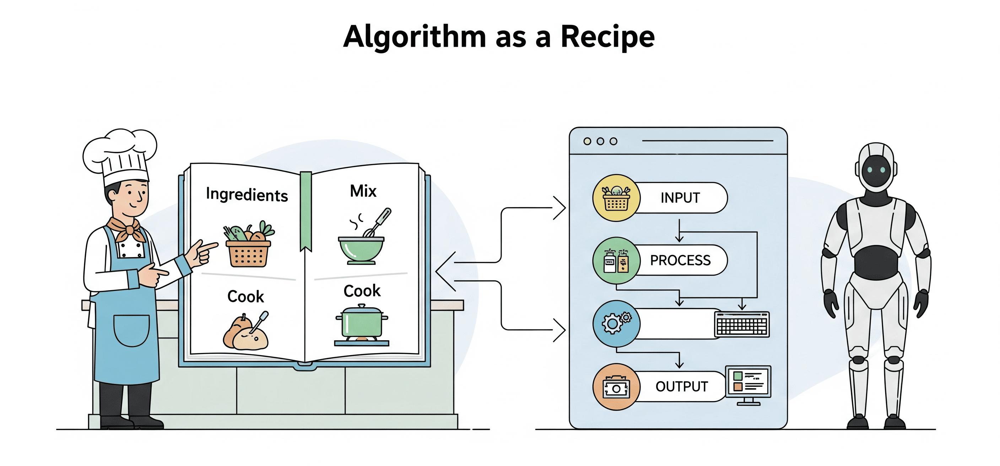

# Algorithm

## About

An **algorithm** is a step-by-step procedure or formula for solving a problem or performing a task. It is a well-defined sequence of instructions that takes some input, processes it, and produces an output.

For example, in programming, an algorithm is the logic used to solve a computational problem, like finding the largest number in an array or sorting data.

## **Algorithm as a Recipe**

An algorithm can be imagined as a **recipe** - a clear, step-by-step set of instructions designed to solve a specific problem or achieve a desired result. Just as a recipe tells us what ingredients to use, in what order to combine them, and how long to cook them, an algorithm defines the logical steps to transform input into output.

<figure><figcaption></figcaption></figure>

#### **Why the Recipe Analogy Works ?**

* **Step-by-Step Instructions:** A recipe explains what to do first, next, and last. Similarly, algorithms provide a sequence of well-defined steps.
* **Predictable Results:** Following the same recipe should always produce the same dish; running the same algorithm on the same data should always give the same output.
* **Efficiency Matters:** Some recipes are quick and simple, while others take time and effort. Algorithms, too, differ in efficiency - some are faster or use fewer resources than others.
* **Adaptability:** A recipe can be tweaked with different ingredients. Likewise, algorithms can be adapted to handle different types of input or problem variations.
* **Universality:** Recipes exist for cuisines across the world; algorithms exist for problems across domains - from sorting numbers to finding the shortest path on a map.

#### **Everyday Impact**

Algorithms are not abstract concepts hidden in textbooks. They run behind the scenes in our daily life - deciding what shows up in our social media feed, securing our online payments, compressing files, or finding the quickest driving route. Just like recipes are the foundation of cooking, algorithms are the foundation of computing.

## Why Learn Algorithms ?

Algorithms are at the heart of computer science and software development. They provide the logic that turns raw computing power into useful problem-solving tools. Learning algorithms is not just about memorizing steps - it’s about developing a way of thinking that makes us a better programmer, problem-solver, and system designer.

#### **Foundation of Programming**

Every piece of code we write is, at its core, an algorithm. Whether we are sorting a list, searching for an item, or processing user input, we are applying algorithmic thinking. Understanding algorithms allows us to write code that is not only correct, but also efficient and reliable.

#### **Efficiency and Performance**

Not all solutions are equal. Two programs might solve the same problem, but one may run in seconds while another takes hours. Learning algorithms helps us recognize trade-offs and choose the most efficient approach - which is critical when working with large-scale data, limited resources, or time-sensitive systems.

#### **Problem-Solving Mindset**

Algorithms teach us how to break down complex problems into smaller, manageable steps. This structured approach is valuable far beyond programming - it sharpens our analytical thinking and logical reasoning in everyday tasks and professional challenges.

#### **Career and Technical Interviews**

In the software industry, knowledge of algorithms is often a core requirement. Many technical interviews test our ability to design, analyze, and implement algorithms. A solid grasp of algorithms can greatly enhance our chances of landing jobs at top companies.

#### **Foundation for Advanced Topics**

Algorithms are stepping stones to advanced areas like data structures, optimization, cryptography, machine learning, and artificial intelligence. Without a good understanding of algorithms, diving into these domains can feel overwhelming. With it, we gain the confidence to explore deeper.

## **For Whom Is This Guide?**

This guide is for anyone who wants to understand algorithms in a simple and practical way. We don’t need to be a computer science expert - just an interest in problem-solving and logical thinking.

It is suitable for:

* **Beginners** who are learning the basics of programming and want to understand how algorithms fit in.
* **Students** studying data structures and algorithms as part of their coursework.
* **Developers** aiming to improve their coding skills and write more efficient programs.
* **Professionals** preparing for technical interviews or looking to strengthen their problem-solving toolkit.
* **Enthusiasts** who enjoy puzzles, logic problems, and the art of breaking down tasks into steps.

In short, this guide is for anyone curious about how problems are solved systematically through algorithms, from simple routines to advanced techniques.
