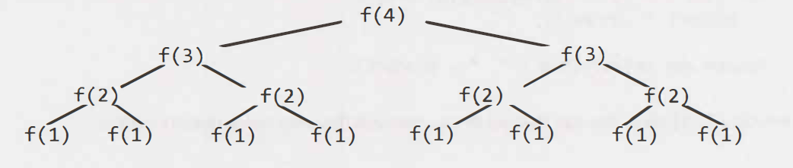

# Problems

## For loop

### Simple for loop

```java
int a = 0, b = 0;    
for (i = 0; i < N; i++) {
    a = a + 5;  
}
for (j = 0; j < M; j++) {
    b = b + 5;
}
//Time O(N+M), Space O(1)
```

### Nested for loop

```java
int a = 0, b = 0; 
for (i = 0; i < N; i++) { 
    for (j = 0; j < N; j++) { 
        a = a + j; 
    } 
} 
for (k = 0; k < N; k++) { 
    b = b + k; 
}
//Time O(N^2), Space O(1)
```

```java
int a = 0;
for (i = 0; i < N; i++) {
    for (j = N; j > i; j--) {
        a = a + i + j;
    }
}
//Time O(N^2), Space O(1)
```


* **Outer Loop (`for (i = 0; i < N; i++)`)**:\
  The outer loop runs from `i = 0` to `i = N - 1`, which means it executes **N times**.
*   **Inner Loop (`for (j = N; j > i; j--)`)**:

    * For a given value of `i`, the inner loop runs from `j = N` to `j = i + 1`.
    * The number of iterations for the inner loop depends on the current value of `i`:
      * When `i = 0`, the inner loop runs `N` times.
      * When `i = 1`, the inner loop runs `N - 1` times.
      * When `i = 2`, the inner loop runs `N - 2` times.
      * ...
      * When `i = N - 1`, the inner loop runs `1` time.

    Thus, the total number of inner loop iterations is the sum of the first `N` natural numbers:

    Total Iterations=N+(N−1)+(N−2)+⋯+1=N\*(N+1)/2


```java
int count = 0;
for (int i = N; i > 0; i /= 2) {     // Outer loop
    for (int j = 0; j < i; j++) {    // Inner loop
        count += 1;
    }
}
//Time O(N), Space O(1)
```


**Outer Loop**

The outer loop runs with the variable `i`, starting at N and halving its value in each iteration (i/=2).\
Thus, the value of `i` takes the following sequence:

N,N/2,N/4,N/8,…,1

The number of iterations in the outer loop is determined by how many times N can be halved before it becomes 1. This is equivalent to the number of times N can be divided by 2, which is:

Number of iterations=⌊log⁡2(N)⌋+1

So, the outer loop runs **O(log⁡N)** times.

**Inner Loop**

The inner loop runs from j=0j=0 to j\<ij\<i.\
For each iteration of the outer loop, the number of iterations of the inner loop is equal to the current value of `i`.

* When i=N, the inner loop runs N times.
* When i=N/2​, the inner loop runs N/2 times.
* When i=N/4​, the inner loop runs N/4​ times.
* ...
* When i=1, the inner loop runs 1 time.

This is a geometric series with the first term N and a common ratio of 1 /2 . The sum of this series is N\*( 1)/(1− 1/2) ​ i.e. 2N.


```java
int i, j, k = 0;
for (i = n / 2; i <= n; i++) {            // Outer loop
    for (j = 2; j <= n; j = j * 2) {      // Inner loop
        k = k + n / 2;                    // Body
    }
}
//Time O(Nlog(N)), Space O(1)
```


**Outer Loop**

The outer loop runs with the variable `i`, starting at n/2 and going up to n.\
Thus, the number of iterations of the outer loop is:

Number of iterations of outer loop=n−n/2+1=n/2+1

This is approximately O(n) since the dominant term is n/2, which scales linearly with n.

**Inner Loop**

The inner loop runs with the variable `j`, starting at 2 and doubling its value in each iteration (j=j∗2).\
Thus, the values of `j` are: 2,4,8,16,…,n

The number of iterations in the inner loop is determined by how many times j can be doubled before it exceeds n. This is equivalent to the number of times n can be divided by 2, which is:

Number of iterations of inner loop=log⁡(n)

Thus, the inner loop runs **O(log⁡n)** times.

**Total Iterations**

To calculate the total number of iterations of the inner loop across all iterations of the outer loop:

* The outer loop runs O(n/2) ≈ O(n) times.
* For each iteration of the outer loop, the inner loop runs O(logn) times.

Thus, the total number of iterations is: O(n)⋅O(log⁡n)=O(nlog⁡n)


```java
void printPairs(int[] array) {
    for (int i= 0; i < array.length; i++) {
        for (int j = 0; j < array.length; j++) {
            System.out.println(array[i] + "," + array[j]);
        }
    }
}
//Time O(N^2), Space O(1)
```


The first time through j runs for N-1 steps. The second time, it's N-2 steps. Then N-3 steps. And so on. Therefore, the number of steps total is: (N-1) + (N-2) + (N-3) + ... + 2 + 1

\= 1 + 2 + 3 + ... + N-1 = sum of 1 through N-1


```java
void printUnorderedPairs(int[] arrayA, int[] arrayB) {
    for (int i= 0; i < arrayA.length; i++) {
        for (int j = 0; j < arrayB.length; j++) {
            for (int k = 0; k < 100000; k++) {
                System.out.println(arrayA[i] + "," + arrayB[j]);
            }
        }
    }
}
// 100,000 units of work is still constant, so the runtime is 0(a b).
//Time O(ab), Space O(1)
```

### Check if Prime number

```java
boolean isPrime(int n) {
    for (int x = 2; x * x <= n; x++) {
        if (n % X == 0) {
            return false;
        }
    }
    return true;
}
//Time O(sqrt(n)), Space O(1)
```

## While loop

### Simple while loop

```java
int a = 0, i = N;
while (i > 0) {
    a += i;
    i /= 2;
}
//Time O(log(N)), Space O(1)
```

## Recursion

### Divide and Conquer Method

```java
int search(vector<int> &V, int k, int start, int end) {
    if (start > end) return 0;
    int mid = (start + end) / 2;
    if (V[mid] < k) return search(V, k, mid + 1, end);
    if (V[mid] > k) return search(V, k, start, mid - 1);
    return search(V, k, start, mid - 1) + 1 + search(V, k, mid + 1, end);
}
// Time Complexity O(N), Space Complexity O(N)
```

The function searches for the occurrences of the element `k` in a sorted vector `V` using a recursive approach.

1. **Base Case**: If the `start` index exceeds the `end` index, it returns 0 (no match found).
2. **Divide and Conquer**:
   * If V\[mid]\<k, search the right half of the array (mid+1 to end).
   * If V\[mid]>k, search the left half of the array (start to mid−1).
3. **When V\[mid]==k**:
   * Count this occurrence of k (+1) and recursively search both the left and right halves to count all other occurrences.


#### **Time Complexity Analysis**

The function involves **binary search** combined with **multiple recursive calls when V\[mid]==k**. Let's analyze:

**Best Case**

* If k is not present in the array, the function acts like a standard binary search:
  * At each step, it halves the search space.
  * The recursion depth is O(log⁡N).
* In this case, the time complexity is: O(log⁡N)

**Worst Case**

* When all elements in the array are equal to kk:
  * For every element, the function recursively explores **both halves of the array**.
  * This results in a **full binary tree of recursive calls**.
  * The total number of recursive calls is O(N), since all elements are visited once.

Thus, in the **worst case**, the time complexity is: O(N)

#### **Space Complexity Analysis**

The space complexity is determined by the **recursive call stack**. In the worst case, the depth of recursion is:

1. O(log⁡N) if the array is halved at each step (binary search behavior).
2. O(N) if all elements are equal to kk (linear recursion due to overlapping searches).

Thus, the space complexity is: O(N)

in the worst case and O(log⁡N) in the best case.


### Minimum Path

The function `findMinPath` computes the minimum path sum from the top-left corner (0,0) to the bottom-right corner (R−1,C−1) of a matrix `V` by recursively exploring the possible paths. At every cell, the function can move:

* **Down** (r+1,c)
* **Right** (r,c+1)

The function returns the minimum sum of the path.

```java
int findMinimumPath(vector<vector<int> > &V, int r, int c) {
  int R = V.size();
  int C = V[0].size();
  if (r >= R || c >= C) return 100000000; // Infinity
  if (r == R - 1 && c == C - 1) return 0;
  return V[r][c] + min(findMinimumPath(V, r + 1, c), findMinimumPath(V, r, c + 1));
}
// Time Complexity O(2^(R+C)), Space Complexity O(R+C)
```


#### **Time Complexity Analysis**

**Recursive Calls**

At every cell (r,c), the function makes two recursive calls:

1. `findMinimumPath(V, r + 1, c)` — explores the path moving **down**.
2. `findMinimumPath(V, r, c + 1)` — explores the path moving **right**.

If the matrix has R rows and C columns, the function explores all possible paths from the top-left to the bottom-right corner. In the worst case, the total number of recursive calls is exponential: T(R,C)=2^(R+C−2)

This is because, for a path of length R+C−2 (the total number of moves i.e. R−1 **downward moves** to go from row 0 to row R−1 and C−1 **rightward moves** to go from column 0 to column C−1), there are 2^(R+C−2) combinations of recursive calls.

**Exponential Growth**

The time complexity of the function is: O(2(R+C))


#### **Space Complexity Analysis**

**Recursive Call Stack**

The space complexity is determined by the **maximum depth of the recursion**. Since the function makes recursive calls in two directions (down and right), the depth of the recursion is bounded by the longest path in the matrix, which is R+C−2

Thus, the space complexity is: O(R+C)


### Minimum Path with Dynamic Programming (DP)

The above implementation recomputes the results for overlapping subproblems, which makes it inefficient. To improve the time complexity, we can use Dynamic Programming (DP) with memoization or tabulation.

```java
int findMinPath(vector<vector<int>> &V, int r, int c, vector<vector<int>> &dp) {
  int R = V.size();
  int C = V[0].size();
  if (r >= R || c >= C) return 100000000; // Infinity
  if (r == R - 1 && c == C - 1) return 0;
  if (dp[r][c] != -1) return dp[r][c]; // Use memoized result
  return dp[r][c] = V[r][c] + min(findMinPath(V, r + 1, c, dp), findMinPath(V, r, c + 1, dp));
}
// Time Complexity O(RxC), Space Complexity O(RxC+R+C)
```


**Time Complexity with Memoization**

With memoization, each cell in the matrix is computed at most once. The time complexity becomes:

O(R×C)

**Space Complexity with Memoization**

The space complexity with memoization includes the storage for the DP table (O(R×C)) and the recursive call stack (O(R+C)):

O(R×C+R+C)


### Exponential Growth

```java
int f(int n) {
    if (n <= 1) {
        return 1;
    }
    return f(n - 1) + f(n - 1);
}
// Time Complexity O(2^n), Space Complexity O(n)
```


There will be 2^0 + 2^1 + 2^2 + 2^3 + 2^4 + . . + 2^N (which is 2^(N+1) - 1) nodes.

\
\
Although we have 0(2^N) nodes in the tree total, only O(N) exist at any given time. Therefore, we would only need to have O(N) memory available.


### Sum of all values of Balanced Binary Search Tree

The function performs a **recursive in-order traversal** of a binary tree:

* It visits each node **once** (`O(N)` time complexity).
* Uses **recursive calls** to traverse the left and right subtrees.

```java
int sum(Node node) {
    if (node == null) {
        return 0;
    }
    return sum(node.left) + node.value + sum(node.right);
}
// Time Complexity O(N), Space Complexity = O(log N) , N is the number of nodes.
```


The tree is a balanced binary search tree. Therefore, if there are N total nodes, then depth is roughly log N.&#x20;

2^logN = N


### Factorial of a number

```java
int factorial(int n) {
    if (n < 0) {
        return -1;
    } else if (n
        return 1;
    } else {
        return n * factorial(n - 1);
    }
}
//Time O(N), Space O(N)
```

### Permutations of a string

<pre class="language-java" data-line-numbers><code class="lang-java">void permutation(String str) {
    permutation(str, "");
}

void permutation(String str, String prefix) {
    if (str.length() == 0) {
        System.out.println(prefix);
    } else {
<strong>        for (int i= 0; i &#x3C; str.length(); i++) {
</strong><strong>            String rem = str.substring(0, i) + str.substring(i + 1);
</strong><strong>            permutation(rem, prefix + str.charAt(i));
</strong><strong>        }
</strong><strong>    }
</strong><strong>}
</strong><strong>//Time O(N^2*N!), Space O(N)
</strong></code></pre>


#### **Time Complexity**

#### **Step 1: Counting Base Case Calls**

* The base case occurs when `str.length() == 0`, meaning we've used all characters and formed a complete permutation.
* Each unique permutation is a leaf node in the recursion tree.
* Since there are `n!` permutations of an `n`-character string, the base case is reached `n!` times.

#### **Step 2: Counting Total Function Calls**

* We need to count all calls, not just the base cases.
* Consider how the recursion unfolds:
  * The first call has `n` branches (one for each starting character).
  * Each of those branches has `n-1` further branches (one for each remaining character), and so on.
  * This forms a recursive tree where each node makes `n - depth` recursive calls.
  * The total number of nodes in the tree (calls to `permutation()`) is approximately n × n!.

#### **Step 3: Work Done per Function Call**

Each function call performs:

1. **Printing the permutation (Base Case Only)**
   * Involves printing a string of length `n`, which takes **O(n)** time.
2. **Generating `rem` (Line 10)**
   * Constructing `rem` involves substring operations, which take **O(n)** time.
   * Since we create a new string in each call, this contributes to the overall complexity.
3. **Recursive Call (Line 11)**
   * Simply a function call, which is O(1) itself but triggers further recursive work.

Thus, **each function call does O(n) work** due to substring creation and concatenation.

#### **Final Complexity Analysis**

* **Total number of calls:** ≈ `n × n!`
* **Work per call:** `O(n)`
* **Overall complexity:** O(n^2\*n!)


Fibonacci Number

```java
int fib(int n) {
    if (n <= 0) return 0;
    else if (n == 1) return 1;
    return fib(n - 1) + fib(n - 2);
}
//Time O(2^N), Space O(N)
```


#### **Time Complexity O(branches^depth)**

#### **Step 1: Identifying Branches and Depth**

* Each call to `fib(n)` makes **two recursive calls**:
  * `fib(n - 1)`
  * `fib(n - 2)`
* This means the recursion tree **branches** into **2** subproblems at each level → **branches = 2**.
* The **depth** of the recursion tree is `n`, because we reduce `n` by 1 or 2 in each step.&#x20;

#### **Step 2: Complexity Using Recursion Tree Growth**

* The recursion grows exponentially, with each level roughly doubling the number of calls.
* The total number of calls is proportional to **O(2ⁿ)**.


#### **Space Complexity**

* **Recursive call stack depth is at most `O(n)`.**
* Each recursive call adds a new frame until we reach the base case (`n = 0` or `n = 1`).

So, **space complexity = O(n) (due to recursion depth).**


## All Fibonacci numbers from 0 to n with recursion

```java
void allFib(int n) {
    for (int i= 0; i < n; i++) {
        System.out.println(i + ": "+ fib(i));
    }
}

int fib(int n) {
    if (n <= 0) return 0;
    else if (n == 1) return 1;
    return fib(n - 1) + fib(n - 2);
}

//Time O(2^N), Space O(N)
```


fib(1) -> 2^1 steps&#x20;

fib(2) -> 2^2 steps&#x20;

fib(3) -> 2^3 steps&#x20;

....

fib(n) -> 2^n steps&#x20;

Therefore, the total amount of work is: 2^1 + 2^2 + 2^3 + 2^4 + , , , + 2^n


## All Fibonacci from 0 to n numbers with memoization

```java
void allFib(int n) {
    int[] memo = new int[n + 1];
    for (int i= 0; i < n; i++) {
        System.out.println(i + ": "+ fib(i, memo));
    }
}

int fib(int n, int[] memo) {
    if (n <= 0) return 0;
    else if (n == 1) return 1;
    else if (memo[n] > 0) return memo[n];

    memo[n] = fib(n - 1, memo)+ fib(n - 2, memo);
    return memo[n];
}
//Time O(N), Space O(N)
```


#### **Time Complexity**

**Step 1: Time Complexity of `fib(n, memo)`**

* In a naive recursive Fibonacci, `fib(n)` makes **O(2ⁿ) calls** due to repeated work.
* With **memoization**, each Fibonacci number is computed **only once**.
* The function still makes **O(n) recursive calls** in total, since each number is computed once and stored.
* Thus, **`fib(n, memo)` runs in O(n) time**.

**Step 2: Time Complexity of `allFib(n)`**

* It calls `fib(i, memo)` for each `i` from `0` to `n-1`.
* Since memoization prevents redundant calculations, `fib(i, memo)` runs in **O(1)** for already computed values.
* The first call computes Fibonacci numbers in **O(n)** total.
* All subsequent calls just fetch values from `memo` in **O(1)** time.
* Overall, **O(n) + O(n) = O(n).**

Thus, **final time complexity = O(n).**


#### **Space Complexity**

**Step 1: Space Complexity of `memo` Array**

* The `memo` array stores **n+1** Fibonacci values.
* This contributes **O(n) space**.

**Step 2: Space Complexity of Recursion Stack**

* Since `fib(n, memo)` is recursive, it uses the call stack.
* The maximum recursion depth is **O(n)** (for the deepest recursive call).
* However, memoization avoids redundant calls, so at most **O(n)** calls are on the stack.

Thus, **final space complexity = O(n).**


Powers of 2 from 1

```java
int powers0f2(int n) {
    if (n < 1) {
        return 0;
    } else if (n == 1) {
        System.out.println(l);
        return 1;
    } else {
        int prev = powers0f2(n / 2);
        int curr = prev * 2;
        System.out.println(curr);
        return curr;
    }
}
//Time O(logN), Space O(logN)
```


#### **Space Complexity Analysis**

**1. Understanding the Recursion**

* The function repeatedly **divides `n` by 2** in each recursive call until `n < 1`.
* This means the recursion **depth** is **O(log n)** (since `n` is halved in each step).

**2. Space Used by the Call Stack**

* Each recursive call adds a **new frame** to the call stack.
* Since the recursion depth is **O(log n)**, the **maximum stack size** is also **O(log n)**.

**3. No Extra Data Structures**

* Apart from the call stack, no extra space (like arrays or hash tables) is used.
* The function **only uses a few integer variables (`prev`, `curr`, `n`)**, which are **O(1) space**

**Total = O(1) + O(logn) = O(logn)**



## Miscellaneous Problems

### GCD with Euclidean algorithm

This is Euclidean algorithm which repeatedly replaces the pair (n, m) with (m , n mod  m)  until m=0. The result is the greatest common divisor (GCD) of n and m .

```java
int gcd(int n, int m) {
    if (n % m == 0) return m;         // Base case
    if (n < m) swap(n, m);           // Ensure n >= m
    while (m > 0) {                  // Loop until m becomes 0
        n = n % m;                   // Compute remainder
        swap(n, m);                  // Swap n and m
    }
    return n;                        // Return the GCD
}
//Time O(log(N)), Space O(1)
```


#### **Worst-Case Example**

The worst-case input for the Euclidean algorithm occurs when the two numbers are consecutive Fibonacci numbers, because the remainder reduction is minimal in each step. For example:

* For n=Fk+1​ and m=Fk​ (where Fk​ is the k-th Fibonacci number), the algorithm performs k steps.
* Since Fibonacci numbers grow exponentially (Fk≈ϕk, where ϕ is the golden ratio), the number of steps is proportional to logN.

Eg: 8 and 13.

(13 % 8) = 5 which is the previous fibonacci number of 8.

Same way : (8 % 5) = 3 , (5 % 3) = 2 , (3 % 2) = 1 , (2 % 1) = 0.


### Different For loops

```
Consider the following for loops:
  A) for(i = 0; i < n; i++)
  B) for(i = 0; i < n; i += 2)
  C) for(i = 1; i < n; i *= 2)
  D) for(i = n; i > -1; i /= 2)
If n is the size of input(positive), which function is the most efficient?
-> C
```


#### **A) for (i = 0; i < n; i++)**

* **Loop Analysis**:
  * The loop starts at i=0 and increments by 1 (i++) until i\<n.
  * The number of iterations is directly proportional to nn.
* **Time Complexity**: O(n)

**B) for (i = 0; i < n; i += 2)**

* **Loop Analysis**:
  * The loop starts at i=0 and increments by 2 (i+=2) until i\<n.
  * Since the increment step is 2, the number of iterations will be approximately half the size of n. Number of iterations=⌈n/2⌉
* **Time Complexity**: O(n)

Although the number of iterations is halved compared to Case A, the time complexity remains O(n) because constants are ignored in Big-O notation.

#### _C) for (i = 1; i < n; i = 2)_

* **Loop Analysis**:
  * The loop starts at i=1 and multiplies by 2 (i∗=2) until i\<n.
  * The value of i follows the sequence: 1,2,4,8,… The loop runs while i\<n.
  * The number of iterations corresponds to the number of times ii can be doubled before it exceeds nn:Number of iterations=⌊log⁡2(n)⌋
* **Time Complexity**: O(log⁡n)

This is more efficient than both A and B because the growth rate is logarithmic, much smaller than linear.

#### **D) for (i = n; i > -1; i /= 2)**

* **Loop Analysis**:
  * The loop starts at i=n and divides i by 2 (i/=2) until i>−1.
  * The value of i follows the sequence: n,n/2,n/4,…n. The loop runs while i>−1. Loop will not end since i will stuck at 0.


### Check the boundness

```java
Which is not bounded by O(n^2)?
1. (10^10) * n + 12099
2. n^1.95
3. n^3 / (sqrt(n))
4. (2^30) * n

-> 3
```

Check the growth rate

```
Order in increasing order of complexity of functions f1, f2, f3 and f4:
f1(n) = 2^n
f2(n) = n^(3/2)
f3(n) = nLogn
f4(n) = n^(Logn)
-> f3, f2, f4, f1
```




**1. f1(n)=2^n (Exponential Growth)**

* This function grows exponentially.
* Exponential functions grow faster than polynomial or logarithmic functions.
* For large nn, 2n becomes extremely large.
* **Time Complexity**: Exponential

***

**2. f2(n)=n^3/2 (Polynomial Growth)**

* This is a polynomial function where the exponent is 3/2 (greater than 1 but less than 2).
* Polynomial functions grow slower than exponential functions but faster than logarithmic or linearithmic functions for large n.
* **Time Complexity**: Polynomial (O(n3/2).

***

**3. f3(n)=nlog⁡n (Linearithmic Growth)**

* This is a linearithmic function (a combination of linear and logarithmic growth).
* It grows faster than logarithmic functions but slower than any polynomial function with nk where k>1
* **Time Complexity**: Linearithmic (O(nlog⁡n).

***

**4. f4(n)=n^log⁡n (Super-Polynomial Growth)**

* The function n^log⁡n grows faster than any polynomial function because the exponent itself is log⁡n, which increases with n.
* It is slower than exponential functions like 2^n but faster than standard polynomials.
* **Time Complexity**: Super-Polynomial (O(n^log⁡n).


### For and While loop

```java
int j = 0;
for(int i = 0; i < n; ++i) {
  while(j < n && arr[i] < arr[j]) {
    j++;
  }
}
//Time O(N), Space O(1)
```


#### **Outer Loop**

* The `for` loop iterates from `i = 0` to `i = n - 1`, so it runs nn times.

#### **Inner `while` Loop**

* The `while` loop increments `j` until one of the conditions (`j < n` or `arr[i] < arr[j]`) is false.
* The key observation here is that **`j` does not reset** to 0 for each iteration of the outer `for` loop. Instead, `j` keeps its value from the previous iteration.
* This means `j` only moves forward and never goes backward.

#### **Number of Iterations**

* `j` starts at 0 and can increment at most nn times (from 0 to n−1) across all iterations of the outer loop. This is because `j` is shared across all iterations of the `for` loop and is incremented only in the `while` loop.

#### **Time Complexity**

* The **outer loop** runs nn times.
* The **inner loop** (the `while` loop) moves `j` forward at most nn times in total across all iterations of the outer loop.

Thus, the total number of operations performed by both loops is **O(n)**.


### Which of the following are equivalent to O(N)?&#x20;

O(N + P), where P < X \
0(2N)\
O(N + log N)\
O(N + M)

All but the last one are equivalent to O(N) because there is no established relationship between N and M, so we have to keep both variables in there.

### String Array Sorting

Suppose we had an algorithm that took in an array of strings, sorted each string, and then sorted the full array. What would the runtime be?

Let s be the length of the longest string. Let a be the length of the array.&#x20;

Sorting each string is 0( s log s). We have to do this for every string (and there are a strings), so that's 0( a\* s log s). Now we have to sort all the strings. There are a strings, so we'll may be inclined to say that this takes O ( a log a) time. We should also take into account that we need to compare the strings. Each string comparison takes O(s) time. There are O(a log a) comparisons, therefore this will take 0( a\*s log a) time.

Then runtime will be 0( a\* s ( log a + log s)).

