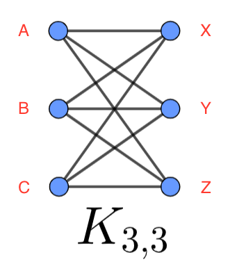

# Graph

## About

A **Graph** is a fundamental data structure used to represent relationships between objects. It consists of **vertices (nodes)** and **edges (connections between nodes)**. Graphs are widely used in areas such as computer networks, social media, pathfinding algorithms, and artificial intelligence.

**Characteristics of Graphs**

* **Non-linear Data Structure** → Unlike arrays, linked lists, or trees, graphs do not follow a linear arrangement of elements.
* **Consists of Vertices (V) and Edges (E)** → A graph **G** is defined as **G = (V, E)**, where:
  * **V** is the set of vertices (nodes).
  * **E** is the set of edges (connections).
* **Used for Relationship Representation** → Suitable for **real-world modeling** like networks, web pages, cities, and transportation systems.
* **Supports Various Traversal Techniques** → DFS (Depth First Search) and BFS (Breadth First Search) help explore graph structures.

**Example Graph**

```
      A ----- B
      |       |
      |       |
      C ----- D
```

* **Vertices:** `{A, B, C, D}`
* **Edges:** `{(A-B), (A-C), (B-D), (C-D)}`

## Components of a Graph

A graph consists of several components.

### **Vertices (Nodes)**

* The **fundamental unit** of a graph.
* Each vertex represents **an entity** in a system (e.g., a person in a social network, a city in a map, or a webpage in a web graph).
* A graph can contain millions or billions of vertices in large-scale applications.

**Examples of Vertices in Different Domains**

| **Domain**       | **Vertex Representation** |
| ---------------- | ------------------------- |
| Social Network   | A user profile            |
| Computer Network | A router or a switch      |
| City Map         | A location or landmark    |
| Web Graph        | A webpage                 |

### **Edges (Links)**

* An **edge** connects two vertices.
* Represents a **relationship or connection** between entities.
* Can be **directed** (one-way) or **undirected** (two-way).

#### **Types of Edges**

<table data-header-hidden><thead><tr><th width="196"></th><th></th></tr></thead><tbody><tr><td><strong>Edge Type</strong></td><td><strong>Description</strong></td></tr><tr><td><strong>Undirected Edge</strong></td><td>A bidirectional connection. Example: A friendship in a social network.</td></tr><tr><td><strong>Directed Edge</strong></td><td>A one-way connection. Example: A "follower" relationship on Twitter.</td></tr><tr><td><strong>Weighted Edge</strong></td><td>An edge with a weight (cost, distance, etc.). Example: Distance between two cities.</td></tr></tbody></table>

**Example Graph with Weighted and Directed Edges**

```
      A ----(5)----> B
      |             |
     (2)           (3)
      |             |
      C ----(4)----> D
```

* **A → B** has a weight of **5**.
* **C → D** has a weight of **4**.

### **Degree of a Vertex**

* The **degree of a vertex** is the **number of edges connected** to it.
* In a **directed graph**, we differentiate between:
  * **In-degree** → Number of incoming edges.
  * **Out-degree** → Number of outgoing edges.

**Example**

```
      A → B → C
      ↑   ↓
      D ← E
```

| Vertex | In-degree | Out-degree | Degree |
| ------ | --------- | ---------- | ------ |
| A      | 1         | 1          | 2      |
| B      | 1         | 2          | 3      |
| C      | 1         | 0          | 1      |
| D      | 1         | 1          | 2      |
| E      | 1         | 1          | 2      |

### **Path in a Graph**

* A **path** is a **sequence of vertices** connected by edges.
* A path can be **simple** (no repeated vertices) or **cyclic** (forms a loop).

**Example**

```
      A → B → C → D
```

* Path: `A → B → C → D`
* Path Length: **3** (number of edges)

### **Subgraphs**

* A **subgraph** is a smaller portion of a graph.
* It consists of a subset of **vertices and edges**.

**Example of a Subgraph**

Original Graph:

```
      A → B → C
      ↓   ↓   ↑
      D → E → F
```

Subgraph:

```
      B → C
      ↓  
      E  
```

## Types of Graphs

### **Connected and Disconnected Graphs**

* **Connected Graph** → Every vertex has at least **one path** to another vertex.
* **Disconnected Graph** → Some vertices have **no connection** to others.

**Example of a Connected Graph**

```
      A → B → C
      ↓   ↓   ↑
      D → E → F
```

* All nodes are **reachable** from any other node.

**Example of a Disconnected Graph**

```
      A → B    C → D
```

* `{A, B}` is separate from `{C, D}`.

### **Weighted and Unweighted Graphs**

* **Unweighted Graph** → All edges have **equal importance**.
* **Weighted Graph** → Edges have **weights or costs**.

**Example of a Weighted Graph**

```
      A --(3)--> B
      |          |
     (2)        (5)
      |          |
      C --(4)--> D
```

* **Path Cost:** `A → C → D = 2 + 4 = 6`.

### **Directed and Undirected Graphs**

* **Undirected Graph** → Edges have **no direction**.
* **Directed Graph (Digraph)** → Edges have **specific direction**.

**Example of an Undirected Graph**

```
      A --- B
      |     |
      C --- D
```

* `A - B` means **both A can reach B and B can reach A**.

**Example of a Directed Graph**

```
      A → B
      ↓   ↓
      C → D
```

* `A → B` means **A can reach B, but B cannot reach A**.

### **Cyclic and Acyclic Graph**

* A **cycle** is a path that **starts and ends at the same vertex**.
* **Cyclic Graph** → Contains at least one cycle.
* **Acyclic Graph** → Does **not** contain cycles.

**Example of a Cyclic Graph**

```
      A → B → C
      ↑       ↓
      D ←---- E
```

* Cycle: `A → B → C → E → D → A`

**Example of an Acyclic Graph**

```
      A → B → C → D
```

* No cycles present.

### Bipartite Graph

A **Bipartite Graph** is a special type of graph where:

* The set of **vertices can be divided into two disjoint sets** such that
* **Every edge connects a vertex from one set to the other**
* No edge connects two vertices in the same set

A graph **G = (V, E)** is **bipartite** if the vertex set **V** can be partitioned into two sets **U** and **V**, such that:

* U∪V=V and U∩V=∅
* Every edge e∈E connects a vertex from **U** to a vertex from **V** (not within the same set)

#### Characteristics

* **No odd-length cycles**: A graph is bipartite **if and only if** it does **not** contain a cycle of **odd length**
* Can be **colored using 2 colors** such that no two adjacent vertices have the same color (2-colorable)
* Can represent relationships like:
  * People and hobbies
  * Jobs and applicants
  * Users and roles

#### How to Check if a Graph is Bipartite

We can use either **Breadth-First Search (BFS)** or **Depth-First Search (DFS)** to check if a graph is bipartite.

**Using BFS (Coloring Method):**

1. Assign one color (say 0) to the starting vertex
2. Traverse all adjacent vertices:
   * Assign them the opposite color (1)
   * If a neighbor has the same color as the current vertex → Not bipartite
3. Continue the process for all vertices
4. If no conflicts found, the graph is bipartite

**Using DFS (Same logic, recursive coloring)**

#### Example 1&#x20;

Graph:

```
A -- B
|    |
C -- D
```

Set U = {A, D}, Set V = {B, C}\
All edges go between the sets → Bipartite

Graph with a triangle (3-cycle):

```
A -- B
 \  /
  C
```

This has an odd-length cycle (3 nodes) → Not bipartite

#### **Example 2**

Let’s define the sets as follows:

* **Set U (Left side)**: {1, 2, 3}
* **Set V (Right side)**: {A, B}

Edges:

* (1, A)
* (2, A)
* (2, B)
* (3, B)

Graph:

```
Set U       Set V
  1   ---->   A
  2   ---->   A
  2   ---->   B
  3   ---->   B
```

Explanation:

* The graph can be split into two sets (U and V)
* All edges connect a node from Set U to Set V
* No edge exists between nodes **within the same set**
* Therefore, this graph is **bipartite**

### **Complete Graph (Kn)**

* A **graph where every vertex is connected to every other vertex**.

**Example: Complete Graph with 4 Vertices (K4)**

```
   A --- B
   | \ / |
   C --- D
```

* **All possible edges exist.**

### **Sparse vs. Dense Graphs**

* **Sparse Graph** → Very few edges compared to vertices.
* **Dense Graph** → Many edges compared to vertices.

**Example:**

**Sparse Graph:**

```
   A → B       C → D
```

* **Few edges compared to vertices.**

**Dense Graph:**

<pre><code><strong>   A --- B
</strong>   |  \  |
   C --- D
</code></pre>

* **Most vertices are interconnected.**

### **Planar and Non-Planar Graph**

#### Planar Graph

A **planar graph** is a graph that **can be drawn on a 2D plane without any of its edges crossing** (except at the vertices).

#### **Example of a Planar Graph:**

```
   A --- B
   |     |
   C --- D
```

Here, **no edges cross**, so it is a **planar graph**.

**Properties of Planar Graphs**

1. **No Edge Crossings** → Edges do not intersect except at vertices.
2. **Can be Drawn on a Plane** → There exists at least one way to represent it without overlapping edges.
3. **Faces (Regions)** → The division of the plane by the edges results in **faces (regions)**, including the **outer face (infinite region).**
4. **Euler’s Formula for Planar Graphs** V−E+F=2 Where:
   * **V** = Number of vertices
   * **E** = Number of edges
   * **F** = Number of faces

#### **Example Calculation (Planar Graph)**

```
   A --- B
   |     |
   C --- D
```

* **V = 4 (A, B, C, D)**
* **E = 4 (AB, BC, CD, DA)**
* **F = 2 (one inner face + outer face)**
* Applying **Euler’s Formula**: 4−4+2=2

Thus, it satisfies the condition for a **planar graph**.


#### **Non-Planar Graphs**

A **non-planar graph** is a graph that **cannot be drawn on a plane without edges crossing** (no matter how you rearrange it).

#### **Examples of Non-Planar Graphs**

**1. Complete Graph on 5 Vertices (K₅)**

```
   (A)------(B)
     | \  / |
     |  \/  |
     |  /\  |
     | /  \ |
   (C)------(D)
      \    /
       (E)
```

* Every vertex is connected to every other vertex.
* It is impossible to draw it without edge crossings.

**2. Complete Bipartite Graph K₃,₃**

* K₃,₃ consists of two sets of 3 vertices each, with every vertex in one set connected to all vertices in the other set.
* Example: (A, B, C) connected to (X, Y, Z)

<figure><figcaption></figcaption></figure>

* It is impossible to draw without edge crossings, making it non-planar.

### Eulerian and Hamiltonian Graphs

Eulerian and Hamiltonian graphs are two important types of graphs in **Graph Theory**, characterized by their ability to traverse vertices and edges under specific constraints.

#### **Eulerian Graphs**

A **graph is Eulerian** if it contains an **Eulerian circuit**, which is a path that:

* Visits every edge exactly once
* Returns to the starting vertex

**1. Eulerian Circuit**

* A closed path that traverses every edge once and returns to the starting vertex.
*   Example:

    ```
        A ---- B
        |      |
        D ---- C
    ```

    If we traverse **A → B → C → D → A**, covering all edges **exactly once**, it is an **Eulerian Circuit**.

**2. Eulerian Path**

* A path that traverses every edge exactly once but does not necessarily return to the starting vertex.
*   Example:

    ```
        A ---- B
        |      |
        D ---- C
    ```

    If we traverse **A → B → C → D**, it is an **Eulerian Path** (not a circuit).

**3. Conditions for Eulerian Graphs**

* &#x20;**Eulerian Circuit Exists If:**

1. The graph is connected (all vertices are reachable).
2. Every vertex has an even degree (even number of edges).

* &#x20;**Eulerian Path Exists If:**

1. The graph is **connected**.
2. Exactly 0 or 2 vertices have an odd degree.

* &#x20;**Non-Eulerian Graph:**

A graph that does not satisfy either of the above conditions.


#### **Hamiltonian Graphs**

A graph is Hamiltonian if it contains a Hamiltonian cycle, which is a path that:

* Visits every vertex exactly once
* Returns to the starting vertex

**1. Hamiltonian Cycle**

* A closed path that visits every vertex exactly once and returns to the starting vertex.
*   **Example:**

    ```
        A ---- B
       /       \
      D ------- C
    ```

    A → B → C → D → A is a Hamiltonian Cycle.

**2. Hamiltonian Path**

* A path that visits every vertex exactly once but does not return to the starting vertex.
*   **Example:**

    ```
        A ---- B
       /       \
      D ------ C
    ```

    A → B → C → D is a Hamiltonian Path.

**3. Conditions for Hamiltonian Graphs**

Unlike Eulerian graphs, no simple necessary and sufficient condition guarantees a Hamiltonian graph. However, some useful theorems provide guidance:

* **Dirac’s Theorem**

A graph with n vertices (n ≥ 3) is Hamiltonian if every vertex has a degree of at least n/2.

* **Ore’s Theorem**

If for every pair of non-adjacent vertices u and v, their degree sum (deg(u) + deg(v)) is at least n, the graph is Hamiltonian.


## **Applications of Graphs**

Graphs are powerful data structures used across various domains, from computer science and mathematics to networking, AI, and biology. They represent relationships between objects and help solve real-world problems efficiently.

### **1️. Computer Science & Algorithmic Applications**

#### **1.1 Graph Traversal (DFS & BFS) in Problem Solving**

* **Depth First Search (DFS)** and **Breadth First Search (BFS)** are used for **graph traversal** in search problems.
* Used in **solving mazes**, **finding connected components**, and **topological sorting**.

#### **1.2 Shortest Path Algorithms**

* **Dijkstra’s Algorithm** → Used in **navigation systems (Google Maps, GPS)**.
* **Bellman-Ford Algorithm** → Works with negative weights, used in **financial risk analysis**.
* _A Search Algorithm_\* → AI-based **pathfinding for games and robotics**.

#### **1.3 Spanning Trees (MST Algorithms)**

* **Prim’s and Kruskal’s Algorithm** → Used for **minimum cost network design** (LAN, WAN, electric grid connections).

### **2️. Networking and Communication Systems**

#### **2.1 Computer Networks (Internet & Routing Protocols)**

* The internet can be modeled as a **graph**, where:
  * **Nodes** → Represent routers/computers.
  * **Edges** → Represent connections between them.
* **Link-State Routing Protocols (OSPF, IS-IS)** → Use graphs to determine the **best paths**.

#### **2.2 Social Networks & Recommendation Systems**

* **Facebook, Twitter, LinkedIn** → Represent users as **nodes** and relationships as **edges**.
* **Google PageRank Algorithm** → Uses **graph theory** to rank web pages.
* **Netflix & YouTube Recommendations** → Use **Graph Neural Networks (GNNs)** to analyze user interactions.

#### **2.3 Wireless Sensor Networks (WSNs)**

* Graphs help optimize **sensor placement** and **data transmission** in IoT applications.

### **3️. Artificial Intelligence & Machine Learning**

#### **3.1 Knowledge Representation (Knowledge Graphs)**

* **Google Knowledge Graph** → Uses graphs to structure information about entities and their relationships.
* **Semantic Web & Ontologies** → Represent hierarchical knowledge structures.

#### **3.2 Graph Neural Networks (GNNs) in AI**

* Used in **fraud detection (banking)**, **molecular biology**, and **natural language processing (NLP)**.

#### **3.3 Decision Trees and State Space Representation**

* AI agents use **state space graphs** in game theory (chess, Go) and robotics.
* Decision trees are special types of graphs used in **machine learning models**.

### **4️. Database & Data Storage**

#### **4.1 Graph Databases**

* **Neo4j, ArangoDB, Amazon Neptune** → Store data in graph format for faster queries.
* Used in **fraud detection, recommendation engines, and identity management**.

#### **4.2 Indexing and Query Optimization (B-Trees, Trie, DAGs)**

* **B-Trees** → Used in databases (MySQL, PostgreSQL) for efficient indexing.
* **Tries** → Optimize **autocomplete features** in search engines.
* **DAGs (Directed Acyclic Graphs)** → Used in **version control systems (Git, blockchain)**.

### **5️. Biology & Chemistry**

#### **5.1 Protein Interaction Networks**

* Graphs help model how **proteins interact** inside a cell.
* **Bioinformatics** uses graphs to **map genomes** and **predict drug interactions**.

#### **5.2 Chemical Compound Representation**

* Chemical compounds can be represented as **graphs**, where atoms are **nodes** and chemical bonds are **edges**.
* Used in **molecular design and drug discovery**.

### **6️. Transportation and Logistics**

#### **6.1 Road and Railway Networks**

* **Metro maps, airline routes, and road navigation systems** use graphs.
* Used in **scheduling and optimization** for transport systems.

#### **6.2 Supply Chain Optimization**

* Companies like **Amazon and FedEx** use graphs for **warehouse logistics, delivery route planning, and inventory management**.

### **7️. Cryptography & Blockchain**

#### **7.1 Blockchain as a Graph (DAG-based Crypto)**

* **Bitcoin, Ethereum** use **Merkle Trees** (a graph-based structure) for transaction verification.
* **IOTA and Hedera Hashgraph** use **DAG-based blockchain structures** for scalability.

### **8️. Electrical Circuits & Engineering**

#### **8.1 Circuit Design and Optimization**

* **VLSI (Very-Large-Scale Integration) Circuit Design** → Uses **graph partitioning** and **shortest path algorithms** for chip layouts.
* **Electric Grid Networks** → Use **graph algorithms** for power distribution.

### **9️. Linguistics & Natural Language Processing (NLP)**

#### **9.1 Syntax Trees & Dependency Parsing**

* Graphs model sentence structure in NLP.
* Used in machine translation, speech recognition, and chatbot development.

