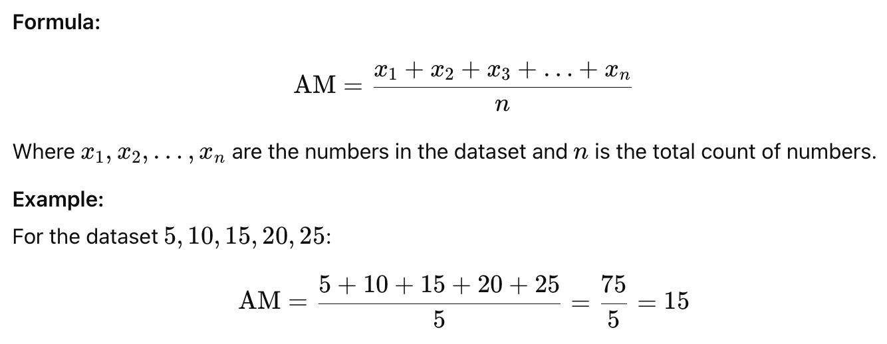
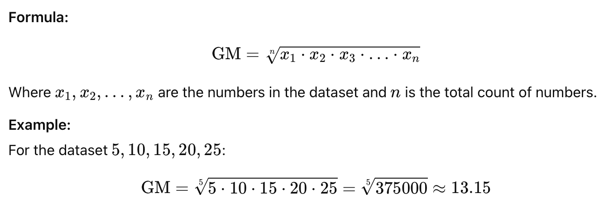
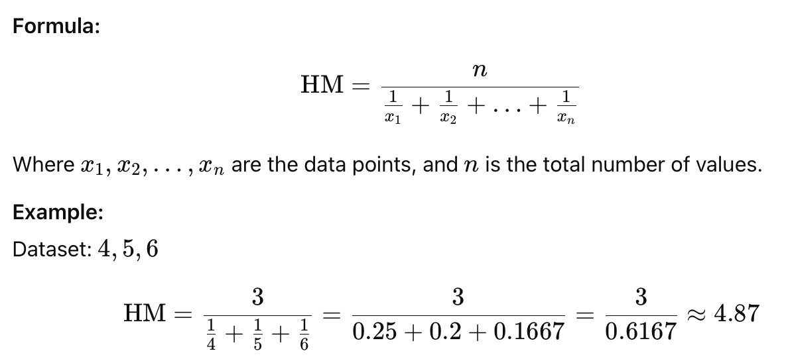
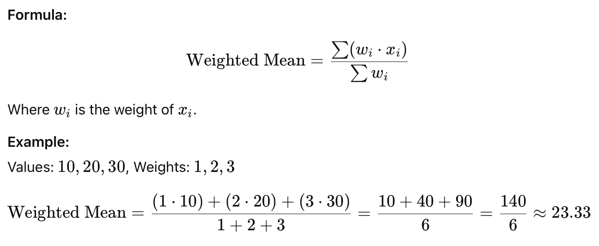
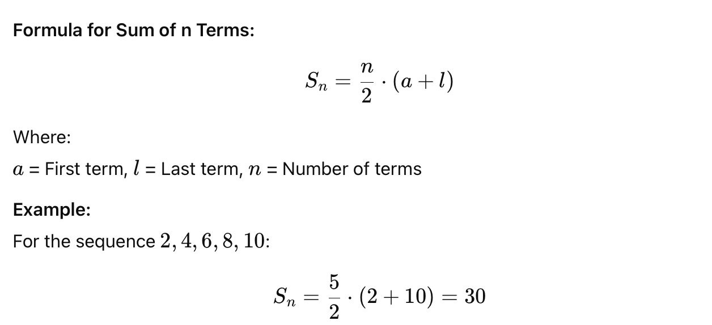
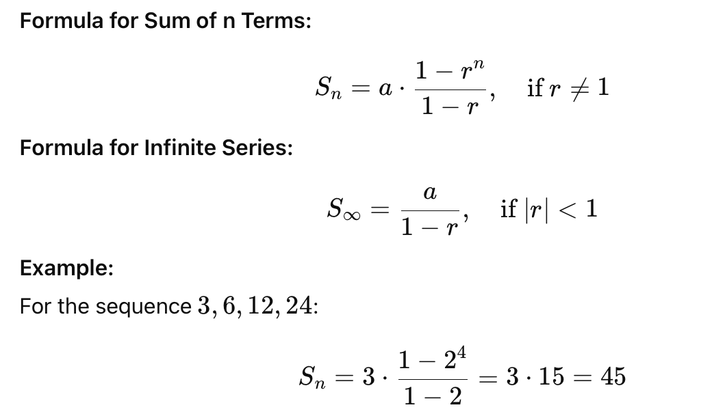
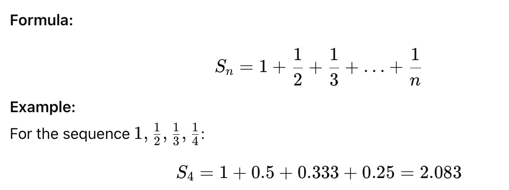
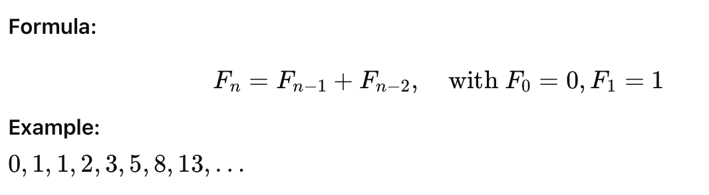

# Mathematical Algorithms - TBU

## **Positive & Non-Negative Integer**

* **Positive integer:** Any integer greater than 0 (e.g., 1, 2, 3, ...).
* **Non-negative integer:** Any integer that is either 0 or greater than 0 (e.g., 0, 1, 2, 3, ...).


0 is not a positive integer, but it is a non-negative integer.



If a <= b, it logically means b >= a.

This is because the relationship <= (less than or equal to) and >=  (greater than or equal to) are equivalent but reversed. So:

* a <= b implies that a is either **less than** or **equal to** b.
* b >= a implies that b is either **greater than** or **equal to** a.


## **Mean**

Mean is a measure of central tendency that provides an average value for a dataset. It helps summarize the data by giving a single representative value.

### **Arithmetic Mean**

The Arithmetic Mean (AM) is the sum of all numbers in a dataset divided by the count of numbers. It represents the average value of the dataset.

<figure><figcaption></figcaption></figure>

### **Geometric Mean**

The Geometric Mean (GM) is the nth root of the product of all numbers in a dataset. It is often used for datasets involving growth rates or proportional changes.

<figure><figcaption></figcaption></figure>

### **Harmonic Mean (HM)**

It is the reciprocal of the average of the reciprocals of the values, used in rates like speed or efficiency.

<figure><figcaption></figcaption></figure>

### **Weighted Mean**

The average where each value has a specific weight or importance.

<figure><figcaption></figcaption></figure>

## Series

A series is the sum of the terms of a sequence. A sequence is a list of numbers arranged in a specific order, while a series is formed by adding these numbers together.&#x20;

### **Types of Series**

1. **Finite Series:**\
   A series with a limited number of terms.\
   For the sequence 1,2,3,4,5, the corresponding finite series is: 1+2+3+4+5 = 15
2. **Infinite Series:**\
   A series with an unlimited number of terms.\
   For the sequence 1,1/2,1/3,1/4,… the infinite series is: 1+1/2+1/3+1/4+…

### **Arithmetic Series**&#x20;

The sum of terms in an arithmetic sequence, where the difference between consecutive terms is constant (d).

<figure><figcaption></figcaption></figure>

### **Geometric Series**

The sum of terms in a geometric sequence, where each term is obtained by multiplying the previous term by a fixed ratio r.

<figure><figcaption></figcaption></figure>

### **Harmonic Series**

A series where each term is the reciprocal of a positive integer.

<figure><figcaption></figcaption></figure>

### **Fibonacci Series**

A sequence where each term is the sum of the two preceding terms, starting with 0 and 1.

<figure><figcaption></figcaption></figure>

## Prime Number

A prime number is a natural number greater than 1 that has no positive divisors other than **1** and **itself**. For example, 2, 3, 5, 7, 11, and 13 are prime numbers. The number 1 is not a prime number, and composite numbers are those that have divisors other than 1 and itself (e.g., 4, 6, 8, etc.).

### **1. Basic Division Method**

Check if a number n is divisible by any number from 2 to n−1. If it is not divisible by any of them, it is a prime number.

**Steps:**

1. Start with the number n.
2. Check divisibility for all numbers between 2 and n−1.
3. If none divide n, it is prime.

**Example:** (for n=7)

Check divisors: 2,3,4,5,6\
None divide 7, so 7 is prime.

### **2. Optimized Division Method**

Instead of checking divisibility up to n−1, we only need to check divisors up to sqrt(n)​. If a number is divisible by any integer up to sqrt(n)​, it is not a prime number.

**Steps:**

1. Compute sqrt(n)​.
2. Check divisors only up to sqrt(n)​.
3. If none divide n, it is prime.

**Example:** (for n=37)&#x20;

sqrt(37)≈6.08\
Check divisors: 2,3,4,5,6\
None divide 37, so 37 is prime.

### **3. Sieve of Eratosthenes**

A highly efficient algorithm to find all prime numbers up to a given number nn.

**Steps:**

1. Create a list of integers from 2 to n.
2. Start with the first prime number (2). Mark all multiples of 2 as non-prime.
3. Move to the next unmarked number and mark all its multiples as non-prime.
4. Repeat until the square of the current number exceeds nn.
5. The remaining unmarked numbers are primes.

**Example:** (for n=10)

Start with 2,3,4,5,6,7,8,9,10\
Mark multiples of 2: 4,6,8,10.\
Mark multiples of 3: 6,9.\
Remaining primes: 2,3,5,7.

### **4. Fermat's Little Theorem**

A number n is prime if for any integer **a** such that 1<**a**\<n, the following holds:

a^(n−1) mod  n = 1&#x20;

If this condition fails for any a, n is not prime.

**Example:** (for n=7)

Let a=2:\
2^(7−1) mod  7 = 2^6 mod  7 = 64 mod  7 = 127\
The result is 1, so n=7 is prime.

