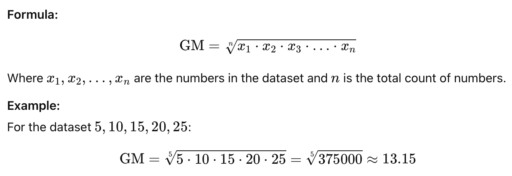
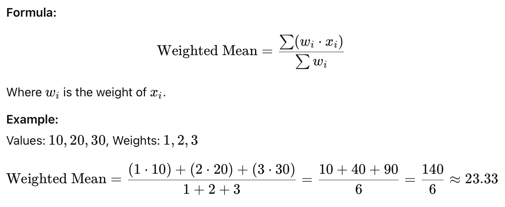
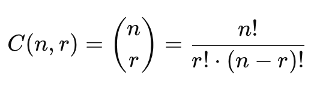

# Mathematical Algorithms

## **Positive & Non-Negative Integer**

* **Positive integer:** Any integer greater than 0 (e.g., 1, 2, 3, ...).
* **Non-negative integer:** Any integer that is either 0 or greater than 0 (e.g., 0, 1, 2, 3, ...).


0 is not a positive integer, but it is a non-negative integer.



If a <= b, it logically means b >= a.

This is because the relationship <= (less than or equal to) and >=  (greater than or equal to) are equivalent but reversed. So:

* a <= b implies that a is either **less than** or **equal to** b.
* b >= a implies that b is either **greater than** or **equal to** a.


## **Mean**

Mean is a measure of central tendency that provides an average value for a dataset. It helps summarize the data by giving a single representative value.

### **1. Arithmetic Mean**

The Arithmetic Mean (AM) is the sum of all numbers in a dataset divided by the count of numbers. It represents the average value of the dataset.

<figure><figcaption></figcaption></figure>

### **2. Geometric Mean**

The Geometric Mean (GM) is the nth root of the product of all numbers in a dataset. It is often used for datasets involving growth rates or proportional changes.

<figure><figcaption></figcaption></figure>

### **3. Harmonic Mean (HM)**

It is the reciprocal of the average of the reciprocals of the values, used in rates like speed or efficiency.

<figure><figcaption></figcaption></figure>

### **4. Weighted Mean**

The average where each value has a specific weight or importance.

<figure><figcaption></figcaption></figure>

## Series

A series is the sum of the terms of a sequence. A sequence is a list of numbers arranged in a specific order, while a series is formed by adding these numbers together.&#x20;

#### **Types of Series**

1. **Finite Series:**\
   A series with a limited number of terms.\
   For the sequence 1,2,3,4,5, the corresponding finite series is: 1+2+3+4+5 = 15
2. **Infinite Series:**\
   A series with an unlimited number of terms.\
   For the sequence 1,1/2,1/3,1/4,… the infinite series is: 1+1/2+1/3+1/4+…

### **1. Arithmetic Series**&#x20;

The sum of terms in an arithmetic sequence, where the difference between consecutive terms is constant (d).

<figure><figcaption></figcaption></figure>

### **2. Geometric Series**

The sum of terms in a geometric sequence, where each term is obtained by multiplying the previous term by a fixed ratio r.

<figure><figcaption></figcaption></figure>

### **3. Harmonic Series**

A series where each term is the reciprocal of a positive integer.

<figure><figcaption></figcaption></figure>

### **4. Fibonacci Series**

A sequence where each term is the sum of the two preceding terms, starting with 0 and 1.

<figure><figcaption></figcaption></figure>

## Prime Number

A prime number is a natural number greater than 1 that has no positive divisors other than **1** and **itself**. For example, 2, 3, 5, 7, 11, and 13 are prime numbers. The number 1 is not a prime number, and composite numbers are those that have divisors other than 1 and itself (e.g., 4, 6, 8, etc.).

### **1. Basic Division Method**

Check if a number n is divisible by any number from 2 to n−1. If it is not divisible by any of them, it is a prime number.

**Steps:**

1. Start with the number n.
2. Check divisibility for all numbers between 2 and n−1.
3. If none divide n, it is prime.

**Example:** (for n=7)

Check divisors: 2,3,4,5,6\
None divide 7, so 7 is prime.

### **2. Optimized Division Method**

Instead of checking divisibility up to n−1, we only need to check divisors up to sqrt(n)​. If a number is divisible by any integer up to sqrt(n)​, it is not a prime number.

**Steps:**

1. Compute sqrt(n)​.
2. Check divisors only up to sqrt(n)​.
3. If none divide n, it is prime.

**Example:** (for n=37)&#x20;

sqrt(37)≈6.08\
Check divisors: 2,3,4,5,6\
None divide 37, so 37 is prime.

### **3. Sieve of Eratosthenes**

A highly efficient algorithm to find all prime numbers up to a given number n.

**Steps:**

1. Create a list of integers from 2 to n.
2. Start with the first prime number (2). Mark all multiples of 2 as non-prime.
3. Move to the next unmarked number and mark all its multiples as non-prime.
4. Repeat until the square of the current number exceeds n.
5. The remaining unmarked numbers are primes.

**Example:** (for n=10)

Start with 2,3,4,5,6,7,8,9,10\
Mark multiples of 2: 4,6,8,10.\
Mark multiples of 3: 6,9.\
Remaining primes: 2,3,5,7.

### **4. Fermat's Little Theorem**

A number n is prime if for any integer **a** such that 1<**a**\<n, the following holds:

a^(n−1) mod  n = 1&#x20;

If this condition fails for any a, n is not prime.

**Example:** (for n=7)

Let a=2:\
2^(7−1) mod  7 i.e. 2^6 mod  7 i.e. 64 mod  7 = 127\
The result is 1, so n=7 is prime.

## All Factors of a Number

Factors of a number are integers that divide the number exactly (without leaving a remainder). Unlike prime factors, these include all divisors, both prime and non-prime.

For example, the factors of 12 are 1,2,3,4,6, and 12.

#### **Steps to Find All Factors of a Number**

1. Start with 1 (since 1 is a factor of every number).
2. Check all integers up to the square root of the number:
   * If i divides n, then both i and n/i​ are factors.
3. Stop when we reach the square root of the number.

## Prime Factors of a Number

Prime factors of a number are the prime numbers that divide the number exactly (without leaving a remainder). For example, The prime factors of 30 are 2, 3, and 5 because: 30 = 2 \* 3 \* 5&#x20;

#### **Steps to Find Prime Factors**

1. Start with the smallest prime number 2.
2. Divide the number by 2 as long as it is divisible.
3. Move to the next prime number (e.g., 3,5,7 etc.) and repeat.
4. Stop when the number becomes 1.

## GCD **(Greatest Common Divisor)**

The GCD (or HCF - Highest Common Factor) of two or more integers is the largest positive integer that divides each of the numbers without leaving a remainder. For example, the GCD of 12 and 18 is 6 because 6 is the largest number that divides both 12 and 18.

### **1. Using Prime Factorization**

GCD is the product of all common prime factors with the lowest powers.

Example: 12=2^2\*3^1 ,  18=2^1⋅3^2\
Common factors: 2^1⋅3^1=6.\
So, GCD(12, 18) = 6.

### **2. Using Euclidean Algorithm**

GCD(a,b) = GCD(b,a _mod_  b) until b=0.

Example: a=56, b=98

* Step 1: 98 _mod_  56 = 42.
* Step 2: 56 _mod_  42 = 14.
* Step 3: 42 _mod_  14 = 0.\
  GCD = 14.

## **LCM (Least Common Multiple)**

The LCM of two or more integers is the smallest positive integer that is divisible by each of the numbers. For example, the LCM of 12 and 18 is 36 because 36 is the smallest number that is divisible by both 12 and 18.

### **1. Using Prime Factorization**

LCM is the product of all prime factors with the highest powers.\
Example: 12=2^2\*3^1, 18=2^1⋅3^2.\
LCM = 2^2\*3^2=36.

### **2. Relation Between GCD and LCM**

<figure><figcaption></figcaption></figure>

## Palindrome

A **palindrome** is a sequence (number, string, or other data) that reads the same backward as forward. Examples include words like "radar" and "level," numbers like 121, and sentences like "A man, a plan, a canal, Panama!" (ignoring spaces, punctuation, and capitalization).

#### **Types of Palindromes**

1. **String Palindrome**\
   A word or sentence that reads the same forward and backward.\
   Examples:
   * Word: "madam"
   * Sentence: "Able was I, I saw Elba."
2. **Number Palindrome**\
   A numeric value that remains the same when its digits are reversed.\
   Examples: 121, 1331, 12321.

### 1. Reverse Check

Reverse the input and compare with original

**Steps:**

1. **Input the Data:** Accept the input sequence (string or number) to be checked.
2. **Normalize the Input (if applicable):**
   * If it’s a string, convert it to a uniform case (e.g., lowercase).
   * Remove any non-alphanumeric characters (like spaces, punctuation, etc.).
3. **Reverse the Sequence:** Create a reversed version of the input sequence.
4. **Compare the Original with the Reversed:**
   * If the original sequence is the same as the reversed sequence, it is a palindrome.
   * Otherwise, it is not a palindrome.
5. **Return the Result:** Output whether the input is a palindrome or not.

## Anagram

An **anagram** is a word or phrase formed by rearranging the letters of another, using all the original letters exactly once.\
For example:

* "listen" and "silent" are anagrams.
* "triangle" and "integral" are anagrams.

### **1. Sorting Approach**

* Sort both strings alphabetically and compare.
* **Pros:** Simple to implement and understand.
* **Cons:** Sorting has O(nlog⁡n) time complexity.

### **2. Frequency Count Using Arrays**

* Use an array of size 26 (for English alphabets) to store character counts.
* Traverse both strings to update counts and check if all counts are zero.
* **Pros:** Linear time complexity (O(n)) and space-efficient.
* **Cons:** Limited to alphabets or ASCII-based characters.

### **3. Hash Map for Character Count:**

* Use a hash map to store character counts from one string and validate with the second string.
* **Pros:** Works for strings with special characters, symbols, or Unicode.
* **Cons:** Hash map overhead increases space usage.

### **4. Bit Manipulation (For Alphabets Only):**

* Use a bit vector to represent character counts (e.g., a 26-bit integer for the alphabet).
* Increment/decrement counts using XOR operations for each character.
* Check if the result is zero.
* **Pros:** Highly optimized for specific use cases.
* **Cons:** Limited to small character sets.

### **5. Character Removal (In-Place):**

* For each character in the first string, find and remove it from the second string.
* If the second string becomes empty and no unmatched characters remain, they are anagrams.
* **Pros:** Simple for small strings.
* **Cons:** Inefficient for larger strings (O(n^2)).

## **Combination**

A combination is a way of selecting items from a group, **where the order does not matter**.\
For example, selecting 2 fruits from {Apple, Banana, Cherry} gives the combinations: {Apple, Banana}, {Apple, Cherry}, {Banana, Cherry}.

**Formula:** The number of combinations of r items from a set of n items is given by:

<figure><figcaption></figcaption></figure>

Where n! (n factorial) is the product of all positive integers from 1 to n:\
n!=n⋅(n−1)⋅(n−2)⋅⋯⋅1

**Example:** Find the number of ways to select 2 items from a group of 4 items: {A, B, C, D}.

<figure><figcaption></figcaption></figure>

Combinations: {A, B}, {A, C}, {A, D}, {B, C}, {B, D}, {C, D}.

### **1. Formula Method**

Use the formula for combinations

**Steps:**

1. Compute the factorial of n, r, and n−r.
2. Substitute the values into the formula.
3. Simplify the result.

### **2. Using Pascal’s Triangle**

Pascal's Triangle provides a visual representation of combinations. Each entry in the triangle represents C(n,r).

<figure><figcaption></figcaption></figure>

**Steps:**

1. Construct Pascal’s Triangle row by row.
2. The r-th entry in the n-th row gives C(n,r).

**Example:** To find C(5,2), go to the 5th row (starting from 0), and pick the 2nd element:\
**Result: C(5,2)=10**.

### **3. Iterative Method (Optimized)**

Instead of calculating factorials, the combination formula can be simplified iteratively:

<figure><figcaption></figcaption></figure>

**Steps:**

1. Start multiplying n down to (n−r+1).
2. Divide the result by r!.

**Example:** Find C(5,2):\
Numerator: 5⋅4=20\
Denominator: 2!=2\
C(5,2)=20/2=10\
**Result: 10**.

### **4. Using Recursion**

The combination formula can be represented recursively as:

<figure><figcaption></figcaption></figure>

**Steps:**

1. Break down the problem into smaller subproblems using recursion.
2. Use the base cases for termination.

**Example:** Find C(5,2)C(5,2):

C(5,2)=C(4,1)+C(4,2)

C(4,1)=4,  C(4,2)=6

**Result: C(5,2)=4+6=10**

### **6. Using Binomial Theorem**

Combinations are directly linked to the coefficients in the Binomial Expansion:

<figure><figcaption></figcaption></figure>

We can find the binomial coefficients directly from the combination formula.

**Example:** Expand (x+y)^5:\
Coefficients: C(5,0), C(5,1), C(5,2), C(5,3), C(5,4), C(5,5)\
C(5,2)=10C(5,2)=10.\
**Result: 10**.

## **Permutation**

A permutation is a way of arranging items, **where the order matters**.\
For example, arranging 2 fruits from {Apple, Banana, Cherry} gives the permutations:\
(Apple, Banana), (Banana, Apple), (Apple, Cherry), (Cherry, Apple), (Banana, Cherry), (Cherry, Banana).

**Formula:** The number of permutations of rr items from a set of n items is given by:

<figure><figcaption></figcaption></figure>

**Example:** Find the number of ways to arrange 2 items from a group of 4 items: {A, B, C, D}.

<figure><figcaption></figcaption></figure>

Permutations: (A, B), (A, C), (A, D), (B, A), (B, C), (B, D), (C, A), (C, B), (C, D), (D, A), (D, B), (D, C).

## Matrix

### About

A matrix is a rectangular arrangement of numbers, symbols, or expressions in rows and columns. Matrices are widely used in mathematics, computer science, and engineering for representing data, solving equations, and performing linear transformations.

### **Matrix Representation**

A matrix is typically denoted by a capital letter, and its elements are represented as aij​, where:

* i: Row index (1-based or 0-based).
* j: Column index (1-based or 0-based).

Example of a 3×3 matrix:

<figure><figcaption></figcaption></figure>

### **Types of Matrices**

<figure><figcaption></figcaption></figure>

<figure><figcaption></figcaption></figure>

<figure><figcaption></figcaption></figure>

### Matrix Operations

#### **1. Matrix Addition**

Add two matrices by summing their corresponding elements. The matrices must have the same dimensions.

**Steps**

1. Check if the dimensions of both matrices are the same.
2. Initialize a new matrix to store the result.
3. Loop through each row.
   * For each row, loop through each column.
   * Add the corresponding elements from the two matrices and store them in the result matrix.
4. Return the result matrix.

#### **2. Matrix Subtraction**

Subtract one matrix from another by subtracting their corresponding elements. The matrices must have the same dimensions.

**Steps**

1. Check if the dimensions of both matrices are the same.
2. Initialize a new matrix to store the result.
3. Loop through each row.
   * For each row, loop through each column.
   * Subtract the corresponding elements of the second matrix from the first and store them in the result matrix.
4. Return the result matrix.

#### **3. Matrix Multiplication**

Multiply two matrices. The number of columns in the first matrix must equal the number of rows in the second matrix. The result matrix will have dimensions rows(A)×columns(B)rows(A)×columns(B).

**Steps**

1. Check if the number of columns in the first matrix equals the number of rows in the second matrix.
2. Initialize a result matrix with dimensions rows(A)×columns(B)rows(A)×columns(B) and fill it with zeros.
3. Loop through each row of the first matrix.
   * For each row, loop through each column of the second matrix.
   * Calculate the dot product of the current row from the first matrix and the current column from the second matrix.
   * Store the result in the corresponding position in the result matrix.
4. Return the result matrix.

#### **4. Matrix Transpose**

Flip a matrix over its diagonal, converting rows into columns and columns into rows.

**Steps**

1. Initialize a result matrix with dimensions columns(A)×rows(A)columns(A)×rows(A).
2. Loop through each row.
   * For each row, loop through each column.
   * Set result\[j]\[i]=A\[i]\[j]result\[j]\[i]=A\[i]\[j], where ii is the row index and jj is the column index.
3. Return the transposed matrix.

#### **5. Scalar Multiplication**

Multiply every element of a matrix by a scalar value.

**Steps**

1. Initialize a result matrix with the same dimensions as the input matrix.
2. Loop through each row.
   * For each row, loop through each column.
   * Multiply the current element by the scalar and store it in the result matrix.
3. Return the result matrix.

#### **6. Matrix Trace**

The trace of a matrix is the sum of its diagonal elements. Only applicable to square matrices.

**Steps**

1. Ensure the matrix is square.
2. Initialize a variable trace=0.
3. Loop through the diagonal elements (where row index equals column index).
   * Add the element to tracetrace.
4. Return the trace.

## **Swapping Two Numbers**

Swapping two numbers is a basic operation in programming.

**Different Ways to Achieve it**

### **1. Using a Temporary Variable**

**Steps**

1. Declare a temporary variable.
2. Assign the value of the first number to the temporary variable.
3. Assign the value of the second number to the first number.
4. Assign the value of the temporary variable to the second number.

### 2. **Without Using a Temporary Variable (Arithmetic Method)**

**Steps (Using Addition and Subtraction)**

1. Add the two numbers: a=a+b.
2. Subtract the second number from the sum: b=a−b.
3. Subtract the new second number from the sum: a=a−b.

**Steps (Using Multiplication and Division)**

1. Multiply the two numbers: a=a×b (ensure b≠0).
2. Divide the product by the second number: b=a/b.
3. Divide the new second number by the first number: a=a/b.

### **3. Using Bitwise XOR**

**Steps**

1. Perform XOR operation on the two numbers: a=a⊕ba=a⊕b.
2. Perform XOR operation again with the second number: b=a⊕bb=a⊕b.
3. Perform XOR operation again with the first number: a=a⊕ba=a⊕b.

**Example**

Let a=5 (01010101 in binary), b=10 (10101010 in binary):

* a=a⊕b=1111 (15 in decimal),
* b=a⊕b=0101 (5 in decimal),
* a=a⊕b=1010 (10 in decimal).

### **4. Using Stack**

**Steps**

1. Push both numbers onto a stack.
2. Pop the numbers in reverse order.

**Example:**

Stack operations:

* Push a=5, b=10 onto the stack.
* Pop b, then a in reverse order.

### **5. Using Deque (Double-Ended Queue)**

**Steps:**

1. Insert both numbers into a deque.
2. Pop elements from the opposite ends to swap.
