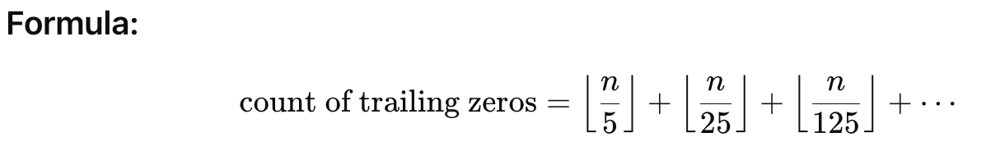

# Problems - Set 2

## Easy

### Circular Problem

Determine the position where the A-th item will be delivered in a circle of size B, starting from position C.


* **Understanding the Circle Behavior:**
  * The positions are numbered from 1 to B, forming a circle.
  * After B, the numbering wraps around to 1.
*   **Determine the Position:**

    * Starting at position C, we deliver items sequentially.
    * The A-th item is delivered at the position calculated as:

    Position=(C+A−1)%B

    * If the result of the modulo operation is 0, it means the position wraps around to B.


```java
public static int findPosition(int A, int B, int C) {
        // Calculate the position
        int position = (C + A - 1) % B;

        // If position is 0, it means we are at the last position in the circle
        return position == 0 ? B : position;
    }
```

### Number Divisibility

Given a  number represent in the form of an integer array **A**, where each element is a digit. We have to find whether there exists any permutation of the array **A** such that the number becomes divisible by 60. Return 1 if it exists, 0 otherwise.


#### **Approach**

1. **Check for 0 (Divisibility by 5 and 2)**
   1. The number must contain at least one 0 because the last digit must be 0 for divisibility by 60.
2. **Check for Divisibility by 3:**
   1. Compute the sum of the digits in A.
   2. If the sum is divisible by 3, this condition is satisfied.
3. **Check for an Additional Even Digit:**
   1. Besides the 0 required for divisibility by 5, ensure there is at least one more even digit (2,4,6,8) to satisfy divisibility by 2.
4. Check for edge case like all number 0


```java
public static int isDivisibleBy60(int[] A) {
        boolean hasZero = false; // To check if 0 is present
        int sumOfDigits = 0; // Sum of all digits
        int evenCount = 0; // Count of even digits (including 0)
        int nonZeroCount = 0; // Count of non-zero digits

        // Iterate through the array
        for (int digit : A) {
            if (digit == 0) {
                hasZero = true; // Mark that 0 is found
            } else {
                nonZeroCount++; // Count non-zero digits
            }
            if (digit % 2 == 0) {
                evenCount++; // Count even digits
            }
            sumOfDigits += digit; // Add the digit to the sum
        }

        // Special case: All zeros
        if (nonZeroCount == 0) {
            return 1; // A number like 0 or 00 is divisible by 60
        }

        // General case: Check all conditions for divisibility by 60
        if (hasZero && sumOfDigits % 3 == 0 && evenCount > 1) {
            return 1; // A permutation exists that is divisible by 60
        }

        return 0; // No valid permutation exists
    }
```

### Line Segment Intersection

Given two straight line segments (represented as a start point and an end point), compute the point of intersection, if any.

#### Basics

Each segment can be seen as part of an infinite line in 2D space.

We can represent each line in the **general form**:

Ax+By=C

For a line from (x<sub>1</sub>,y<sub>1</sub>) to (x<sub>2</sub>,y<sub>2</sub>), the general form is:

* A=y<sub>2</sub>−y<sub>1</sub>
* B=x<sub>1</sub>−x<sub>2</sub>
* C=A⋅x<sub>1</sub>+B⋅y<sub>1</sub>,

#### For the two lines:

**Line 1** (through P1,P2​):

A<sub>1</sub>=y<sub>2</sub>−y<sub>1</sub>, B<sub>1</sub>=x<sub>1</sub>−x<sub>2</sub>, C<sub>1</sub>=A<sub>1</sub>x<sub>1</sub>+B<sub>1</sub>y<sub>1</sub>&#x20;

**Line 2** (through P3,P4​):

A<sub>2</sub>=y<sub>4</sub>−y,,B<sub>2</sub>=x<sub>3</sub>−x<sub>4</sub>,C<sub>2</sub>=A<sub>2</sub>x<sub>3</sub>+B<sub>2</sub>y<sub>3</sub>

#### Solve the Linear System

Now solve:

A<sub>1</sub>x+B<sub>1</sub>y=C<sub>1</sub>        A<sub>2</sub>x+B<sub>2</sub>y=C<sub>2</sub>​

Use **Cramer's Rule** or matrix inversion. The determinant is:

det=A<sub>1</sub>B<sub>2</sub>−A<sub>2</sub>B<sub>1</sub>

If `det = 0`, the lines are **parallel** or **coincident** (no unique intersection).

Otherwise, the intersection point (x,y) is:

x=B<sub>2</sub>C<sub>1</sub>−B<sub>1</sub>C<sub>2</sub>/det &#x20;

y=A<sub>1</sub>C<sub>2</sub>−A<sub>2</sub>C<sub>1</sub>/det

#### Check if the Point Lies on Both Segments

The above point lies on the **infinite lines**. You must ensure it lies **within the bounds of both segments**.

For a point r=(x,y) to lie on segment P=(x<sub>1</sub>,y<sub>1</sub>) to Q=(x<sub>2</sub>,y<sub>2</sub>), it must satisfy:

min⁡(x<sub>1</sub>,x<sub>2</sub>) ≤ x ≤ max⁡(x<sub>1</sub>,x<sub>2</sub>)

min⁡(y<sub>1</sub>,y<sub>2</sub>) ≤ y ≤ max⁡(y<sub>1</sub>,y<sub>2</sub>)

Repeat for both segments.

#### Solution

```java
public class LineIntersection {

    static class Point {
        double x, y;
        Point(double x, double y) { this.x = x; this.y = y; }

        @Override
        public String toString() {
            return "(" + x + ", " + y + ")";
        }
    }

    // Function to compute the intersection of two segments
    public static Point getIntersection(Point p1, Point p2, Point p3, Point p4) {
        double A1 = p2.y - p1.y;
        double B1 = p1.x - p2.x;
        double C1 = A1 * p1.x + B1 * p1.y;

        double A2 = p4.y - p3.y;
        double B2 = p3.x - p4.x;
        double C2 = A2 * p3.x + B2 * p3.y;

        double determinant = A1 * B2 - A2 * B1;

        if (determinant == 0) {
            // Lines are parallel or coincident
            return null;
        } else {
            double x = (B2 * C1 - B1 * C2) / determinant;
            double y = (A1 * C2 - A2 * C1) / determinant;

            Point intersection = new Point(x, y);

            if (isOnSegment(p1, p2, intersection) && isOnSegment(p3, p4, intersection)) {
                return intersection;
            } else {
                return null; // Intersection point is outside the segments
            }
        }
    }

    private static boolean isOnSegment(Point p, Point q, Point r) {
        return r.x >= Math.min(p.x, q.x) && r.x <= Math.max(p.x, q.x) &&
               r.y >= Math.min(p.y, q.y) && r.y <= Math.max(p.y, q.y);
    }

    public static void main(String[] args) {
        Point p1 = new Point(1, 1);
        Point p2 = new Point(4, 4);

        Point p3 = new Point(1, 4);
        Point p4 = new Point(4, 1);

        Point intersection = getIntersection(p1, p2, p3, p4);
        System.out.println(intersection != null ? "Intersection at: " + intersection : "No intersection");
    }
}
```

### Tic Tac Toe

Design an algorithm to figure out if someone has won a game of tic-tac-toe.

* Board is a **3x3 grid**.
* Each cell is either: `'X'`, `'O'`, or `null` / `''` (empty).
* Determine if `'X'` or `'O'` has won.
* A win occurs when a player has **3 of their marks** in:
  * A row
  * A column
  * A diagonal

```java
public class TicTacToeWinner {

    public static Character checkWinner(char[][] board) {
        // Check rows
        for (int i = 0; i < 3; i++) {
            if (board[i][0] != '\0' &&
                board[i][0] == board[i][1] &&
                board[i][1] == board[i][2]) {
                return board[i][0];
            }
        }

        // Check columns
        for (int j = 0; j < 3; j++) {
            if (board[0][j] != '\0' &&
                board[0][j] == board[1][j] &&
                board[1][j] == board[2][j]) {
                return board[0][j];
            }
        }

        // Check diagonals
        if (board[0][0] != '\0' &&
            board[0][0] == board[1][1] &&
            board[1][1] == board[2][2]) {
            return board[0][0];
        }

        if (board[0][2] != '\0' &&
            board[0][2] == board[1][1] &&
            board[1][1] == board[2][0]) {
            return board[0][2];
        }

        // No winner
        return null;
    }

    public static void main(String[] args) {
        char[][] board = {
            {'X', 'O', 'X'},
            {'O', 'X', 'O'},
            {'O', 'X', 'X'}
        };

        Character winner = checkWinner(board);
        System.out.println(winner != null ? "Winner: " + winner : "No winner");
    }
}
```

### Trailing zeros in n factorial

Write an algorithm which computes the number of trailing zeros in n factorial.

Trailing zeros are the zeros at the end of a number.

Example:\
`120` has **1** trailing zero\
`1000` has **3** trailing zeros

Trailing zeros are formed when the number is divisible by powers of 10.

#### What causes a 10 in factorial?

Every time we multiply numbers, a 10 is produced when we multiply `2 × 5`.

In a factorial like `n! = 1 × 2 × 3 × ... × n`, there are many 2s and many 5s.

But **5s are less frequent** than 2s, so:

* The number of 10s = the number of times 5 appears in the prime factors of `n!`.

So the number of trailing zeros is equal to the number of times `5` appears as a factor in `n!`.

#### How do we count how many 5s are there?

We look for:

* Numbers divisible by 5: these give **one 5**
* Numbers divisible by 25: these give **two 5s**
* Numbers divisible by 125: these give **three 5s**, and so on.

So we add:

```
n / 5  +  n / 25  +  n / 125  + ...
```

We stop when the division result becomes zero.

#### Example: n = 100

```
100 / 5   = 20   → 20 numbers give at least one 5
100 / 25  = 4    → 4 of them give an extra 5
100 / 125 = 0    → done
```

So, total number of trailing zeros = 20 + 4 = 24

<figure><figcaption></figcaption></figure>

```java
public class FactorialTrailingZeros {

    public static int countTrailingZeros(int n) {
        int count = 0;
        for (int i = 5; n / i >= 1; i *= 5) {
            count += n / i;
        }
        return count;
    }

    public static void main(String[] args) {
        int n = 20;
        int zeros = countTrailingZeros(n);
        System.out.println("Trailing zeros in " + n + "! = " + zeros);
    }
}
```

### Smallest Difference

Given two arrays of integers, compute the pair of values (one value in each array) with the smallest (non-negative) difference. Return the difference.

Example

Input: a = {1, 3, 15, 11, 2}, b = {23, 127,235, 19, 8}

Output: 3. That is, the pair (11, 8).

#### Solution 1: Brute-force approach

```java
package algo;

public class Problem1 {
    public static void main(String[] args) {
        int[] a = {1, 3, 15, 11, 2};
        int[] b = {23, 127,235, 19, 8};
        int a1 = 0, b1 = 0;
        int diff = Integer.MAX_VALUE;

        for (int i = 0; i < a.length; i++) {
            for (int j = 0; j < b.length; j++) {
                if (Math.abs(a[i] - b[j]) < diff) {
                    diff = Math.abs(a[i] - b[j]);
                    a1 = a[i];
                    b1 = b[j];
                }
            }
        }
        System.out.println("a = " + a1 + " b = " + b1 + " diff = " + diff);
    }
}
```

Time Complexity: **O(n × m)**

This works by comparing every pair from array `a` and `b` using two nested loops.

#### Solution 2: Optimized Approach (Using Sorting + Two Pointers)

*   Sort both arrays:

    ```
    a = [1, 2, 3, 11, 15]
    b = [8, 19, 23, 127, 235]
    ```
* Use two pointers `i` and `j` to walk through `a` and `b`:
  * If `a[i] < b[j]`, try next value in `a` (increase `i`)
  * If `a[i] > b[j]`, try next value in `b` (increase `j`)
  * Always track the current absolute difference
* Stop when we reach the end of either array.

```java
import java.util.Arrays;

public class SmallestDifference {

    public static int findSmallestDifference(int[] a, int[] b) {
        Arrays.sort(a);
        Arrays.sort(b);

        int i = 0, j = 0;
        int minDiff = Integer.MAX_VALUE;
        int a1 = 0, b1 = 0;

        while (i < a.length && j < b.length) {
            int diff = Math.abs(a[i] - b[j]);

            if (diff < minDiff) {
                minDiff = diff;
                a1 = a[i];
                b1 = b[j];
            }

            // Move the pointer with the smaller value
            if (a[i] < b[j]) {
                i++;
            } else {
                j++;
            }
        }

        System.out.println("a = " + a1 + ", b = " + b1 + ", diff = " + minDiff);
        return minDiff;
    }

    public static void main(String[] args) {
        int[] a = {1, 3, 15, 11, 2};
        int[] b = {23, 127, 235, 19, 8};

        findSmallestDifference(a, b);
    }
}
```

#### Time Complexity

* Sorting: O(n log n + m log m)
* Linear scan: O(n + m)
* **Total: O(n log n + m log m)**


## Medium

### Operations

Write methods to implement the multiply, subtract, and divide operations for integers.\
The results of all of these are integers. Use only the add operator

```java
public static void main(String[] args) {
    System.out.println("Subtract: " + subtract(10, 4)); // 6
    System.out.println("Multiply: " + multiply(-3, 5)); // -15
    System.out.println("Divide: " + divide(20, -4));    // -5
}
```

#### Subtract using only `+`

To subtract `b` from `a`, add the **negative of b** to a.

```java
public static int negate(int x) {
    int neg = 0;
    int delta = x > 0 ? -1 : 1;
    while (x != 0) {
        x += delta;
        neg += delta;
    }
    return neg;
}

public static int subtract(int a, int b) {
    return a + negate(b);
}
```

#### Multiply using only `+`

Multiply `a` and `b` by adding `a` repeatedly `|b|` times.

```java
public static int multiply(int a, int b) {
    if (a == 0 || b == 0) return 0;

    boolean negative = false;
    if (b < 0) {
        b = negate(b);
        negative = !negative;
    }
    if (a < 0) {
        a = negate(a);
        negative = !negative;
    }

    int result = 0;
    for (int i = 0; i < b; i++) {
        result += a;
    }

    return negative ? negate(result) : result;
}
```

#### Divide using only `+`

Use repeated subtraction to see how many times `b` fits into `a`.

```java
public static int divide(int a, int b) {
    if (b == 0) throw new ArithmeticException("Division by zero");

    boolean negative = false;
    if (a < 0) {
        a = negate(a);
        negative = !negative;
    }
    if (b < 0) {
        b = negate(b);
        negative = !negative;
    }

    int quotient = 0;
    int sum = 0;
    while (sum + b <= a) {
        sum += b;
        quotient++;
    }

    return negative ? negate(quotient) : quotient;
}
```

### Board Lengths

There are two types of planks, one of length shorter and one of length longer. We must use exactly **K** planks of wood. Write a method to generate all possible lengths for the board.

#### Solution 1:  **Brute Force (Two nested loops)**

Loop through all combinations of shorter and longer planks that add up to `k`.

```java
public static Set<Integer> boardBruteForce(int shorter, int longer, int k) {
    Set<Integer> result = new HashSet<>();
    for (int i = 0; i <= k; i++) {
        int numShorter = i;
        int numLonger = k - i;
        int totalLength = numShorter * shorter + numLonger * longer;
        result.add(totalLength);
    }
    return result;
}
```

#### Time Complexity

* O(k) because we loop from `0` to `k` and compute a single value each time.

#### **Solution 2: Optimized Approach (No Set, No Duplicates)**

We avoid using a `Set` and simply **generate values in a loop** if `shorter != longer`.

```java
public static List<Integer> boardOptimized(int shorter, int longer, int k) {
    List<Integer> result = new ArrayList<>();
    if (k == 0) return result;

    if (shorter == longer) {
        result.add(shorter * k);  // Only one possible length
        return result;
    }

    for (int i = 0; i <= k; i++) {
        int totalLength = i * shorter + (k - i) * longer;
        result.add(totalLength);
    }

    return result;
}
```

#### Time Complexity

* O(k)
* No duplicate check needed as each value is guaranteed unique if `shorter != longer`.

### Sub Sort

Given an array, find the smallest subarray (from index m to n) such that if this part is sorted, the entire array becomes sorted. We aim to **minimize** `n - m`.

1. Find where the array stops being sorted from **left to right**.
2. Find where the array stops being sorted from **right to left**.
3. Then:
   * Find **min** and **max** in the unsorted region.
   * Expand the left (`m`) to include any number greater than `min`.
   * Expand the right (`n`) to include any number less than `max`.

#### Explanation

Given:\
`[1, 2, 4, 7, 10, 11, 7, 12, 6, 7, 16, 18, 19]`

1. Find the **first dip** from the left where array is no longer sorted:\
   Index `5` → `11 > 7`
2. Find the **first rise** from the right where array is no longer sorted:\
   Index `8` → `6 < 7`

So the unsorted window is initially from `6` to `8`: `[7, 12, 6]`\
→ But we now find the **min = 6**, **max = 12**

3.  Expand `m` to include any number greater than `min (6)`\
    → Expand left: 4th index is `10` > 6\
    → 3rd index is `7` > 6\
    → 2nd index is `4` < 6 → stop

    So `m = 3`
4.  Expand `n` to include any number less than `max (12)`\
    → 9th is 7 < 12\
    → 10th is 16 > 12 → stop

    So `n = 9`&#x20;

```java
public static int[] findUnsortedSubarray(int[] arr) {
    int n = arr.length;

    // Step 1: find the initial left boundary
    int left = 0;
    while (left < n - 1 && arr[left] <= arr[left + 1]) {
        left++;
    }
    if (left == n - 1) return new int[]{-1, -1}; // already sorted

    // Step 2: find the initial right boundary
    int right = n - 1;
    while (right > 0 && arr[right] >= arr[right - 1]) {
        right--;
    }

    // Step 3: find min and max in subarray [left, right]
    int min = Integer.MAX_VALUE;
    int max = Integer.MIN_VALUE;
    for (int i = left; i <= right; i++) {
        min = Math.min(min, arr[i]);
        max = Math.max(max, arr[i]);
    }

    // Step 4: expand left
    while (left > 0 && arr[left - 1] > min) {
        left--;
    }

    // Step 5: expand right
    while (right < n - 1 && arr[right + 1] < max) {
        right++;
    }

    return new int[]{left, right};
}

public static void main(String[] args) {
    int[] arr = {1, 2, 4, 7, 10, 11, 7, 12, 6, 7, 16, 18, 19};
    int[] result = findUnsortedSubarray(arr);
    System.out.println("(" + result[0] + ", " + result[1] + ")");
    // Output: (3, 9)
}
```


## Difficult

### Powerful Divisors

Given an integer array **A** of length **N**.\
For every integer **X** in the array, we have to find out the number of integers **Y**, such that **1 <= Y <= X**, and the number of divisors of Y is a power of 2.

For example, 6 has the following divisors - \[1, 2, 3, 6]. This is equal to 4, which is a power of 2.\
On the other hand, 9 has the following divisors \[1, 3, 9] which is 3, which is not a power of 2. Return an array containing the answer for every X in the given array.


**Example**\
Input 1: A = \[1, 4]

Output 1: \[1, 3]

Input 2: A = \[5, 10]

Output 2: \[4, 8]



Optimized Approach

We can optimize the code by:

1. Precomputing the divisor counts for all numbers up to the maximum value in the input list.
2. Using a single array to store the count of "powerful divisors" for each number.
3. Reusing computed results instead of recalculating them.


```java
import java.util.ArrayList;
import java.util.List;

public class PowerfulDivisors {

    public static List<Integer> powerfulDivisors(ArrayList<Integer> A) {
        // Find the maximum number in the input array
        int maxNumber = A.stream().max(Integer::compare).orElse(0);

        // Precompute divisor counts for all numbers up to maxNumber
        int[] divisorCounts = new int[maxNumber + 1];
        for (int i = 1; i <= maxNumber; i++) {
            for (int j = i; j <= maxNumber; j += i) {
                divisorCounts[j]++;
            }
        }

        // Precompute whether a divisor count is a power of 2
        boolean[] isPowerful = new boolean[maxNumber + 1];
        for (int i = 1; i <= maxNumber; i++) {
            if (isPowerOfTwo(divisorCounts[i])) {
                isPowerful[i] = true;
            }
        }

        // Compute the number of "powerful divisors" for each number using cumulative approach
        int[] powerfulDivisorCounts = new int[maxNumber + 1];
        for (int i = 1; i <= maxNumber; i++) {
            powerfulDivisorCounts[i] = powerfulDivisorCounts[i - 1] + (isPowerful[i] ? 1 : 0);
        }

        // Generate the result for the input array
        List<Integer> result = new ArrayList<>();
        for (int num : A) {
            result.add(powerfulDivisorCounts[num]);
        }

        return result;
    }

    private static boolean isPowerOfTwo(int n) {
        return n > 0 && (n & (n - 1)) == 0;
    }

    public static void main(String[] args) {
        ArrayList<Integer> input = new ArrayList<>(List.of(10, 15, 20));
        System.out.println(powerfulDivisors(input)); // Output: [8, 11, 15]
    }
}

```


