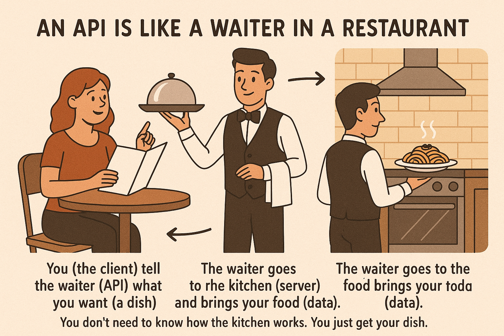

# API

## About

An **API** (Application Programming Interface) is a way for different software systems to **talk to each other**. It defines **rules and protocols** that allow applications to **request and exchange data**.

We can think of an API as a **waiter in a restaurant**:

* We (the client) tell the waiter (API) what we want (a dish).
* The waiter goes to the kitchen (server) and brings our food (data).
* We don’t need to know how the kitchen works. We just get our dish.

<figure><figcaption></figcaption></figure>

## How APIs Are Used in Applications ?

APIs are used in almost every modern application to **communicate between systems**, **fetch data**, **send user inputs to a server**, or **connect with third-party services**. Whether we are using a web application, mobile app, desktop software, or even IoT devices, chances are APIs are involved.

#### 1. APIs Connect Frontend and Backend

When we open a mobile or web application, what we see on the screen is the **frontend** (user interface). However, the real data—like our profile, messages, transactions, or orders—lives in the **backend** (server and database).\
To access that data, the frontend sends **API requests** to the backend.

Example: In a shopping app

* When we tap “My Orders,” the frontend sends a request to an API endpoint like:\
  `/api/orders/user/123`
* The backend receives the request, fetches data from the database, and sends it back.
* The frontend then displays that order information to we.

#### 2. APIs Power User Actions

Every meaningful action a user performs—like logging in, signing up, searching, saving, or deleting—results in an API call.

Examples:

* **Login**: Sends username and password to the `POST /login` API
* **Search**: Sends keywords to the `GET /products?query=laptop` API
* **Add to Cart**: Sends product ID to the `POST /cart/add` API

In all of these, the UI just provides a form or button, but the action is performed by calling an API.

#### 3. APIs Connect to External Services

Applications rarely work in isolation. They often depend on third-party systems. APIs allow our app to integrate with these systems easily.

Examples:

* Using **Google Maps API** to show a location
* Using a **payment gateway API** (like Stripe or Razorpay) to process payments
* Using **SMS or Email APIs** (like Twilio, SendGrid) to send messages or OTPs

Our system doesn't have to rebuild these features—it just consumes existing APIs.

#### 4. APIs Enable Mobile/Desktop Apps to Work Just Like Web Apps

When we use a mobile app, it may not have its own internal logic or database. Instead, it works like a **thin client**—sending requests to a centralized backend through APIs.

This makes it easier to:

* Keep logic consistent across platforms (web, mobile, desktop)
* Centralize data management
* Update the backend without needing to change each client app

#### 5. APIs Help Microservices Communicate

In large backend systems, different modules may be split into microservices. For example:

* One service handles users
* Another handles orders
* Another handles payments

These services **talk to each other via internal APIs**. It makes the system modular, easier to scale, and maintainable.

#### 6. APIs Enable Automation and Integration

APIs are not just for user-facing apps. Many systems use APIs to:

* Automate tasks (e.g., triggering builds or reports)
* Integrate with other systems (e.g., CRM or ERP tools)
* Export/import data between platforms

For example, an e-commerce platform might push order updates to a logistics provider through an API.

