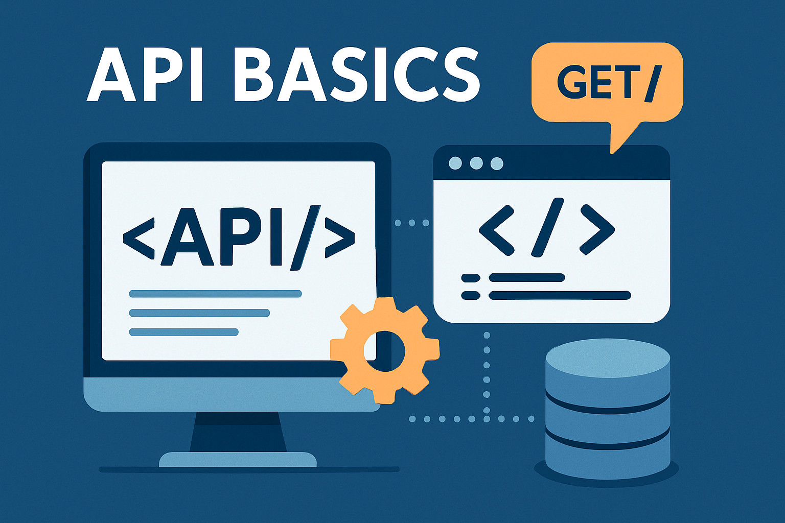

# API Basics

## About

The **API Basics** section is designed to help us understand the **fundamentals of APIs (Application Programming Interfaces) -** what they are, why they matter, and how they are used in modern software systems.

Whether we are just starting with APIs or looking to refresh our understanding, this section will give us the essential knowledge needed to work with APIs confidently.

<figure><figcaption></figcaption></figure>
