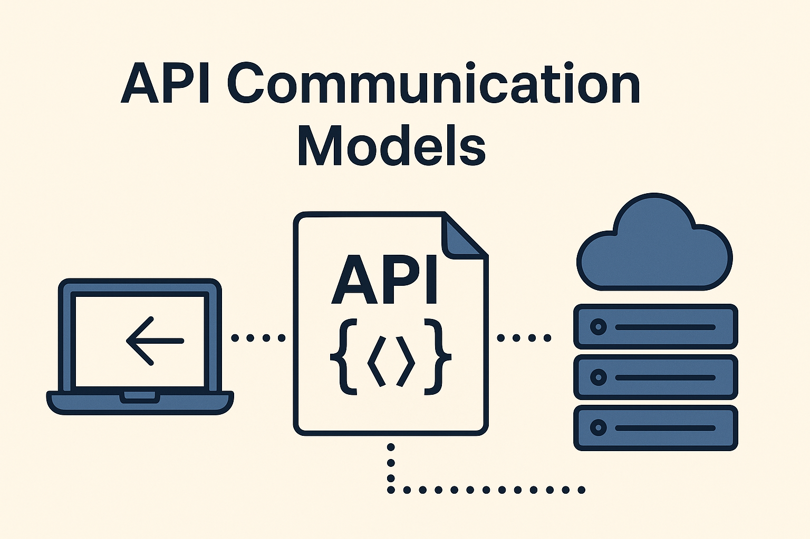

# API Communication Patterns

## About

In software systems, the way different components communicate through APIs can greatly influence performance, scalability, responsiveness, and user experience. **API communication models** define how messages are exchanged between clients and servers or between different services.

At its core, communication is about **how data flows**, when responses are expected, and how systems behave during that interaction. Whether we're building APIs for real-time applications, background jobs, or external integrations, choosing the right communication model is crucial.

Communication between systems can follow different styles depending on the **timing of the response**, the **interaction flow**, and the **architecture of the system**. Understanding these models helps in designing APIs that are efficient, reliable, and suitable for the use case.

Key aspects that determine the communication model include:

* **Response timing**: Whether the client waits for a response or continues independently.
* **Interaction flow**: Whether messages are exchanged directly, through intermediaries, or as events.
* **Data delivery behavior**: How reliably and timely the data needs to be delivered.

Some systems prioritize **immediacy**, like online banking or e-commerce APIs, while others focus on **throughput and decoupling**, like analytics pipelines or messaging systems. As applications become more distributed and event-driven, a strong grasp of API communication models becomes a necessary skill for backend, integration, and full-stack developers.

<figure><figcaption></figcaption></figure>

## Importance of Learning

Understanding API communication models is essential for anyone involved in designing, building, or consuming APIs—whether we're a backend developer, system architect, or integration engineer. Communication models define **how systems talk to each other**, which directly impacts system performance, reliability, and scalability.

**1. Designing APIs That Fit the Use Case**

Different applications have different communication needs:

* Real-time systems like chat apps or live dashboards require asynchronous, event-based models.
* Payment or order systems may need synchronous, request-response models for immediate confirmation.

Knowing the right communication style allows us to match the API behavior with the business requirement.

**2. Improving Performance and Responsiveness**

Using asynchronous communication or non-blocking patterns can help reduce wait times and improve the responsiveness of our application. For instance, instead of blocking the client while the server processes data, the client can move on and react when the response is ready.

**3. Building Scalable and Resilient Systems**

As systems grow, they need to handle more users and more requests without breaking. Communication models like **publish-subscribe** or **event-driven** architectures allow services to be loosely coupled, improving fault tolerance and enabling independent scaling of components.

**4. Enabling System Integration**

Modern software is built on interconnected services and platforms. Understanding communication models helps developers integrate APIs across third-party platforms, microservices, or internal tools more efficiently—especially when services don’t share the same architecture or speed.

**5. Reducing Complexity and Maintenance Cost**

Choosing an inappropriate model can introduce unnecessary complexity, tight coupling, or performance issues. By understanding the communication trade-offs early, we can design simpler, more maintainable APIs.

**6. Supporting Modern Application Patterns**

Technologies like **microservices**, **serverless**, and **cloud-native applications** depend heavily on correct communication patterns. Whether we're designing RESTful APIs, messaging queues, or streaming services, selecting the right model is foundational to building modern distributed systems.
