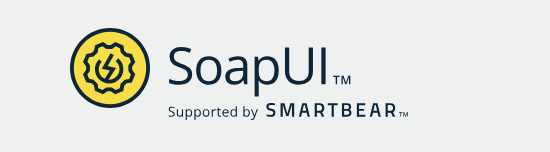

# SoapUI

## **About**

SoapUI is one of the most popular open-source tools for testing **SOAP** and **REST** web services. It allows developers and testers to create, execute, and automate functional, regression, and load tests for APIs. Unlike command-line tools, SoapUI provides a rich graphical interface to visually inspect request/response pairs and organize complex test scenarios.

It’s particularly valuable in **enterprise environments** or wherever SOAP-based web services are still in use, although it fully supports REST APIs as well.

<figure><figcaption></figcaption></figure>

## **What is SoapUI?**

SoapUI is a **cross-platform** API testing tool developed by SmartBear. It was originally created for testing SOAP-based web services, hence the name. Over time, it has evolved to support modern RESTful APIs and more advanced use cases like mocking, security testing, and automation.

SoapUI is available in two versions:

* **SoapUI Open Source**: Free, with essential features.
* **ReadyAPI** (formerly SoapUI Pro): Commercial version with advanced capabilities like data-driven testing, advanced reporting, and CI/CD integrations.

## **Installing SoapUI**

### **1. Download SoapUI**

Go to the official download page:\
[**https://www.soapui.org/downloads/soapui.html**](https://www.soapui.org/downloads/soapui.html)

Choose the version suitable for our OS:

* Windows
* macOS
* Linux

### **2. Install on Windows**

* Download the `.exe` file.
* Run the installer and follow the steps.
* Choose whether to install SoapUI Open Source or ReadyAPI trial.
* Launch SoapUI after installation.

### **3. Install on macOS**

* Download the `.zip` or `.dmg` file.
* Extract or mount and drag the SoapUI app to Applications.
* Open the app and start using it.

### **4. Install on Linux**

* Download the `.sh` installer.
* Make the file executable and run it:

```bash
chmod +x SoapUI-x.y.z.sh
./SoapUI-x.y.z.sh
```

Follow the setup wizard to complete installation.

## **Features of SoapUI**

### **1. SOAP & REST API Support**

Test both SOAP and RESTful services. Define operations, methods, and assertions using XML or JSON payloads.

### **2. Graphical User Interface**

Easy-to-use drag-and-drop interface to build test requests, set parameters, and view results with minimal scripting.

### **3. Functional Testing**

Create reusable test cases with input/output validations using assertions. Group them into test suites for automation.

### **4. Data-Driven Testing**

Use external files (CSV, Excel, DB) to run the same test with different input data (available in ReadyAPI version).

### **5. Mocking Services**

Simulate both SOAP and REST APIs using mock services. Useful when backend services are unavailable or still in development.

### **6. Security Testing**

Perform penetration and fuzz testing to validate the robustness of our APIs against common vulnerabilities like SQL injection and XML bombs.

### **7. Load & Performance Testing**

Use SoapUI’s integration with **LoadUI** or ReadyAPI to simulate high-volume traffic and analyze system behavior under load.

### **8. Automation & CI Integration**

Automate test runs with command-line tools and integrate with CI pipelines (Jenkins, Bamboo, etc.) using plugins.

### **9. Reporting**

Generate test reports in different formats (PDF, HTML, JUnit-style) to track test results and share insights with teams.
