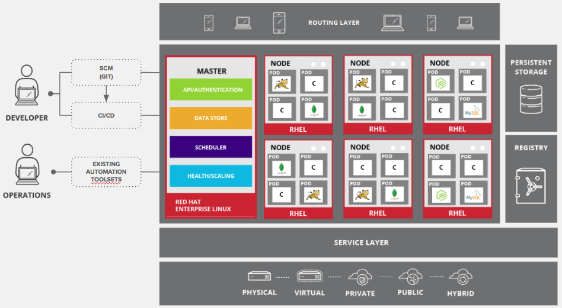

# Openshift

## About

OpenShift is a comprehensive container orchestration platform developed by Red Hat. It is built on top of Kubernetes and provides a more user-friendly interface and additional tools to facilitate the management of containerized applications.

OpenShift Container Platform is a private <mark style="background-color:purple;">platform-as-a-service (PaaS)</mark> for enterprises that run OpenShift on public cloud or on-premises infrastructure. It runs on the Red Hat Enterprise Linux (RHEL) operating system and functions as a set of Docker-based application containers managed with Kubernetes orchestration

OpenShift is a Docker-based system intended to help developers easily construct applications. Cluster management and orchestration of containers on multiple hosts is handled by Kubernetes.


**What is container orchestration?**

Container orchestration is the automated management of the deployment, scaling, and operation of containerized applications. In simple terms, it is a way to manage and coordinate multiple containers that are used to run applications, ensuring they work together smoothly and efficiently.


## How Openshift differs from Kubernetes?

### Comparison Table

<table data-full-width="true"><thead><tr><th width="200">Feature</th><th width="357">Kubernetes</th><th>OpenShift</th></tr></thead><tbody><tr><td><strong>Base Platform</strong></td><td>Core container orchestration platform</td><td>Enterprise-grade container orchestration platform built on Kubernetes</td></tr><tr><td><strong>Installation &#x26; Setup</strong></td><td>Manual setup and configuration</td><td>Automated installation via Installer-Provisioned Infrastructure (IPI); User-Provisioned Infrastructure (UPI) for custom setups</td></tr><tr><td><strong>Developer Tools</strong></td><td>Requires integration of external CI/CD tools</td><td>Integrated CI/CD pipelines with Jenkins, Source-to-Image (S2I) builds, and a rich web console</td></tr><tr><td><strong>User Interface</strong></td><td>Basic dashboard</td><td>Feature-rich, user-friendly web console for developers and administrators</td></tr><tr><td><strong>Security</strong></td><td>Basic security features like RBAC; advanced security requires manual setup</td><td>Enhanced security with integrated policies, SELinux support, and Open Policy Agent (OPA) integration</td></tr><tr><td><strong>Multi-Tenancy</strong></td><td>Supported via namespaces and RBAC, requires additional configuration for secure isolation</td><td>Advanced multi-tenancy with robust isolation and security controls</td></tr><tr><td><strong>Networking</strong></td><td>Basic networking through CNI plugins</td><td>Advanced networking with OpenShift SDN, including network policies and enhanced security</td></tr><tr><td><strong>Storage</strong></td><td>Supports various storage solutions via CSI plugins</td><td>Seamless integration with Red Hat OpenShift Container Storage</td></tr><tr><td><strong>Service Mesh</strong></td><td>Supports Istio and other service meshes, requires manual setup</td><td>Integrated Istio-based service mesh for microservices communication, traffic management, and observability</td></tr><tr><td><strong>Operational Tools</strong></td><td>Requires third-party tools for monitoring, logging, and alerting</td><td>Built-in monitoring (Prometheus), logging (EFK stack), and alerting tools</td></tr><tr><td><strong>Image Management</strong></td><td>Uses Docker and other runtimes, lacks advanced image management features</td><td>Integrated container image registry with advanced features like image streams and automatic updates</td></tr><tr><td><strong>Updates &#x26; Upgrades</strong></td><td>Requires manual intervention for cluster updates and upgrades</td><td>Automated updates and upgrades with minimal downtime</td></tr><tr><td><strong>Support &#x26; Ecosystem</strong></td><td>Vast open-source community; enterprise support depends on chosen distribution (e.g., GKE, EKS)</td><td>Enterprise-grade support from Red Hat, curated ecosystem of tools and integrations</td></tr><tr><td><strong>Ease of Use</strong></td><td>Requires more manual setup and management</td><td>More user-friendly with additional tools and automated processes</td></tr><tr><td><strong>Scalability</strong></td><td>Supports automatic scaling with configuration</td><td>Advanced auto-scaling capabilities for applications and nodes</td></tr><tr><td><strong>Service Catalog</strong></td><td>Service Catalog requires additional setup</td><td>Built-in Service Catalog with a wide range of services and integrations</td></tr><tr><td><strong>Compliance</strong></td><td>Compliance features depend on distribution and additional setup</td><td>Enhanced compliance features with built-in security policies and controls</td></tr></tbody></table>

### Additional Points

#### Distribution

Kubernetes is an open-source container orchestration platform, with several vendors providing managed services based on the platform, including Amazon Elastic Kubernetes Service, Azure Kubernetes Service, Google Kubernetes Engine and Rancher. OpenShift is based on Kubernetes but is not considered a Kubernetes distribution. It is distinct from other Kubernetes distributions as it offers extensions and add-ons.

#### Workflow and configuration

OpenShift uses Kubernetes as its foundation, so it shares the same core principles. To deploy containerized applications across server clusters, the user writes configuration files that define how the applications should deploy. Both Kubernetes and OpenShift support the YAML and JSON configuration languages and offer load-balancing and routing capabilities. We can run either platform on-premises or in the public cloud.

#### APIs and integrations

OpenShift’s compliance with Kubernetes APIs means that applications that can be deployed on Kubernetes can be deployed on OpenShift. The main difference between OpenShift and Kubernetes is that OpenShift supports different tools and extensions.

#### Command line tools

Kubernetes distributions typically use `kubectl` as the primary command-line tool for managing clusters. The OpenShift command line is `oc` and is similar to kubectl but offers additional features to simplify complex administrative tasks.

#### Logging and dashboards

Kubernetes is compatible with a variety of logging tools, so users can choose how they manage logging. In OpenShift, log management depends on EFK (Elasticsearch, Fluentd and Kibana). Kubernetes offers a dashboard as an add-on, which is not a core part of Kubernetes. OpenShift has a web management console built in.

#### Operating system support

Kubernetes nodes can run on any Linux OS (and worker nodes can also run on Windows), while OpenShift nodes require Red Hat Enterprise Linux CoreOS.

#### Platform Support

OpenShift can be installed on the following platforms:

* OpenShift 3—Red Hat Enterprise Linux (RHEL) or Red Hat Atomic.
* OpenShift 4—Red Hat CoreOS for the control plane, and either CoreOS or RHEL for worker nodes.

Kubernetes can be installed on almost any Linux distribution, including the popular Ubuntu, Debian, and other alternatives.

## Core Concepts

### 1. Containers

Containers are the basic units of an OpenShift Container Platform application. They are a lightweight mechanism for isolating processes and can only interact with specified resources on the host machine. We can use Kubernetes and OpenShift Container Platform to orchestrate Docker containers across multiple hosts.

### 2. Images

OpenShift Container Platform uses standard Docker images to create containers. Images are binaries that include all requirements for running containers, along with descriptive metadata..

### 3. Container Image Registries

An image registry is necessary to manage container images and allow OpenShift to store and retrieve images when provisioning resources. We can use either Docker Hub, any other registry, or the OpenShift Container Platform’s internal image registry.

### 4. Pods

In Kubernetes, a pod is the smallest operating unit of a cluster, letting us deploy one or more containers on a host machine, and scale out to additional machines as needed. Pods are roughly equivalent to machine instances, with each pod having an internal IP address and its own port space—the containers in a pod share networking and local storage. OpenShift Container Platform doesn’t support changes to pod definitions while they are running. Changes are implemented by terminating a pod and recreating a modified version. Pods are expendable and don’t maintain state when reconstituted, so they should be managed by a higher-level controller and not by users.

### 5. Services

Kubernetes services act as internal load balancers—they identify sets of replicated pods and help proxy their connections. We can add or remove pods from a service, and the service always remains available, allowing other objects to refer to the service’s consistent address. Default service clusterIP addresses allow pods to access each other.

### 6. Users

Users are the agents that interact with the OpenShift Container Platform - user objects can be given role-based permissions, either individually or as groups. Users must authenticate to access the platform; unauthenticated API requests are treated as requests by an anonymous user. Roles and policies determine what each user is authorized to do.

### 7. Builds

Builds are the process of creating an object based on input parameters, usually resulting in a runnable image. BuildConfig objects are definitions for entire build processes. OpenShift Container Platform creates Docker containers from build images and pushes them to a container image registry.

### 8. Image Streams

Image streams and their associated tags provide abstractions for referencing container images in OpenShift Container Platform. They do not contain image data, but rather present a visualization of related images and changes made to them. We can set up builds and deployments that respond to image stream notifications

## OCP Architecture

Reference: [https://redhat-scholars.github.io/openshift-starter-guides/rhs-openshift-starter-guides/4.7/\_images/common-environment-ocp-architecture.png](https://redhat-scholars.github.io/openshift-starter-guides/rhs-openshift-starter-guides/4.7/\_images/common-environment-ocp-architecture.png)

<figure><figcaption></figcaption></figure>

### Infrastructure Layer

This layer lets us host applications on virtual servers or physical servers, as well as private or public cloud infrastructure

### Service Layer

This layer lets us define pods and access policies. Here are several features of the service layer:

* Provides a permanent IP address and host name for your pods.
* Lets connect applications together
* Enables us to use simple internal load balancing for distributing tasks across multiple application components.

The service layer runs our clusters. An OpenShift cluster uses two types of nodes—**main nodes** (responsible for managing the cluster, also called master nodes) and **worker nodes** (responsible for running applications).

### **Main Nodes**

Main nodes are in charge of managing the OpenShift cluster, performing four key tasks:

API and authentication—administration requests must go through APIs. Each request is encrypted by SSL and authenticated to ensure the cluster remains secure.

Data store—the state and any information related to the environment and application is kept in data stores.

Scheduler—pod placements are determined by schedulers, which take into account the current environment and utilization aspects like CPU and memory.

Health and scaling—health of pods is monitored and scaled by self-healing and auto-scaling processes that take into account CPU utilization. Once a pod fails, the main node automatically restarts it. If a pod fails too often, the automated process marks it as a bad pod and stops restarting it for a temporary period of time.

### **Worker Nodes**

Each worker consists of pods. In OpenShift, a pod is the smallest unit you can define, deploy, and manage. A pod can host one or more containers.

A container hosts applications and relevant dependencies. We can deploy containers as stateless or stateful.

Containers located in the same pod share an IP address, local storage, and attached storage volumes. A pod can host a sidecar container, which we can use to add components like a service mesh, logging or monitoring tools.

### Persistent Storage

Containers are ephemeral and are often restarted or deleted. This is not ideal for storing data. To prevent data loss, we can use persistent storage, which lets define stateful applications and data.

### Routing Layer

This layer provides external access to cluster applications from any device. The routing layer also performs auto-routing and load balancing for unhealthy pods.

## Components of OpenShift

<figure><figcaption></figcaption></figure>

 

<figure><figcaption></figcaption></figure>

One of the key components of OpenShift architecture is to manage containerized infrastructure in Kubernetes. Kubernetes is responsible for Deployment and Management of infrastructure. In any Kubernetes cluster, we can have more than one master and multiple nodes, which ensures there is no point of failure in the setup.


The openshift environment consists of the following systems:

\-> Master node(s)\
\-> Worker or "application" nodes\
\-> Dynamic Provisioned Storage

OpenShift container platform is available in two package levels.

**OpenShift Container Local** − This is for those developers who wish to deploy and test applications on the local machine. This package is mainly used by development teams for developing and testing applications.

**OpenShift Container Lab** − This is designed for extended evaluation of application starting from development till deployment to pre-prod environment.

There are **three ways** to interact with OpenShift: the command line, the web interface, and the RESTful API.


### Kubernetes Components

<figure><figcaption></figcaption></figure>

#### Kubernetes Master Machine Components

**Etcd** − It stores the configuration information, which can be used by each of the nodes in the cluster. It is a high availability key value store that can be distributed among multiple nodes. It should only be accessible by Kubernetes API server as it may have sensitive information. It is a distributed key value Store which is accessible to all.

**API Serve**r − Kubernetes is an API server which provides all the operation on cluster using the API. API server implements an interface which means different tools and libraries can readily communicate with it. A kubeconfig is a package along with the server side tools that can be used for communication. It exposes Kubernetes API”.

**Controller Manager** − This component is responsible for most of the collectors that regulate the state of the cluster and perform a task. It can be considered as a daemon which runs in a non-terminating loop and is responsible for collecting and sending information to API server. It works towards getting the shared state of the cluster and then make changes to bring the current status of the server to a desired state. The key controllers are replication controller, endpoint controller, namespace controller, and service account controller. The controller manager runs different kind of controllers to handle nodes, endpoint, etc.

**Scheduler** − It is a key component of Kubernetes master. It is a service in master which is responsible for distributing the workload. It is responsible for tracking the utilization of working load on cluster nodes and then placing the workload on which resources are available and accepting the workload. In other words, this is the mechanism responsible for allocating pods to available nodes. The scheduler is responsible for workload utilization and allocating a pod to a new node.

#### Kubernetes Node Components

Following are the key components of the Node server, which are necessary to communicate with the Kubernetes master.

**Docker** − The first requirement of each node is Docker which helps in running the encapsulated application containers in a relatively isolated but lightweight operating environment.

**Kubelet Service** − This is a small service in each node, which is responsible for relaying information to and from the control plane service. It interacts with etcd store to read the configuration details and Wright values. This communicates with the master component to receive commands and work. The kubelet process then assumes responsibility for maintaining the state of work and the node server. It manages network rules, port forwarding, etc.

**Kubernetes Proxy Service** − This is a proxy service which runs on each node and helps in making the services available to the external host. It helps in forwarding the request to correct containers. Kubernetes Proxy Service is capable of carrying out primitive load balancing. It makes sure that the networking environment is predictable and accessible but at the same time it is isolated as well. It manages pods on node, volumes, secrets, creating new containers health checkup, etc.

### Integrated OpenShift Container Registry

OpenShift container registry is an inbuilt storage unit of Red Hat, which is used for storing Docker images. With the latest integrated version of OpenShift, it has come up with a user interface to view images in OpenShift internal storage. These registries are capable of holding images with specified tags, which are later used to build containers out of it.

## Developer Sandbox

Developer Sandbox for Red Hat OpenShift is a free Kubernetes cloud environment in a shared, multi-tenant OpenShift cluster that is pre-configured with a set of developer tools. The Developer Sandbox is active for 30 days and renewable once it expires

<figure><figcaption></figcaption></figure>

<figure><figcaption></figcaption></figure>

Sample Console url: [https://console-openshift-console.apps.sandbox-m2.ll9k.p1.openshiftapps.com/project-details/ns/pranaypourkar17-dev](https://console-openshift-console.apps.sandbox-m2.ll9k.p1.openshiftapps.com/project-details/ns/pranaypourkar17-dev)

Cluster Subdomain: apps.sandbox-m2.ll9k.p1.openshiftapps.com

## Notes

### Types of workloads

Kubernetes defines different types of workloads that are appropriate for different kinds of applications. To determine the appropriate workload for your application, consider if the application is:

* Meant to run to completion and be done. An example is an application that starts up to produce a report and exits when the report is complete. The application might not run again then for a month. Suitable OpenShift Container Platform objects for these types of applications include Job and CronJob objects.
* Expected to run continuously. For long-running applications, we can write a deployment.
* Required to be highly available. If our application requires high availability, then we want to size our deployment to have more than one instance. A Deployment or DeploymentConfig object can incorporate a replica set for that type of application. With replica sets, pods run across multiple nodes to make sure the application is always available, even if a worker goes down.
* Need to run on every node. Some types of Kubernetes applications are intended to run in the cluster itself on every master or worker node. DNS and monitoring applications are examples of applications that need to run continuously on every node. We can run this type of application as a daemon set. We can also run a daemon set on a subset of nodes, based on node labels.
* Require life-cycle management. When we want to hand off our application so that others can use it, consider creating an Operator. Operators let us build in intelligence, so it can handle things like backups and upgrades automatically. Coupled with the Operator Lifecycle Manager (OLM), cluster managers can expose Operators to selected namespaces so that users in the cluster can run them.
* Have identity or numbering requirements. An application might have identity requirements or numbering requirements. For example, you might be required to run exactly three instances of the application and to name the instances 0, 1, and 2. A stateful set is suitable for this application. Stateful sets are most useful for applications that require independent storage, such as databases and zookeeper clusters.

### Applying the manifest

Kubernetes manifests let us create a more complete picture of the components that make up our Kubernetes applications. We write these manifests as YAML files and deploy them by applying them to the cluster, for example, by running the `oc apply` command.

We have some sort of CI pipeline that builds the images and pushes them to a registry. In particular, a GitOps pipeline integrates your container development with the Git repositories that we use to store the software that is required to build your applications.

The workflow to this point might look like:

* Day 1: We write some YAML. We then run the oc apply command to apply that YAML to the cluster and test that it works.
* Day 2: We put our YAML container configuration file into our own Git repository. From there, people who want to install that app, or help improve it, can pull down the YAML and apply it to their cluster to run the app.
* Day 3: Consider writing an Operator for our application.

### Image Pull Policy

<figure><figcaption></figcaption></figure>

### Base image options

Red Hat provides a new set of base images referred to as Red Hat Universal Base Images (UBI). These images are based on Red Hat Enterprise Linux and are similar to base images that Red Hat has offered in the past, with one major difference: they are freely redistributable without a Red Hat subscription. As a result, we can build our application on UBI images without having to worry about how they are shared or the need to create different images for different environments.

### Registry options

Container registries are where we store container images so we can share them with others and make them available to the platform where they ultimately run. We can select large, public container registries that offer free accounts or a premium version that offer more storage and special features. To get Red Hat images and certified partner images, we can draw from the Red Hat Registry. The Red Hat Registry is represented by two locations: registry.access.redhat.com, which is unauthenticated and deprecated, and registry.redhat.io, which requires authentication.

Large, public registries include Docker Hub and Quay.io. The Quay.io registry is owned and managed by Red Hat. Many of the components used in OpenShift Container Platform are stored in Quay.io, including container images and the Operators that are used to deploy OpenShift Container Platform itself. Quay.io also offers the means of storing other types of content, including Helm charts.

If we want our own, private container registry, OpenShift Container Platform itself includes a private container registry that is installed with OpenShift Container Platform and runs on its cluster. Red Hat also offers a private version of the Quay.io registry called Red Hat Quay. Red Hat Quay includes geo replication, Git build triggers, Clair image scanning, and many other features.

#### Diagram

\-> Process of building and pushing an image

<figure><figcaption></figcaption></figure>

## Example: Parksmap Architecture

ParksMap is a geo-spatial data visualization application built using the microservices architecture and is composed of a set of services which are developed using different programming languages and frameworks. The main service is a web application which has a server-side component in charge of aggregating the geo-spatial APIs provided by multiple independent backend services and a client-side component in JavaScript that is responsible for visualizing the geo-spatial data on the map. The client-side component which runs in our browser communicates with the server-side via WebSockets protocol in order to update the map in real-time.

There will be a set of independent backend services deployed that will provide different mapping and geo-spatial information. These backends will be dynamically discovered by using service discovery mechanisms provided by OpenShift which will be discussed in more details in the following labs.

### Deploy the web component

Deploy the web component of the ParksMap application which is also called parksmap

<figure><figcaption></figcaption></figure>

1. Click on + and select container images

<figure><figcaption></figcaption></figure>

2. Enter the below sample details

Container Registry Image: quay.io/openshiftroadshow/parksmap:latest

The Quay.io registry is owned and managed by Red Hat.

Source code: https://github.com/openshift-roadshow/parksmap-web

<figure><figcaption></figcaption></figure>

<figure><figcaption></figcaption></figure>

<figure><figcaption></figcaption></figure>

<figure><figcaption></figcaption></figure>

<figure><figcaption></figcaption></figure>

<figure><figcaption></figcaption></figure>

<figure><figcaption></figcaption></figure>

<figure><figcaption></figcaption></figure>

<figure><figcaption></figcaption></figure>

<figure><figcaption></figcaption></figure>

<figure><figcaption></figcaption></figure>

<figure><figcaption></figcaption></figure>

## CLI (Command Line Interface)

### Copy Login command

<figure><figcaption></figcaption></figure>

<figure><figcaption></figcaption></figure>

<figure><figcaption></figcaption></figure>

### Change project

oc project pranaypourkar17-dev

<figure><figcaption></figcaption></figure>

### Get All Pods

oc get pods

<figure><figcaption></figcaption></figure>

### Get specific Pod details

oc get pod \<pod\_name> -o yaml

oc get pod parksmap-56899576dd-w9p8f -o yaml

<figure><figcaption></figcaption></figure>



### Describe a pod

oc describe pod \<pod name>

oc describe pod parksmap-56899576dd-w9p8f

<figure><figcaption></figcaption></figure>

### View All the Services

oc get services

<figure><figcaption></figcaption></figure>

Here, We have a Service named parksmap with an IP/Port combination of 172.30.35.117/8080TCP. IP address may be different, as each Service receives a unique IP address upon creation. Service IPs are fixed and never change for the life of the Service.

### View specific Service details

oc get service \<service name> -o yaml

oc get service parksmap -o yaml

<figure><figcaption></figcaption></figure>

### Describe a service

oc describe service \<service name>

oc describe service parksmap

<figure><figcaption></figcaption></figure>

Note: Only one endpoint is listed. That is because there is only one Pod currently running

## Frequently Used Terms

### Image

Kubernetes (Docker) images are the key building blocks of Containerized Infrastructure. As of now, Kubernetes only supports Docker images. Each container in a pod has its Docker image running inside it. When configuring a pod, the image property in the configuration file has the same syntax as the Docker command.

### Container

They are the ones which are created after the image is deployed on a Kubernetes cluster node.

### Node

A node is a working machine in Kubernetes cluster, which is also known as minion for master. They are working units which can a physical, VM, or a cloud instance.

### Pod

A pod is a collection of containers and its storage inside a node of a Kubernetes cluster. It is possible to create a pod with multiple containers inside it. For example, keeping the database container and web server container inside the pod

A Node can have multiple pods, and the Kubernetes control plane automatically handles scheduling the pods across the Nodes in the cluster. The control plane's automatic scheduling takes into account the available resources on each Node

### oc - OpenShift Command Line Interface (CLI)

With the OpenShift command line interface, we can create applications and manage OpenShift projects from a terminal.

### Helm 3

Helm 3 is a package manager for Kubernetes applications which enables defining, installing, and upgrading applications packaged as Helm Charts.
