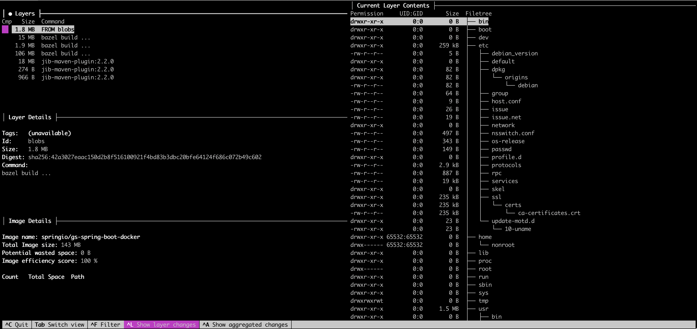

# Use Case

## Analyzing an Open-Source Spring Boot Docker Image with Dive

To truly understand the value of Dive, it's helpful to analyze a real Docker image. Rather than using a custom local build, we will examine a publicly available Spring Boot application image published by the Spring team.

### Image: `springio/gs-spring-boot-docker`

We will use the image from the official [Spring Boot Docker Getting Started Guide](https://github.com/spring-guides/gs-spring-boot-docker), which is available on Docker Hub as:

```
springio/gs-spring-boot-docker
```

This image is a simple "Hello World" Spring Boot application packaged as an executable JAR and containerized using a basic Dockerfile.

### Pull the Image

First, pull the public image:

```bash
docker pull springio/gs-spring-boot-docker
```

This downloads the image locally so that Dive can inspect it.

### Launch Dive

Now run Dive to explore the image:

```bash
dive springio/gs-spring-boot-docker
```

This opens Dive’s interactive terminal UI showing:

* A breakdown of each image layer
* The exact file system state after each Dockerfile instruction
* File changes (added, removed, modified)
* An overall efficiency score for the image

### Understanding the Dive Output

<figure><figcaption></figcaption></figure>

The interface is split into **two panels**:

#### 1. **Left Panel – Layer and Image Metadata**

This side provides a **deep dive into the structure and efficiency** of the Docker image.

**Layers**

* This is the **topmost section** of the left panel.
* Each entry here represents a **layer in the Docker image**.
* Columns:
  * **Cmp** (Compression Color): Indicates what changed in that layer (added/modified/removed).
  * **Size**: Size of that layer.
  * **Command**: Shows the command that generated that layer (`FROM`, `COPY`, `RUN`, etc.).
* In the screenshot:
  * First layer is 1.8 MB created from the base (`FROM blobs`).
  * Others show results of `bazel build` and `jib-maven-plugin` commands.

**Layer Details**

* Appears when you select any layer in the list above.
* Shows metadata about that **individual layer**, such as:
  * **Tags**: Image tags (if available).
  * **Id**: The name of the layer source.
  * **Size**: Layer size.
  * **Digest**: Unique SHA256 digest hash of the layer.
  * **Command**: Dockerfile or tooling command used to generate the layer.
* Helps identify **which layer caused what file changes**.

**Image Details**

* Located below Layer Details.
* Shows **summary metrics about the entire image**:
  * **Image name**: In this case, `springio/gs-spring-boot-docker`
  * **Total Image Size**: 143 MB
  * **Potential Wasted Space**: 0 B → Very efficient image.
  * **Image Efficiency Score**: 100% → No duplicate files or unnecessary bloat.
* Useful to analyze image quality from a performance and delivery perspective.

#### **Right Panel – Current Layer Contents**

This panel reflects the **file system at the selected layer**. You can think of it as a **live diff view** for the layer you’re inspecting.

* **Tree structure** of files and folders at that layer.
* Each file shows:
  * **Permissions**
  * **UID:GID** (owner)
  * **Size**
* This helps you inspect:
  * What got **added** in this layer?
  * What files or folders are taking up space?
  * Are **credentials, logs, or temp files** accidentally being included?

In our image

* You see a complete Linux filesystem (`/bin`, `/etc`, `/usr`, `/home`, etc.).
* Dive allows you to **navigate** into folders using keyboard arrows to inspect exact contents.
* You can also **toggle filters**, compare changes layer-by-layer (`A` key), and see what changed compared to the previous layer.

### Shortcuts

<table><thead><tr><th width="134.9071044921875">Shortcut Key</th><th>Action Description</th></tr></thead><tbody><tr><td><code>Tab</code></td><td>Switch focus between <strong>left pane</strong> (layers) and <strong>right pane</strong> (filesystem)</td></tr><tr><td><code>↑</code> / <code>↓</code></td><td>Navigate <strong>up/down</strong> through the layers or file list</td></tr><tr><td><code>←</code> / <code>→</code></td><td>In file tree, expand/collapse directories</td></tr><tr><td><code>Enter</code></td><td>View details of the <strong>selected file/directory</strong></td></tr><tr><td><code>q</code> or <code>Ctrl+C</code></td><td><strong>Quit</strong> Dive</td></tr><tr><td><code>a</code></td><td>Toggle <strong>aggregate view</strong> of all layers (shows total impact)</td></tr><tr><td><code>l</code></td><td>Toggle <strong>layer changes view</strong> (shows what changed in each layer)</td></tr><tr><td><code>f</code> or <code>Ctrl+F</code></td><td>Toggle <strong>filter view</strong> (hide or show irrelevant files like cache/logs)</td></tr><tr><td><code>?</code></td><td>Show <strong>help screen</strong> with all keybindings</td></tr><tr><td><code>Space</code></td><td><strong>Expand/Collapse</strong> all folders in file tree (when in the right pane)</td></tr></tbody></table>

