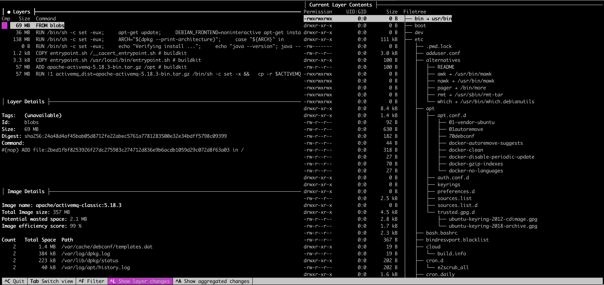

# Dive

## About

Dive is a lightweight, powerful command-line tool designed for **inspecting and analyzing Docker images**. It provides a **layer-by-layer breakdown** of how a Docker image is constructed and allows users to inspect the **content of each layer**, including which files were added, modified, or removed.

Docker images are built using layered file systems, where each instruction in a Dockerfile (like `COPY`, `RUN`, or `ADD`) creates a new layer. These layers accumulate to form the final image. While this layering system enables features like caching and incremental builds, it also introduces complexity. Without a proper inspection tool, it's difficult to see what is actually present in an image, which files contribute to its size, or whether build steps were properly optimized.

Dive fills this gap by offering deep visibility into Docker image layers, making it a key utility in the container optimization and security toolbox.

## Why Use Dive ?

#### 1. Image Transparency

Docker images are often treated as black boxes. Developers may build them using `docker build` and ship them to production without fully understanding what files exist inside. Dive demystifies this by exposing every file and directory in each layer.

#### 2. Build Optimization

Improper Dockerfile instructions can lead to large, inefficient images. For example:

* Copying unneeded build files
* Installing unnecessary packages
* Not cleaning up after `apt-get` or `npm install`
* Rebuilding unchanged files due to inefficient layer ordering

Dive shows the size and content of each layer, allowing us to pinpoint these inefficiencies.

#### 3. Layer Caching and Rebuild Control

Docker builds leverage caching, where unchanged instructions reuse previous layers. However, a small change in the wrong place (like modifying a single line before a large `RUN` instruction) can invalidate the cache and trigger full rebuilds. Dive helps identify such patterns by comparing layer diffs across builds.

#### 4. Security and Compliance

Images may accidentally include sensitive information such as:

* Secret keys or tokens
* Development or debug artifacts
* `.env` files or temporary credentials\
  Dive helps audit image contents to ensure only production-ready artifacts are shipped.

#### 5. Continuous Integration Enforcement

We can use Dive in automated pipelines to enforce image policies:

* Reject builds that exceed a certain size
* Ensure image efficiency score is above a threshold
* Detect presence of banned file patterns

## Installation

Dive can be installed on macOS, Linux, and Windows, or run directly as a Docker container without local installation. Choose the installation method based on our operating system or environment setup.

### macOS (via Homebrew)

If we are using macOS and Homebrew is installed:

```bash
brew install dive
```

This is the easiest and most maintainable way to install Dive on macOS.

### Linux (Debian/Ubuntu)

For Debian-based systems:

```bash
wget https://github.com/wagoodman/dive/releases/download/v<version>/dive_<version>_linux_amd64.deb
sudo dpkg -i dive_<version>_linux_amd64.deb
```

Replace `<version>` with the specific release version from the Dive GitHub repository.

We can also download a binary or package appropriate to our Linux distribution directly from:


[https://github.com/wagoodman/dive/releases](https://github.com/wagoodman/dive/releases)


### Windows

For Windows, we can either:

* Download the executable directly from GitHub Releases
* Use Windows Subsystem for Linux (WSL) and install Dive via Linux instructions
* Use Docker (see below)

### Running Dive via Docker (No Installation Needed)

If we don’t want to install Dive on our system, we can run it directly as a Docker container:

```bash
docker run --rm -it \
  -v /var/run/docker.sock:/var/run/docker.sock \
  wagoodman/dive <image-name>
```

This mounts the Docker socket from our host into the Dive container, allowing it to inspect images just like the installed version.

## Usage

Dive is designed to be simple to invoke but powerful in what it reveals. It supports both interactive exploration and headless execution for CI/CD workflows.

### Inspecting a Docker Image

To analyze a local image and launch Dive’s interactive terminal UI:

```bash
dive <image-name>
```

Example:

```bash
dive my-spring-app:latest
```

This launches a two-pane terminal interface:

* Left pane: Image layer history, size breakdown, and efficiency score
* Right pane: File system tree and file diffs for each layer

We can use keyboard shortcuts (like arrow keys and tab) to navigate through layers and files.

```
pranayp@system docker-compose % dive apache/activemq-classic:5.18.3
```

<figure><figcaption></figcaption></figure>

### Exploring a Saved Tarball Image

If we have exported an image using `docker save`:

```bash
docker save my-image > my-image.tar
dive my-image.tar
```

This is especially useful in environments where Docker is not installed or in air-gapped systems.

### Using Dive in Continuous Integration (CI) Mode

Dive can be executed in a non-interactive mode, ideal for automation:

```bash
dive <image-name> --ci
```

In CI mode:

* Dive runs silently (no TUI)
* It uses configuration thresholds to assess efficiency and exits with a pass/fail status code
* We can define rules like minimum efficiency score or disallowed file types in a `.dive-ci` config file

This allows us to enforce image optimization policies as part of our pipeline, e.g., fail builds if the image becomes bloated or violates layer guidelines.

## Typical Use Workflow

1. **Build our image**

```bash
docker build -t my-app .
```

2. **Run Dive**

```bash
dive my-app
```

3. **Inspect**

* Review the size contribution of each layer
* Analyze what files are added/removed/changed
* Understand whether layering and caching are efficient
* Confirm that no secrets or unneeded files are included

