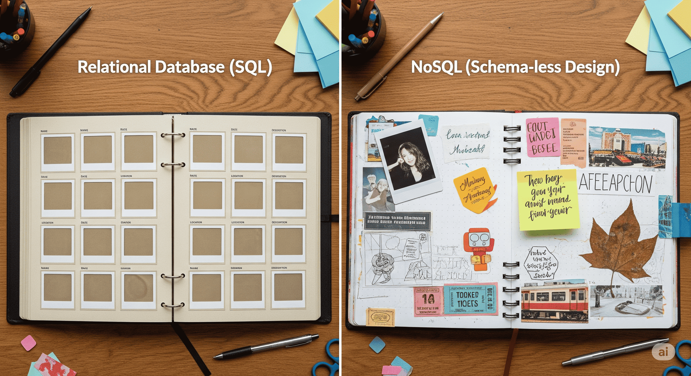

# NoSQL Databases

## About

NoSQL (short for "Not Only SQL") refers to a broad class of non-relational database systems that offer flexible, scalable, and high-performance data storage solutions. Unlike traditional relational databases, which store data in rows and columns and enforce strict schemas, NoSQL databases allow for schema-less or dynamic data structures - making them highly adaptable to modern application needs.

These databases are designed with distributed architectures in mind, supporting horizontal scaling across multiple nodes. This makes them particularly well-suited for handling massive volumes of data generated by modern web, mobile, IoT, and big data applications.

Rather than relying on a single query language like SQL, NoSQL databases support diverse data models - such as key-value pairs, documents, wide-columns, and graphs - and provide APIs or domain-specific query languages optimized for those models.

In essence, NoSQL databases prioritize flexibility, speed, and scalability over rigid consistency and relational structure. They embrace trade-offs (e.g., eventual consistency instead of strong ACID compliance) to deliver performance and agility for use cases that relational databases struggle to support effectively.

## NoSQL as a Scrapbook

Imagine a traditional relational database as a **neatly organized photo album** - each photo (record) is carefully placed in predefined slots (columns) on structured pages (tables). Every photo must conform to the layout, even if some sections are left blank. This structure ensures consistency but can feel rigid, especially when trying to include something unexpected or new.

Now, picture a **scrapbook** - a more freeform, expressive collection where each page can hold a different mix of photos, notes, ticket stubs, drawings, or even a pressed flower. Each page is unique, shaped by its content, not by a pre-decided format. That’s the essence of NoSQL.

NoSQL databases embrace this scrapbook philosophy. They allow us to store diverse and evolving types of data - some records might have five fields, others ten, and that’s perfectly okay. We don't need to define the structure in advance, which makes them ideal for use cases like:

* User profiles with varied attributes
* Event logs where structure evolves
* Product catalogs with flexible specs
* Dynamic content storage in CMS platforms

This flexibility isn’t just convenient - it’s **critical in agile development environments**, where requirements change frequently and rapid prototyping is key.

Just like a scrapbook reflects creativity and adapts to what we want to include, NoSQL adapts to our data - not the other way around. It lets developers model data closer to how it’s used in the application, rather than forcing it into rows and columns.

<figure><figcaption></figcaption></figure>

## Evolution of NoSQL

The emergence of NoSQL databases was driven by the changing demands of modern software systems, especially in the era of the internet, big data, and cloud-native applications. Traditional relational databases, while reliable and consistent, were not designed to handle the scale, variety, and velocity of data that newer applications demanded.

In the early 2000s, tech giants like Google, Amazon, and Facebook began facing limitations with RDBMS, especially around scalability and performance in distributed environments. This led to the development of proprietary solutions like Google’s **Bigtable** and Amazon’s **Dynamo**, which laid the conceptual groundwork for many open-source NoSQL systems that followed.

The term **“NoSQL”** was popularized around 2009 to describe a growing class of databases that rejected the relational model and embraced alternative paradigms. These systems focused on:

* **High availability over strict consistency** (inspired by the CAP theorem)
* **Flexible data models** suited to rapidly evolving requirements
* **Horizontal scalability** for cloud and distributed systems
* **Eventual consistency** and performance tuning based on workload needs

As open-source projects like **MongoDB**, **Cassandra**, **Redis**, and **Neo4j** gained traction, NoSQL quickly moved from being an experimental niche to a cornerstone of modern application architecture.

Today, NoSQL isn’t just about rejecting SQL - it’s about **expanding the database landscape** to accommodate use cases where relational databases fall short. In fact, many NoSQL databases now include SQL-like querying, making the ecosystem more hybrid and practical than ever.

## Why it matters ?

NoSQL matters because it addresses the real-world limitations of traditional relational databases in a modern, data-intensive world.

Today’s applications generate **huge volumes of diverse and rapidly changing data** - user-generated content, logs, sensor data, media files, social interactions, and more. These aren’t always a good fit for rigid, tabular structures. NoSQL databases offer a more natural, efficient way to model and store such information.

They also **scale horizontally** - adding more machines to distribute the load - which is a critical requirement for cloud-native, global-scale systems. Unlike relational databases that often hit performance ceilings due to vertical scaling, NoSQL systems are built to grow with demand.

From a developer’s perspective, NoSQL provides:

* **Faster iterations** due to schema flexibility
* **Better performance** for specific access patterns (e.g., key-value lookups or graph traversals)
* **Improved fault tolerance** and availability through replication and distribution
* **Specialized models** tuned for real-world needs - like storing nested documents, key-value pairs, or deeply connected entities

In essence, NoSQL isn’t just a technology trend - it’s a **fundamental shift in how we think about data**. It empowers developers and architects to build systems that are more responsive, scalable, and aligned with user behavior and expectations.

## When to Use NoSQL ?

NoSQL is not a replacement for relational databases but an alternative suited for specific needs and scenarios. Choosing NoSQL makes sense when the structure, scale, or performance requirements of our application exceed what traditional databases can comfortably provide.

Use NoSQL when:

**1. Data is semi-structured or unstructured**\
If our application deals with JSON documents, logs, user-generated content, or records that don’t share a fixed schema, NoSQL allows us to store and query data without forcing it into rows and columns.

**2. Schema flexibility is essential**\
In rapidly evolving systems where data models change frequently (like user profiles, product catalogs, or dynamic forms), NoSQL’s schema-less nature allows development to move quickly without constant database migrations.

**3. We need horizontal scalability**\
Applications that serve millions of users or process large data streams (e.g., IoT, analytics, recommendation systems) benefit from NoSQL's ability to scale out across distributed systems.

**4. High write/read throughput is required**\
For real-time systems like messaging apps, gaming platforms, caching layers, and analytics engines, NoSQL databases can offer high performance at scale with lower latency.

**5. We are dealing with complex relationships or graph-based data**\
If our data is naturally represented as interconnected nodes and edges (e.g., social networks, recommendation engines), graph databases like Neo4j offer better performance and query capabilities than relational models.

**6. Eventual consistency is acceptable**\
In many use cases (like showing user activity feeds or syncing data across regions), strict transactional consistency is not mandatory. NoSQL systems offer better performance and availability by relaxing consistency guarantees.

However, if our application relies on complex joins, strong transactional integrity (ACID), or structured business rules (like accounting systems or ERPs), an RDBMS is still often the better choice.

Understanding the trade-offs between relational and NoSQL models is key to making the right architectural decision.
