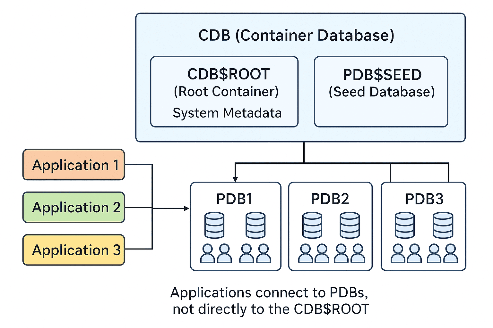

# Multitenant Architecture

## About

Oracle introduced the **Multitenant Architecture** beginning with **Oracle Database 12c** as a major shift from the traditional single-instance model. Instead of running one database per instance, Oracle allows a single **Container Database (CDB)** to host multiple **Pluggable Databases (PDBs)**.

This approach brings **database consolidation, easier management, and better resource utilization**. It is especially important in cloud environments and large enterprises where hundreds of applications may need separate databases but administrators want a centralized way to manage them.

In essence:

* The **CDB** acts as the main container, holding Oracle’s system metadata and common components.
* Each **PDB** is a self-contained database with its own schemas, users, and application data, but sharing the common Oracle binaries and background processes of the CDB.

The model is comparable to a **building with multiple apartments**:

* The **CDB** is the building itself, providing the structure, utilities, and security.
* Each **PDB** is like an apartment — independent, portable, and customizable for its resident (application or tenant).

By separating common system functions from individual databases, Oracle enables:

* Easier upgrades and patching (apply once to CDB, all PDBs benefit).
* Better isolation (issues in one PDB don’t affect others).
* Rapid provisioning and portability (plug/unplug PDBs).

<figure><figcaption></figcaption></figure>

## Key Components

Oracle’s multitenant model is built around a **container-and-pluggable** structure. The main elements are:

#### 1. **Container Database (CDB)**

* The central database that houses Oracle system metadata, background processes, and system tablespaces.
* Contains one or more PDBs.
* Includes special containers like **CDB$ROOT** and **PDB$SEED**.

#### 2. **Root Container (CDB$ROOT)**

* The root of the multitenant structure.
* Stores common data dictionary and metadata needed by the entire CDB.
* Holds system users, metadata, and shared Oracle components.
* Common users (those prefixed with `C##`) are defined here.

#### 3. **Pluggable Database (PDB)**

* A portable, self-contained collection of schemas, objects, and users.
* Each PDB appears to applications as a fully functional Oracle database.
* Application users and schemas are typically created here.

#### 4. **Seed Database (PDB$SEED)**

* A special, read-only PDB provided by Oracle.
* Acts as a template for creating new PDBs quickly.
* Saves time by cloning instead of building databases from scratch.

#### 5. **Users in Multitenant**

* **Common Users**: Exist in all containers, created in the root (e.g., `C##ADMIN`).
* **Local Users**: Exist only in a specific PDB, usually where applications are deployed (e.g., `PRANAY`).
