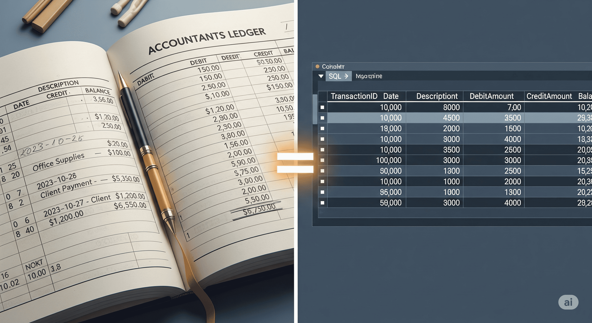

# SQL Databases

## About

SQL databases, also known as **relational databases**, are a foundational technology for structured data storage and management. Built around the **relational model** proposed by Edgar F. Codd in the 1970s, SQL databases organize data into **tables**, where relationships between data are explicitly defined using **foreign keys** and **constraints**.

At the heart of these systems is **Structured Query Language (SQL)** - a powerful, declarative language used to query, manipulate, and manage data. SQL provides robust capabilities for filtering, joining, grouping, aggregating, and updating data with precision and predictability.

Relational databases are known for their **strong consistency**, **data integrity**, and **transactional guarantees** through **ACID properties** (Atomicity, Consistency, Isolation, Durability). These features make them especially suitable for applications where data accuracy and consistency are critical - such as banking systems, inventory control, and enterprise resource planning (ERP) software.

Over decades, SQL databases like **Oracle**, **MySQL**, **PostgreSQL**, **SQL Server**, and **DB2** have matured into reliable, feature-rich platforms that power countless applications across industries. Despite the rise of NoSQL systems, SQL databases remain highly relevant due to their standardized query language, mature tooling, and ability to model complex data relationships.

In summary, SQL databases offer a **structured, consistent, and standardized** approach to managing data, making them a trusted choice for a wide range of traditional and modern applications.


SQL is not a database management system, but it is a query language which is used to store and retrieve the data from a database


## SQL as a Ledger

Think of a **ledger** - the kind used in accounting - a carefully structured, precise, and consistent system where every transaction is recorded, verified, and traceable. Nothing is vague. Every entry follows a strict format. That’s exactly how **SQL databases** operate.

In a SQL database, data is stored in well-defined **tables**, governed by a **schema** that enforces structure and rules. Every field has a specific data type. Relationships are explicit. Constraints like **primary keys**, **foreign keys**, **unique constraints**, and **check constraints** ensure that the data maintains its integrity over time - just like a ledger that must always balance.

Further, SQL databases are built to handle **transactions** - sequences of operations that are treated as a single, indivisible unit. Thanks to **ACID properties**, a transaction in a SQL database is either fully completed or fully rolled back, leaving no room for inconsistency. This behavior is especially vital in systems that require trust and accountability, such as:

* Banking and financial applications
* Inventory and order processing systems
* Billing and invoicing platforms
* Audit logs and compliance tracking

The "ledger-like" nature of SQL is what gives it strength in domains where **accuracy, traceability, and consistency** are non-negotiable. Just as an accountant relies on a ledger to reflect the true financial state of a business, developers and data teams rely on SQL databases to represent the true state of an application’s data.

In this way, SQL is more than just a query language - it's a **system of record** designed for precision, control, and long-term consistency.

<figure><figcaption></figcaption></figure>

## Evolution of SQL

The journey of SQL databases traces back to the early days of computing when businesses began demanding reliable, structured ways to manage and query data.

The **relational model**, introduced by **E.F. Codd in 1970**, revolutionized data storage by organizing data into tables with well-defined relationships. This model emphasized **logical consistency**, **data independence**, and **mathematical rigor**, which became the foundation for Structured Query Language (SQL).

In the late 1970s and early 1980s, commercial relational database systems began to emerge - most notably **Oracle (1979)**, **IBM DB2**, and **Ingres**. These early systems popularized SQL as a standard language for interacting with data, and it was later formalized by **ANSI and ISO** as the industry standard.

Throughout the 1990s and 2000s, relational databases became the default data storage solution for enterprise applications, thanks to their:

* Strong transactional guarantees (ACID)
* Mature concurrency control mechanisms
* Rich query capabilities and indexing support
* Standardization across vendors

The evolution continued with the rise of **open-source SQL databases** like **MySQL** and **PostgreSQL**, which enabled developers to embed powerful data management features into their applications at no cost. This, in turn, fueled the growth of dynamic websites, content management systems, and online commerce.

In recent years, SQL systems have further evolved to meet modern demands. Newer versions support:

* JSON and semi-structured data
* Full-text and geospatial indexing
* Parallel and distributed query execution
* Cloud-native deployments (e.g., Amazon Aurora, Cloud SQL)

Despite the rise of NoSQL, **SQL databases remain highly relevant**. They have adapted to changing needs while retaining their strength in structured data processing, complex queries, and transactional reliability.

## Why it matters ?

SQL databases matter because they provide a **proven, reliable, and standardized** way to manage data where precision and consistency are critical.

In many real-world applications, data is not just something to be stored - it’s something to be **trusted**, **validated**, and **audited**. This is where SQL excels. By enforcing **structured schemas**, **relational integrity**, and **transactional consistency**, SQL databases ensure that data remains correct and reliable even as systems grow in complexity.

Here’s why SQL still holds its place at the core of many applications:

**1. Data Integrity and Consistency**\
SQL databases follow **ACID principles**, which guarantee that data remains accurate and consistent even under failure conditions or concurrent usage. This is essential in domains like finance, healthcare, and logistics, where bad data can have real-world consequences.

**2. Standardization and Portability**\
SQL is an **industry standard** supported by virtually every relational database. This consistency makes it easier to learn, migrate between systems, and maintain over time - especially in teams and enterprises.

**3. Rich Query Capabilities**\
With powerful features like **joins**, **aggregations**, **subqueries**, and **window functions**, SQL is unmatched in its ability to express complex data relationships and business logic in a clear, declarative way.

**4. Mature Ecosystem**\
SQL databases benefit from decades of tooling, documentation, and community support. From visual query builders to monitoring dashboards, the ecosystem around SQL is deep and reliable.

**5. Suitability for Structured, Predictable Data**\
In systems where data is well-understood, follows a fixed structure, and must adhere to rules (like user registrations, inventory systems, or scheduling platforms), SQL remains the most practical and efficient solution.

In short, SQL databases matter not just because of what they can do - but because of what they **guarantee**. They bring order, reliability, and long-term maintainability to systems where **trust in data** is essential.

## When to Use SQL ?

SQL databases are the preferred choice when our application demands **structured data**, **transactional consistency**, and **well-defined relationships**. Their design is optimized for scenarios where data integrity, accuracy, and reliability are critical over time.

Consider using SQL databases when:

**1. Data is predictable and relational**\
If our data fits neatly into tables and maintains clear relationships (e.g., users, orders, payments), SQL provides a clean and efficient way to model and query it.

**2. Strong consistency is a must**\
Applications like banking systems, accounting software, healthcare platforms, and reservation systems cannot tolerate stale or incorrect data. SQL’s **ACID compliance** ensures every transaction is accurate and complete.

**3. You need complex queries and reporting**\
SQL shines when you need to join tables, run aggregations, filter across multiple dimensions, or build reports. Business intelligence and data analytics tools are also deeply integrated with SQL databases.

**4. The data schema is stable or changes infrequently**\
In systems with a clear data model and long-term requirements, the rigidity of SQL becomes an asset - helping enforce discipline and correctness over time.

**5. Regulatory or audit requirements exist**\
When systems must be auditable and traceable - such as in finance or healthcare - SQL’s structure and transactional logs make compliance more manageable.

**6. Mature tooling and vendor support are important**\
SQL databases offer robust tools for administration, backup, monitoring, and tuning - making them a safe choice for enterprise-grade deployments.

However, SQL may not be the best fit when dealing with highly variable, unstructured data, rapidly changing schemas, or applications that prioritize horizontal scaling and low latency above consistency -  in such cases, NoSQL may be better suited.

In summary, choose SQL when **data structure, trust, and precision** matter more than flexibility or raw scalability.
