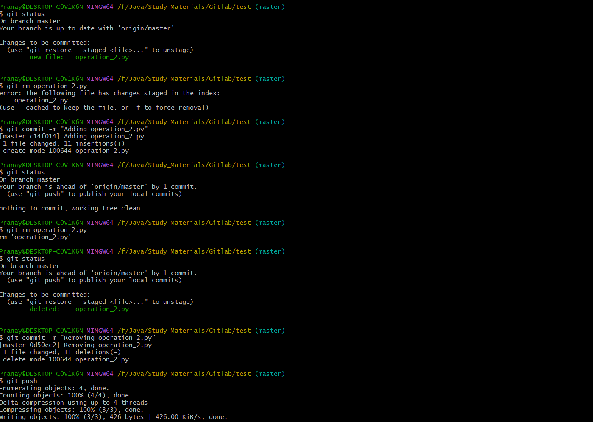

# Tracking Changes

## git status

### Description

It is used to display the state of the working directory and the staging area. It shows which changes have been staged, which haven't, and which files aren't being tracked by Git. This command is very useful for getting a quick overview of the current status of the repository.

### Usage

```sh
git status [<options>]
```

#### Options

`-s` or `--short` : It gives the output in a more concise, short format.

Example short format output:

```ruby
M file3.txt
?? file4.txt
```


`M` indicates a modified file.\
`??` indicates an untracked file.


`-b` or `--branch:` Shows the branch and tracking information in a short format.

```sh
git status -s
git status -b
```

### What It Shows

* **Untracked Files**: Files in your working directory that aren't tracked by Git.
* **Tracked Files**: Files that are tracked by Git and have changes that haven't been staged yet.
* **Staged Changes**: Files that have changes staged for the next commit.
* **Branch Information**: The current branch you are on and whether your local branch is ahead, behind, or has diverged from the remote branch.


**Status Indication**: `git status` provides hints on what to do next, such as commands to stage files, unstage files, or discard changes.

**Performance**: `git status` can be slow in large repositories because it checks the entire working directory. In such cases, using `git status -uno` (show untracked files only) might improve performance.


### Example Output

Here’s an example of what `git status` might display

<figure><figcaption></figcaption></figure>

Or

```git
On branch main
Your branch is up to date with 'origin/main'.

Changes to be committed:
  (use "git restore --staged <file>..." to unstage)
        modified:   file1.txt
        new file:   file2.txt

Changes not staged for commit:
  (use "git add <file>..." to update what will be committed)
  (use "git restore <file>..." to discard changes in working directory)
        modified:   file3.txt

Untracked files:
  (use "git add <file>..." to include in what will be committed)
        file4.txt
```

#### Breakdown of Example Output

* **Branch Information**:
  * `On branch main`: Indicates the current branch.
  * `Your branch is up to date with 'origin/main'.`: Shows synchronization status with the remote branch.
* **Staged Changes (Changes to be committed)**:
  * `modified: file1.txt`: `file1.txt` has been modified and staged.
  * `new file: file2.txt`: `file2.txt` is a new file that has been staged.
* **Changes Not Staged for Commit**:
  * `modified: file3.txt`: `file3.txt` has been modified but not staged.
* **Untracked Files**:
  * `file4.txt`: `file4.txt` is a new file that isn't being tracked by Git.

### Common Workflow

```git
-- Check Status
git status

-- Stage Changes
git add file3.txt

-- Check Status Again
git status

-- Commit Staged Changes
git commit -m "Modify file3.txt"

-- Check Status After Commit
git status
```


## git diff

### Description

The `git diff` command is used to show changes between commits, commit and working tree, etc. It is a powerful tool for inspecting the differences between various states of a repository.


By default, git diff shows the differences in the command-line interface. However, it is also possible to use tools like graphical diff viewers to make it easier to review changes. For example, git difftool can be used to open a graphical diff viewer, such as Beyond Compare or KDiff3 or meld etc.


### Usage

```sh
git diff [<options>] [<commit>] [--] [<path>...]
```

#### Options

* `--staged` or `--cached`: Compare the staged changes with the last commit.
* `--name-only`: Show only the names of changed files.
* `--name-status`: Show the names and status of changed files.
* `-p` or `--patch`: Generate patch (standard output format).
* `--stat`: Show a summary of changes
* `-U<n>` or `--unified=<n>`: Generate diffs with \<n> lines of context.
* `--color`: Colorize the diff output.

```git
git diff --staged
git diff --name-only
git diff --name-status
git diff -p
git diff --stat
git diff -U3
git diff --color
```

### Basic Use Cases

```git
-- Compare Working Directory to Staging Area
-- Shows changes between the working directory and the staging area.
git diff

-- Compare Staging Area to Last Commit
-- Shows changes between the staging area and the last commit
git diff --staged

-- Compare Working Directory to Last Commit
-- Shows changes between the working directory and the last commit
git diff HEAD

-- Compare Two Commits
-- Shows changes between two specific commits
git diff <commit1> <commit2>

-- Compare a Specific File
-- Shows changes in a specific file between the working directory and a commit, or between two commits.
git diff <commit> -- <file>

-- Compare Branches
-- Shows changes between two branches
git diff <branch1> <branch2>
```

### Example Output

```
git diff
```

<figure><figcaption></figcaption></figure>

```
git diff <filename>
```

<figure><figcaption></figcaption></figure>

```
git diff --stat
```

<figure><figcaption></figcaption></figure>


## git add

### Description

It is used to add changes in the working directory to the staging area. This command prepares the changes to be included in the next commit.

### Usage

```sh
git add [<options>] [--] <pathspec>...
```

* `<pathspec>`: Specifies the files or directories to be added. This can be a specific file, a directory, or a pattern.
* `[--]`: Used to separate paths from options, useful if the paths might be mistaken for options.

#### Options

`-A` or `--all`: Stages all changes (modifications, deletions, and untracked files).

`-p` or `--patch`: Interactively stage changes, allowing you to review each hunk before staging

`-u` or `--update`: Stages modifications and deletions, but not new untracked files.

`-n` or `--dry-run`: Shows what would be staged without actually staging the changes.

`-v` or `--verbose`: Shows the files as they are being added.

```
git add -A
git add -p
git add -u
git add -n
git add -v
```

### What It Does

1. **Stages Changes**: Adds changes in specified files or directories to the staging area.
2. **New and Modified Files**: Tracks new files and stages changes in modified files.
3. **Does Not Affect Unchanged Files**: Does not change the state of files that haven't been modified.


**Staging Area**: The staging area (also called the index) is an intermediate area where changes are listed to be included in the next commit. This allows to build up a commit incrementally, adding and reviewing changes before committing them.

**Removing Files**: To remove a file from the staging area, use:

git restore --staged filename.txt

**Interactive Mode**: Using `git add -p` is especially useful for selectively staging parts of files.


### Common Use Cases

```git
-- Add a Specific File
-- Stages changes in filename.txt for the next commit
git add filename.txt

-- Add All Changes
-- Stages all changes in the current directory and subdirectories
git add .

-- Add All Changes (Except Untracked Files)
-- Stages modifications and deletions, but not new untracked files
git add -u

-- Add All Changes in a Specific Directory
-- Stages all changes in the specified directory
git add path/to/directory

-- Add Changes Matching a Pattern
-- Stages changes in all .txt files
git add '*.txt'

-- Removing Files
-- To remove a file from the staging area
git restore --staged filename.txt
```

### Example Output

When running `git status` after staging changes with `git add`

<figure><figcaption></figcaption></figure>


## git rm

### Description

It is used to remove files from the working directory and the staging area (index). This command stages the removal of files so that they will be deleted in the next commit.

### Usage

```sh
git rm [<options>] [--] <file>...
```

* `<file>`: Specifies the file(s) to be removed.

#### Options

`-f` or `--force`: Forces the removal of files. This is required if the files have been modified or if they are staged for commit.

`-r` or `--recursive`: Allows recursive removal of files in directories.

`--cached`: Removes the file only from the staging area, not from the working directory. This stops Git from tracking the file.

`-n` or `--dry-run`: Shows what would be removed without actually removing the files.

```
git rm -f filename.txt
git rm -r dirname/
git rm --cached filename.txt
git rm -n filename.txt
```

### What It Does

1. **Removes Files from the Working Directory**: Deletes the specified files from the working directory.
2. **Stages the Removal**: Stages the deletion of the specified files, so the changes will be included in the next commit.
3. **Does Not Remove Directories**: Only removes files, not directories.

### Common Use Cases

```git
-- Remove a Specific File
-- Removes filename.txt from both the working directory and the staging area
git rm filename.txt

-- Remove Multiple Files
-- Removes both file1.txt and file2.txt
git rm file1.txt file2.txt

-- Remove Files Using a Pattern
-- Removes all .log files from the working directory and stages the deletion
git rm '*.log'

-- Force Remove
-- Forces the removal of filename.txt even if it has been modified
git rm -f filename.txt

-- Keep File in Working Directory
-- Removes filename.txt from the staging area but leaves it in the working directory. 
-- This is useful for stopping tracking of a file without deleting it locally.
git rm --cached filename.txt

-- Untracked Files 
-- If we want to remove untracked files from the working directory, we can use the git clean command instead
git clean -f
```

### Example Workflow

```git
-- Check Current Status
git status

-- Remove a File
git rm filename.txt

-- Check Status Again
git status

-- Commit the Changes
git commit -m "Remove filename.txt"
```

### Example Output

When running `git status` after using `git rm`

<figure><figcaption></figcaption></figure>

<figure><figcaption></figcaption></figure>

## git commit

### Description

It is used to record changes in the repository. It captures a snapshot of the project’s currently staged changes, making them part of the project’s history.

### Usage

```sh
git commit [<options>] [--] [<file>...]
```

* `<file>`: Optionally specify files to commit. If omitted, all staged changes will be committed.

#### Options

`-m <msg>` or `--message=<msg>`: Specifies the commit message directly in the command

`-a` or `--all`: Stages all tracked, modified files and commits them in one step

`-v` or `--verbose`: Shows the diff of changes in the editor during commit message writing.

`--amend`: Modifies the previous commit with new changes and/or a new commit message

`--dry-run`: Shows what would be committed without actually committing the changes.

`-q` or `--quiet`: Suppresses commit output

```
git commit -m "Add new feature"
git commit -a -m "Update all modified files"
git commit -v
git commit --amend -m "Correct previous commit message"
git commit --dry-run
git commit -q -m "Silent commit"
```

### What It Does

1. **Creates a Commit**: Saves the staged changes as a new commit in the repository.
2. **Includes a Commit Message**: Each commit requires a message describing the changes.
3. **Associates Metadata**: Each commit includes metadata like the author, date, and a unique hash identifier.


**Commit Messages**: Commit messages should be descriptive and concise, explaining the rationale for the changes. It's good practice to follow conventions such as the 50/72 rule: a short summary of 50 characters or less, followed by a blank line, and then a detailed description wrapped at 72 characters.

**Atomic Commits**: Each commit should represent a single logical change. This helps in understanding the project history and makes it easier to identify when specific changes were introduced.

**Amending Commits**: Be cautious with `--amend` if we've already pushed the original commit to a shared repository, as it rewrites history and can cause issues for others working with the same repository.

<mark style="background-color:orange;">**Revert Commits:**</mark> If we have committed some changes and now wanted to undo the commit and bring back changes to staging or unstaging area then refer to **git reset** command.


### Common Use Cases

```git
-- Commit All Staged Changes
-- Commits all changes that have been staged with a message
git commit -m "Your commit message"

-- Commit Specific Files
-- Commits only the specified files
git commit <file1> <file2> -m "Commit message"

-- Interactive Commit
-- Opens the default text editor to enter a commit message
git commit
```

### Example Workflow

```
-- 1. Stage Changes
git add .

-- 2. Commit All Staged Changes
git commit -m "Initial commit"

-- 3. Modify a File and Commit with Amend
echo "new content" >> file.txt
git add file.txt
git commit --amend -m "Add new content to file.txt"

-- 4. Commit All Tracked and Modified Files
git commit -a -m "Update modified files"
```

### Example Output

When running `git commit -m "Initial commit"`

<figure><figcaption></figcaption></figure>
