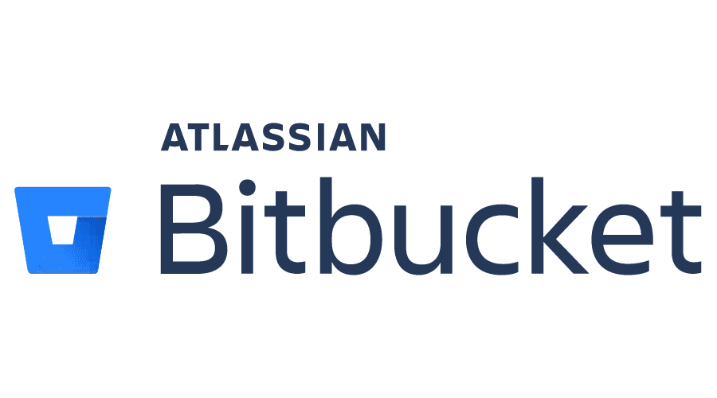

# Bitbucket

## About

**Bitbucket** is a Git-based code hosting and collaboration platform developed by Atlassian. It enables teams to manage repositories, collaborate through pull requests and code reviews, and automate workflows via built-in CI/CD pipelines.

Unlike GitHub and GitLab, Bitbucket is deeply integrated with other Atlassian tools like **Jira, Confluence, and Trello**, making it a popular choice for teams already using the Atlassian ecosystem.

Bitbucket supports both **cloud-hosted** and **self-managed (Bitbucket Data Center)** options, giving teams flexibility based on security, scalability, and compliance needs.

<figure><figcaption></figcaption></figure>

## Importance of Bitbucket

Bitbucket is an important tool for teams seeking a tightly integrated development and project management workflow, especially those already using Atlassian products.

* **Deep Atlassian Integration**\
  Seamlessly connects with **Jira, Confluence, Trello**, and other Atlassian tools to link code with planning, documentation, and task tracking.
* **Team-Centric Collaboration**\
  Designed with team workflows in mind - pull requests, branch permissions, and inline code reviews promote structured collaboration.
* **Built-in CI/CD (Bitbucket Pipelines)**\
  Lets teams build, test, and deploy directly from the repository with simple YAML-based configuration.
* **Flexible Deployment Options**\
  Offers both **Bitbucket Cloud** for easy access and **Bitbucket Data Center** for enterprise-grade self-hosted deployments.
* **Granular Access Control**\
  Provides fine-grained permissions at the project, repo, and branch level to manage contributions securely.
* **Scalable for Enterprises**\
  Used by large teams and organizations for its integration, scalability, and centralized control over DevOps processes.

## Features

<table data-full-width="true"><thead><tr><th width="175.4609375">Feature Category</th><th width="283.51171875">Key Capabilities</th><th>Purpose / Benefit</th></tr></thead><tbody><tr><td><strong>Git Repository Hosting</strong></td><td>Support for Git (and Mercurial in legacy versions), unlimited private repos</td><td>Manage source code securely in the cloud or on-prem</td></tr><tr><td><strong>Pull Requests &#x26; Code Review</strong></td><td>Inline commenting, approvals, merge checks, and default reviewers</td><td>Enable structured collaboration and high-quality code</td></tr><tr><td><strong>Branch Permissions</strong></td><td>Control who can push, merge, or create branches</td><td>Enforce workflows and protect critical branches</td></tr><tr><td><strong>CI/CD (Bitbucket Pipelines)</strong></td><td>Integrated CI/CD with YAML configuration, Docker support</td><td>Automate builds, tests, and deployments directly from our repository</td></tr><tr><td><strong>Jira Integration</strong></td><td>Link commits, branches, and pull requests to Jira issues</td><td>Provide traceability from code to task management</td></tr><tr><td><strong>Issue Tracking (Cloud)</strong></td><td>Built-in issue tracker (basic)</td><td>Manage lightweight tasks directly within Bitbucket (cloud only)</td></tr><tr><td><strong>Snippets</strong></td><td>Share reusable pieces of code or scripts across teams</td><td>Promote knowledge sharing and reusability</td></tr><tr><td><strong>Self-Hosting Option</strong></td><td>Bitbucket Data Center for enterprise deployments</td><td>Control infrastructure, compliance, and security in private environments</td></tr><tr><td><strong>REST APIs &#x26; Webhooks</strong></td><td>Automate workflows and integrate with custom tools</td><td>Build custom solutions on top of Bitbucket</td></tr><tr><td><strong>Smart Mirroring (Data Center)</strong></td><td>Mirror repositories across locations for faster cloning</td><td>Improve performance for distributed teams</td></tr></tbody></table>

## Integrations & Extensions

Bitbucket integrates seamlessly with tools across the Atlassian ecosystem and beyond, enabling teams to create streamlined, connected development workflows.

<table data-full-width="true"><thead><tr><th width="178.62890625">Category</th><th width="253.03125">Examples</th><th>Purpose / Benefit</th></tr></thead><tbody><tr><td><strong>Project Management</strong></td><td>Jira, Trello</td><td>Link commits, branches, and PRs to tasks for full traceability</td></tr><tr><td><strong>Documentation</strong></td><td>Confluence</td><td>Auto-link code and project docs, and embed code snippets in pages</td></tr><tr><td><strong>CI/CD &#x26; DevOps</strong></td><td>Bitbucket Pipelines, Bamboo, Jenkins</td><td>Build, test, and deploy from source with native or external tools</td></tr><tr><td><strong>Communication Tools</strong></td><td>Slack, Microsoft Teams</td><td>Get real-time notifications for commits, PRs, pipelines, and more</td></tr><tr><td><strong>Monitoring &#x26; Alerts</strong></td><td>Sentry, Datadog, New Relic</td><td>Track errors and performance from code to production</td></tr><tr><td><strong>Container &#x26; Cloud</strong></td><td>Docker Hub, AWS, Google Cloud, Azure</td><td>Build, deploy, and manage containers directly in pipelines</td></tr><tr><td><strong>Authentication &#x26; SSO</strong></td><td>SAML, LDAP, Atlassian Access</td><td>Centralize identity and enforce enterprise-grade access control</td></tr><tr><td><strong>Code Quality &#x26; Security</strong></td><td>SonarQube, Snyk, Codecov</td><td>Run static analysis, scan for vulnerabilities, and monitor coverage</td></tr><tr><td><strong>API &#x26; Webhooks</strong></td><td>Bitbucket REST APIs, Custom Webhooks</td><td>Automate custom workflows and tool integrations</td></tr></tbody></table>

## Pricing Model & Plans

Bitbucket offers multiple pricing tiers designed for individuals, small teams, and large enterprises. Each plan adds more collaboration tools, CI/CD capacity, and administrative control.

<table><thead><tr><th width="143.18359375">Plan</th><th>Description</th></tr></thead><tbody><tr><td><strong>Free</strong></td><td>Ideal for individuals or small teams. Includes private repositories, built-in CI/CD (Bitbucket Pipelines), pull requests, and basic Jira integration.</td></tr><tr><td><strong>Standard</strong></td><td>Adds more CI/CD build minutes, user permissions, merge checks, and deployment previews. Suitable for growing teams that need more control and flexibility.</td></tr><tr><td><strong>Premium</strong></td><td>Includes advanced features such as required pull request approvers, IP allowlisting, smart mirroring, and more secure deployment controls.</td></tr><tr><td><strong>Data Center (Self-hosted)</strong></td><td>Designed for large organizations that require full control over infrastructure. Supports high availability, performance at scale, and enterprise-grade compliance features.</td></tr></tbody></table>


Bitbucket's pricing and features may evolve over time.\
Always refer to the official Bitbucket pricing page for the latest details.

