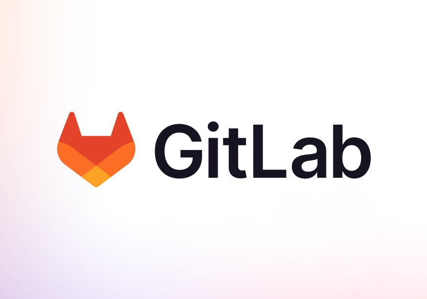

# GitLab

## About

GitLab is a web-based DevSecOps platform that provides a complete end-to-end solution for software development - from version control to deployment. Like GitHub, it’s built around Git, but goes further by integrating built-in tools for **planning, CI/CD, security testing, and monitoring** within a single application.

Unlike platforms that require stitching together different tools, GitLab offers a **"single application for the entire DevOps lifecycle,"** helping teams reduce toolchain complexity, improve collaboration, and accelerate delivery.

It is available in both **cloud-hosted** and **self-managed** editions, making it suitable for startups, enterprises, and regulated environments.

<figure><figcaption></figcaption></figure>

## Importance of GitLab

Understanding GitLab is valuable because it streamlines and unifies the entire software development lifecycle in one place - from planning to deployment.

* **All-in-One DevOps Platform**\
  GitLab combines version control, CI/CD, issue tracking, security, and monitoring — eliminating the need for separate tools.
* **Built-in CI/CD from the Start**\
  Unlike GitHub, where CI/CD is an add-on (GitHub Actions), GitLab CI/CD is a core part of the platform, tightly integrated and highly configurable.
* **Self-Hosted Option**\
  Offers flexibility to host GitLab on our own infrastructure, ideal for organizations with compliance or data control requirements.
* **DevSecOps Capabilities**\
  Built-in tools for static and dynamic code analysis, container scanning, license compliance, and security testing shift security left in the pipeline.
* **Streamlined Collaboration**\
  Developers, testers, security teams, and ops can work together in a unified environment — reducing silos and context switching.
* **Enterprise-Ready**\
  Trusted by large organizations for secure, auditable, and scalable software delivery.

## Features

<table data-full-width="true"><thead><tr><th width="133.60546875" valign="top">Feature Category</th><th width="314.27734375" valign="top">Key Capabilities</th><th valign="top">Purpose / Benefit</th></tr></thead><tbody><tr><td valign="top"><strong>Repository Management</strong></td><td valign="top">Git-based version control with branching, tagging, and merge requests</td><td valign="top">Host and manage code using Git, with collaboration built in</td></tr><tr><td valign="top"><strong>CI/CD</strong></td><td valign="top">GitLab CI/CD pipelines, runners, templates, environment support</td><td valign="top">Automate build, test, and deployment steps in a single platform</td></tr><tr><td valign="top"><strong>Issue Tracking</strong></td><td valign="top">Issues, labels, epics, milestones, boards</td><td valign="top">Plan and track work alongside code</td></tr><tr><td valign="top"><strong>Merge Requests</strong></td><td valign="top">Inline code review, approvals, discussions, suggestions</td><td valign="top">Enable collaborative review and safe merging of code</td></tr><tr><td valign="top"><strong>Security &#x26; Compliance</strong></td><td valign="top">Static analysis (SAST), dynamic analysis (DAST), container scanning, license checks</td><td valign="top">Shift security left and enforce policies early in the pipeline</td></tr><tr><td valign="top"><strong>DevSecOps Integration</strong></td><td valign="top">Full DevOps lifecycle: plan → create → verify → package → secure → release → monitor</td><td valign="top">Bring all teams into a unified workflow for delivery and governance</td></tr><tr><td valign="top"><strong>Self-Hosting Support</strong></td><td valign="top">GitLab Community Edition (CE) &#x26; Enterprise Edition (EE)</td><td valign="top">Install on-premises with full control over infrastructure and data</td></tr><tr><td valign="top"><strong>Package Registry</strong></td><td valign="top">Store and manage Docker images, npm packages, Maven, etc.</td><td valign="top">Centralize dependency management inside GitLab</td></tr><tr><td valign="top"><strong>Monitoring &#x26; Alerts</strong></td><td valign="top">Pipeline performance, error tracking, Grafana/Prometheus integrations</td><td valign="top">Track system health and respond to failures faster</td></tr><tr><td valign="top"><strong>Auto DevOps</strong></td><td valign="top">Predefined CI/CD pipelines with best-practice defaults</td><td valign="top">Fast-track delivery without needing to write custom pipeline scripts</td></tr></tbody></table>

## Integrations & Extensions

GitLab is designed to be **highly extensible**, with built-in support for a wide range of integrations across the development, security, deployment, and monitoring ecosystem. It also offers a powerful API and webhook system for building custom workflows.

<table data-full-width="true"><thead><tr><th width="151.8828125">Category</th><th width="264.328125">Examples</th><th>Purpose / Benefit</th></tr></thead><tbody><tr><td><strong>IDEs &#x26; Editors</strong></td><td>VS Code, JetBrains IDEs (via plugins), Vim</td><td>Work with GitLab repositories and merge requests directly inside the IDE</td></tr><tr><td><strong>CI/CD &#x26; DevOps Tools</strong></td><td>Kubernetes, Terraform, Ansible, Docker</td><td>Deploy, manage infrastructure, and build images in CI/CD pipelines</td></tr><tr><td><strong>Monitoring &#x26; Alerts</strong></td><td>Prometheus, Grafana, Sentry</td><td>Visualize metrics, track errors, and receive alerts</td></tr><tr><td><strong>Security Tools</strong></td><td>WhiteSource, Fortify, Checkmarx, and custom scanners</td><td>Extend security scanning and license compliance checking</td></tr><tr><td><strong>Project Management</strong></td><td>Jira, Trello, Slack, Microsoft Teams</td><td>Sync issues, get notifications, and integrate team communication</td></tr><tr><td><strong>Cloud Providers</strong></td><td>AWS, GCP, Azure, DigitalOcean</td><td>Deploy apps or infrastructure directly from pipelines</td></tr><tr><td><strong>Container Registries</strong></td><td>Docker Hub, GitLab Container Registry, Harbor</td><td>Store and deploy containers from pipelines or releases</td></tr><tr><td><strong>Authentication &#x26; SSO</strong></td><td>LDAP, SAML, OAuth2, Keycloak</td><td>Secure access management with enterprise identity systems</td></tr><tr><td><strong>API &#x26; Webhooks</strong></td><td>GitLab REST &#x26; GraphQL APIs, custom webhooks</td><td>Automate workflows, integrate with internal tools</td></tr></tbody></table>

## Pricing Model & Plans

GitLab offers multiple pricing tiers to suit individuals, teams, and enterprises, with flexible options for both cloud-hosted and self-managed deployments.

<table><thead><tr><th width="103.546875">Plan</th><th>Description</th></tr></thead><tbody><tr><td><strong>Free</strong></td><td>Suitable for individuals or small teams. Includes core features like Git repository hosting, basic CI/CD, and issue tracking.</td></tr><tr><td><strong>Premium</strong></td><td>Designed for growing teams. Adds advanced CI/CD tools, project management features, higher usage limits, and access to support.</td></tr><tr><td><strong>Ultimate</strong></td><td>Intended for large organizations with advanced needs. Includes everything in Premium, plus security testing (SAST, DAST), compliance features, value stream management, and additional analytics.</td></tr></tbody></table>


Pricing, limits, and features may change over time.\
For the latest and most accurate details, always refer to the official GitLab pricing page.


