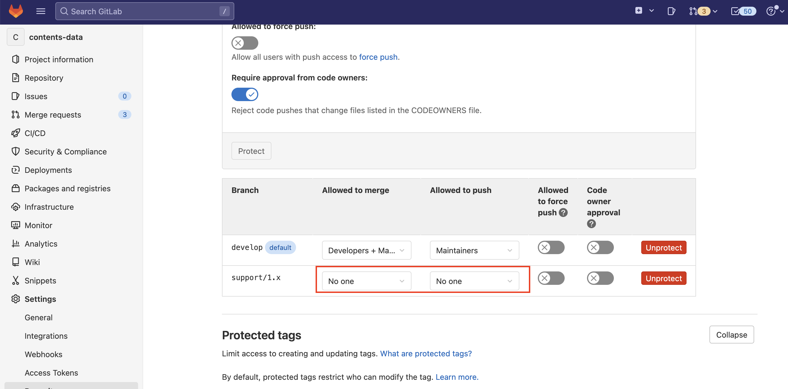

# Freeze a branch

## About

Freezing a branch in GitLab isn't a built-in GitLab feature per se, but we can **prevent changes** to a branch by using a combination of GitLab settings and permissions. This is commonly done when we want to **lock** or **freeze** a release or production branch.

Here are common methods to "freeze" a branch in GitLab:

## Option 1: **Protect the Branch (Recommended for Freezing)**

This will prevent anyone (or certain roles) from pushing or force-pushing to the branch.

**Steps:**

1. Go to your GitLab project.
2. Navigate to: `Settings` → `Repository`.
3. Scroll to **Protected Branches**.
4. In the **"Protect a branch"** section:
   * Choose the branch you want to freeze (e.g., `release`, `main`).
   * Set:
     * **Allowed to push:** `No one`
     * **Allowed to merge:** `No one` _(or keep Maintainers if needed for hotfixes)_
   * Click **Protect**.

> This effectively freezes the branch: no one can push, force push, or merge into it unless you modify these settings.

<figure><figcaption></figcaption></figure>


### Option 2: **Tag the Branch Instead of Freezing**

If the goal is to preserve the current state for a release, you can create a **Git tag** (e.g., `v1.0.0`) and treat that as frozen.

```bash
git checkout release
git tag -a v1.0.0 -m "Release version 1.0.0"
git push origin v1.0.0
```

Tags are immutable by default in GitLab (unless explicitly allowed to be moved), so this provides a "freeze snapshot" without freezing the actual branch.

### Option 3: **Use Code Owners + Merge Request Rules (Premium+)**

If you have GitLab Premium or higher, you can:

* Define `CODEOWNERS` file for the branch.
* Require approval from code owners before merging.
* Combine this with protected branches.

This doesn’t freeze the branch but **controls who can change it**, useful for controlled release branches.
