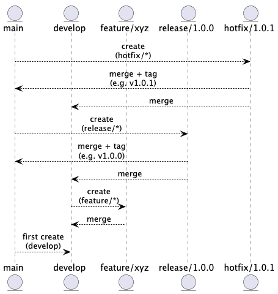

# Git Flow

## About

Git Flow is a branching model that standardizes how features, fixes, and releases are handled in Git-based projects. It introduces **long-lived branches** for stability (`main`, `develop`) and **short-lived branches** for isolated work (`feature`, `release`, `hotfix`).

It is designed to help teams:

* Work on multiple features or fixes in parallel.
* Maintain stable production code.
* Manage releases systematically.
* Handle emergency fixes cleanly.

Introduced by Vincent Driessen, Git Flow is particularly suited to projects with **scheduled releases**, **QA stages**, and **parallel development efforts**.

## Key Branches

Git Flow defines **five main branch types**:

### **`main` Branch**

* The `main` branch (also called `master` in older repositories) is the **production-ready** branch.
* It contains the official release history of the project.
* Every commit here is **fully tested**, **stable**, and **ready to be deployed to production**.
* In many organizations, this branch is protected to prevent direct pushes.


- Deployments and production rollbacks happen from `main`.
- Release tags (e.g., `v1.0.0`, `v2.3.5`) are created on this branch.
- CI/CD pipelines often trigger **production deployment** when a commit lands in `main`.
- Ensures traceability of what's running in production.


### **`develop` Branch**

* Serves as the **integration branch** for ongoing development work.
* All completed `feature/*` branches are merged into `develop`.
* When `develop` reaches a stable point (all planned features for a release are merged), it is used to create a `release/*` branch or directly merged into `main` if a release is ready.


- Acts as the **next release candidate** base.
- Continuous integration runs against `develop` to detect broken changes early.
- Helps separate **unstable** development code from **stable** production code.
- Teams perform functional and regression testing on this branch before creating a release.


### **`feature/*` Branches**

* These are **short-lived branches** used to develop individual features or enhancements.
* Branches are created from `develop`.
* Once the work is complete and tested locally, the feature branch is merged back into `develop`.
* Naming follows a clear convention like `feature/user-auth`, `feature/pdf-export`, `feature/payment-gateway`.


- Enables **parallel development** by different team members without conflicts.
- Isolates incomplete or experimental code from the rest of the codebase.
- Encourages **incremental delivery** by keeping each branch focused and small.
- Helps enforce pull request reviews and code quality standards before integration.


### **`release/*` Branches**

* Used to **prepare code for a production release**.
* Created from `develop` when all planned features for a version are ready.
* Only release-critical changes (bug fixes, final testing updates, version bumps) are made in this branch.
* Once finalized, merged into both `main` and `develop`.


- Provides a **stabilization window** before releasing to production.
- Allows teams to continue feature development on `develop` while QA happens on `release/*`.
- Supports staging environments for user acceptance testing (UAT).
- Prevents last-minute bugs from being directly introduced into production.


### **`hotfix/*` Branches**

* Created to **patch bugs found in the production environment**.
* Originates from `main` and is merged back into both `main` and `develop` to keep branches in sync.
* The fastest way to fix a production issue without waiting for the current development cycle to finish.
* Named like `hotfix/memory-leak`, `hotfix/1.2.1-crash-fix`.


- Critical for **rapid response to outages or high-priority defects**.
- Fixes can be released immediately, independent of current release or feature work.
- Maintains a clean and traceable history of production hotfixes.
- Keeps long-term and short-term workstreams decoupled.


## **How Git Flow Works ?**

<figure><figcaption></figcaption></figure>

### Starting a New Feature

```bash
git checkout develop
git checkout -b feature/login-page
# work on the feature
git commit -am "add login form"
git checkout develop
git merge feature/login-page
git branch -d feature/login-page
```

### Preparing a Release

```bash
git checkout develop
git checkout -b release/1.3.0
# perform QA fixes, update changelog, bump version
git commit -am "prepare release 1.3.0"
git checkout main
git merge release/1.3.0
git tag -a v1.3.0
git checkout develop
git merge release/1.3.0
git branch -d release/1.3.0
```

### Applying a Hotfix

```bash
git checkout main
git checkout -b hotfix/1.3.1
# fix the bug
git commit -am "fix: production bug"
git checkout main
git merge hotfix/1.3.1
git tag -a v1.3.1
git checkout develop
git merge hotfix/1.3.1
git branch -d hotfix/1.3.1
```

## Best Practices

#### 1. **Establish and Communicate our Branching Model Early**

* Before development starts, ensure **all developers understand the purpose** of `main`, `develop`, `feature/*`, `release/*`, and `hotfix/*` branches.
* Document it in the project's README, GitLab/GitHub Wiki, or internal engineering handbook.

#### 2. **Create Descriptive Feature Branch Names**

Use clear, predictable patterns to name branches:

```
feature/login-page
feature/email-notifications
hotfix/fix-crash-on-save
release/2.0.0
```

* Avoid vague names like `feature/new-stuff` or `bugfix/temp`.

#### 3. **Keep Feature Branches Short-Lived**

* Feature branches should be **small, focused**, and merged frequently.
* Avoid long-running branches to minimize merge conflicts and divergence from `develop`.

#### 4. **Regularly Sync with `develop`**

* Developers should **rebase or merge `develop`** into their `feature/*` branches regularly.
* This avoids painful integration issues when finally merging back.

#### 5. **Enforce Pull Request Reviews**

* All merges into `develop`, `release`, or `main` should go through a **Merge Request/Pull Request**.
* This enables peer review, automated checks (CI/CD), and code quality gates.

#### 6. **Don’t Commit Directly to `develop` or `main`**

* Treat `develop` as our **team-shared integration point**, and `main` as your **production environment**.
* All work should go through `feature/*`, `hotfix/*`, or `release/*`.

#### 7. **Use `release/*` to Finalize and Stabilize**

* Create a `release/*` branch when all features for a release are merged into `develop`.
* Apply only critical bug fixes, documentation updates, or versioning here.
* Prevent new features from creeping into a release late.

#### 8. **Merge `release/*` into Both `main` and `develop`**

* After final testing and tagging on `release/*`, merge it into both `main` and `develop`.
* This ensures version bumps and fixes during release are also in the future development base.

#### 9. **Handle Hotfixes Through `hotfix/*`**

* If an issue is found in production, immediately branch from `main` into a `hotfix/*`.
* Once the fix is verified, merge it back into both `main` and `develop`.

#### 10. **Tag Releases on `main`**

* Always tag production-ready commits (on `main`) with release versions:

```
git tag -a v1.0.0 -m "Initial release"
```

* Tags help identify what code is deployed and simplify rollbacks.

#### 11. **Automate CI/CD Based on Branches**

* Set up CI/CD pipelines to run tests and deploy from specific branches:
  * Run all tests on `develop`.
  * Deploy to staging from `release/*`.
  * Deploy to production from `main`.

#### 12. **Clean Up Merged Branches**

* After a branch is merged, **delete it** to keep your repo clean:
  * `git push origin --delete feature/xyz`
* Automate this with merge request settings or CI jobs.

#### 13. **Avoid Overusing `hotfix/*`**

* If we are frequently patching production with hotfixes, it's a **sign of quality issues**.
* Improve regression testing and release QA.

#### 14. **Use `.gitignore` and `.gitattributes` Consistently**

* Standardize file exclusions and attributes across the team to avoid inconsistent diffs and unnecessary files.

#### 15. **Document Common Git Flow Tasks**

* Create a cheat sheet for:
  * Starting a feature
  * Starting a release
  * Performing a hotfix
  * Tagging a release
  * Merging conventions

This saves time and avoids mistakes.

## When to Use Git Flow and When Not ?

<table data-header-hidden data-full-width="true"><thead><tr><th width="216.45703125"></th><th width="286.640625"></th><th width="301.734375"></th></tr></thead><tbody><tr><td><strong>Criteria</strong></td><td><strong>Use Git Flow</strong></td><td><strong>Avoid Git Flow</strong></td></tr><tr><td><strong>Team Size</strong></td><td>Medium to large teams (3+ devs)</td><td>Solo developers or very small teams</td></tr><tr><td><strong>Release Frequency</strong></td><td>Scheduled, versioned releases (e.g., weekly, monthly)</td><td>Continuous delivery or multiple daily releases</td></tr><tr><td><strong>Release Process</strong></td><td>Has distinct <strong>QA, UAT, and staging</strong> phases before production</td><td>Fast-paced, straight-to-prod after review/CI</td></tr><tr><td><strong>Stability Requirements</strong></td><td>Strict production stability needed</td><td>Low risk tolerance or MVP development</td></tr><tr><td><strong>Hotfix Support</strong></td><td>Needs ability to patch production independently</td><td>Hotfixes go through normal flow or are rare</td></tr><tr><td><strong>Maintenance of Multiple Versions</strong></td><td>Maintains older versions in production</td><td>Only latest version matters</td></tr><tr><td><strong>Versioning Policy</strong></td><td>Follows semantic versioning, releases are tagged</td><td>Versioning isn't tracked or is auto-generated by CI</td></tr><tr><td><strong>Development Culture</strong></td><td>Clear separation between dev, test, and release branches</td><td>Prefers simplicity and minimal branching</td></tr><tr><td><strong>Branching Discipline</strong></td><td>Team follows a strict process and naming conventions</td><td>Developers push frequently to one or two main branches</td></tr><tr><td><strong>Tooling Setup</strong></td><td>Has structured CI/CD pipelines for each branch type</td><td>Lightweight or manual deployments</td></tr></tbody></table>


