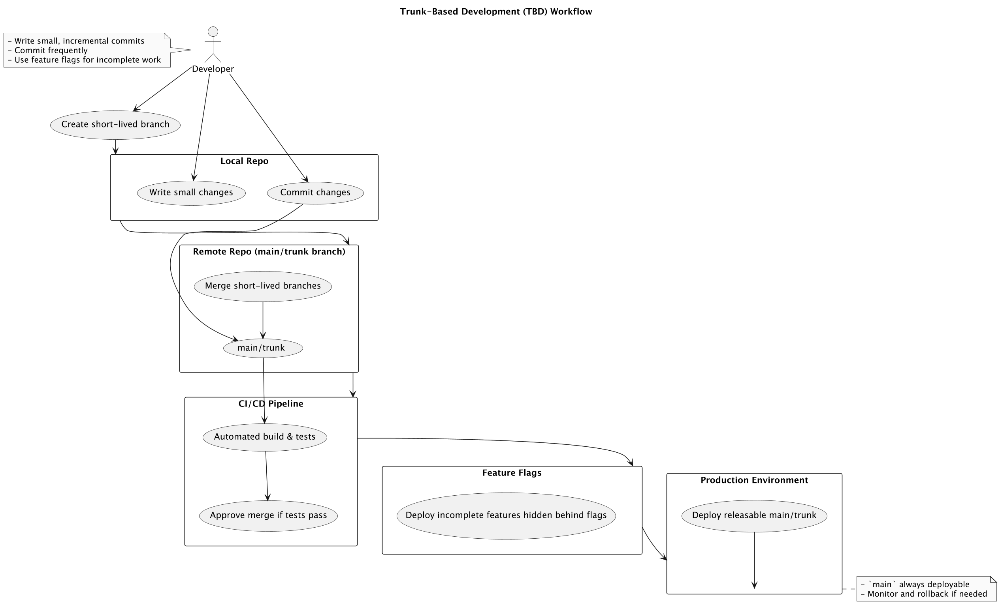

# Trunk-Based Development

## About

Trunk-Based Development (TBD) is a **software development strategy** where all engineers **integrate their code changes into a single shared branch**, usually called `main`, `master`, or `trunk`, **frequently — often multiple times a day**.

Unlike traditional workflows that use long-lived feature branches, TBD promotes:

* **High frequency of integration**
* **Minimal divergence from main**
* **Fast feedback loops**
* **Reduced risk of integration conflicts**

TBD is more than just a Git practice — it's a **cultural and architectural approach** to software delivery that aligns with modern methodologies like Agile, CI/CD, DevOps, and Lean.

## **Historical Context**

#### The Problem It Solves:

* In older workflows (e.g., Git Flow), developers often worked on **long-lived branches**, sometimes for weeks or months.
* This led to **“merge hell”** — massive, error-prone merges.
* Bugs and regressions would often surface **late in the development cycle**, right before release.
* Teams spent significant time **rebasing or resolving conflicts**, rather than building features.

TBD emerged as a response to this, especially as:

* CI/CD became mainstream.
* Agile and Lean advocated for **short feedback cycles**.
* Companies needed to **release faster without breaking things.**


**Real-World Adoption Examples**

* **Google**: 1 billion files in a monorepo; all developers commit to `main`.
* **Facebook**: Large-scale trunk-based dev with feature flags and monorepo tooling.
* **Netflix**: Fast iterations and releases using trunk-based workflows with extensive testing.
* **Amazon**: Microservices architecture with small teams committing directly to `main`.


## **Key Principles**

### a. **Single Source of Truth**

Everyone commits to a single branch (`main`) or integrates their work into it **continuously**. This is the authoritative version of the codebase.

### b. **Short-Lived Branches**

If branches are used (e.g., for pull requests), they:

* Are created for a specific task.
* Stay alive for **less than a day**.
* Are merged immediately after code review.

### c. **Continuous Integration**

Every commit to `main` triggers:

* Build automation
* Unit/integration testing
* Linting, formatting, static analysis

Failing commits are **not allowed to remain** in `main`.

### d. **Feature Flags**

TBD discourages holding back features in branches. Instead:

* Incomplete features are deployed behind **feature toggles**, allowing:
  * Safe integration
  * Controlled releases
  * Easy rollback
* This enables continuous deployment without waiting for feature readiness.

### e. **Always Deployable**

`main` must be **always in a releasable state**, even if not all features are user-visible. Teams can release at any moment with confidence.

## **Implementation Guidelines**

<figure><figcaption></figcaption></figure>

### Development Practices

* Break work into **small, incremental, testable commits**.
* Prefer **pair programming** or **mob programming** to align faster.
* Use **code reviews** to ensure quality, but avoid blocking progress for days.

### Branching Strategy

* If needed, use short-lived branches like `feature/login-fix` or `bug/checkout-null`.
* Avoid feature branches that live more than 1–2 days.

### Integration Strategy

* Use **pull requests or direct commits** (if the team agrees).
* Use **squash merges** to keep history clean.
* Use **CI gating** to prevent broken code from entering `main`.

### Testing Strategy

* Cover critical logic with **unit tests**.
* Automate **integration and end-to-end tests** in the CI pipeline.
* Make tests **fast, reliable, and idempotent**.

## When to use Trunk-Based Development & when not to use it ?

<table data-header-hidden data-full-width="true"><thead><tr><th width="145.09765625"></th><th></th><th></th></tr></thead><tbody><tr><td><strong>Factor / Topic</strong></td><td><strong>When to Use TBD</strong></td><td><strong>When Not to Use TBD</strong></td></tr><tr><td><strong>Team Size</strong></td><td>Small to medium-sized teams (up to ~50 developers) that collaborate closely.</td><td>Very large teams (>100 developers) without proper tooling or coordination.</td></tr><tr><td><strong>Release Frequency</strong></td><td>Need to deliver changes multiple times a day or week (continuous delivery).</td><td>Long release cycles (months or quarters) with heavy regulatory controls.</td></tr><tr><td><strong>Codebase Complexity</strong></td><td>Modular or well-architected codebases that support frequent integration.</td><td>Monolithic legacy codebases with fragile dependencies and no modularity.</td></tr><tr><td><strong>CI/CD Maturity</strong></td><td>Established automated build, test, and deploy pipelines.</td><td>Lack of automated testing or deployment infrastructure.</td></tr><tr><td><strong>Feature Size</strong></td><td>Small, incremental, testable changes and features.</td><td>Large, complex features requiring prolonged development and integration.</td></tr><tr><td><strong>Risk Tolerance</strong></td><td>Teams willing to manage risk with feature flags and automated tests.</td><td>Teams needing guaranteed zero-risk merges (e.g., safety-critical systems).</td></tr><tr><td><strong>Development Culture</strong></td><td>Collaborative culture emphasizing fast feedback and shared ownership.</td><td>Silos between developers, QA, and operations or resistance to frequent integration.</td></tr><tr><td><strong>Branching Discipline</strong></td><td>Teams disciplined enough to create short-lived branches if any.</td><td>Teams that prefer long-lived feature branches and infrequent merges.</td></tr><tr><td><strong>Tooling Support</strong></td><td>Modern Git workflows with robust code review and CI tools.</td><td>Limited or outdated tooling, manual testing, or lack of code review enforcement.</td></tr><tr><td><strong>Deployment Model</strong></td><td>Continuous deployment or frequent releases (daily/weekly).</td><td>Strict release windows and manual, scheduled deployments only.</td></tr><tr><td><strong>Testing Strategy</strong></td><td>Strong automated unit and integration test coverage.</td><td>Lack of tests or heavy reliance on manual testing.</td></tr></tbody></table>
