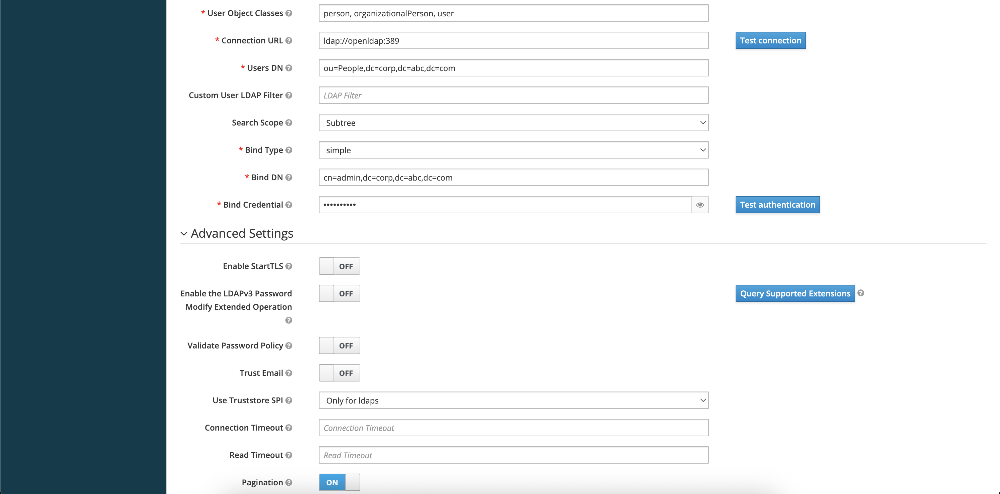
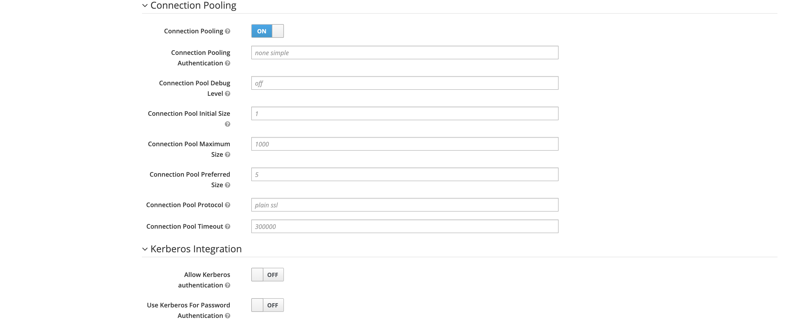
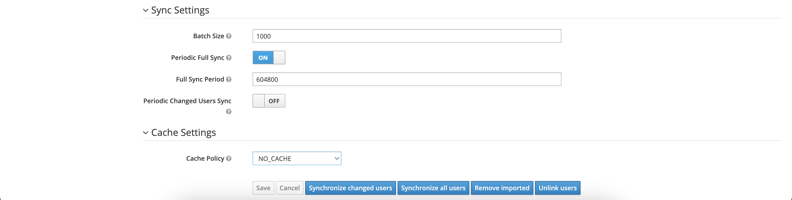
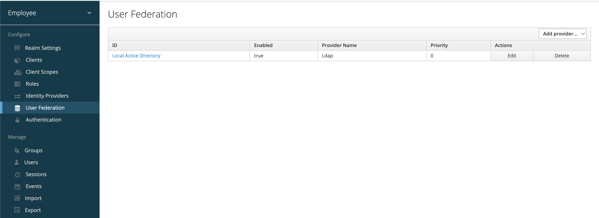

# Integrating Local LDAP

## Objective

Connect a local OpenLDAP server (running via Docker) to Keycloak, so that users and groups can be read, synced, and authenticated via Keycloak.

## Prerequisites

Make sure the following services are running:

| Service          | Tool                    | Example URL              |
| ---------------- | ----------------------- | ------------------------ |
| **LDAP Server**  | `osixia/openldap` image | `ldap://localhost:389`   |
| **phpLDAPadmin** | Admin GUI               | `https://localhost:6443` |
| **Keycloak**     | Identity provider       | `http://localhost:8180`  |

We should already have:

* A working `docker-compose.yml`
* Seeded users and groups via `seed-data.ldif`
* Admin DN and password (e.g., `cn=admin,dc=corp,dc=acme,dc=com`)

Refer to the following pages for more details on the setup


[local-ldap-setup.md](../../ldap/local-ldap-setup.md)


## Apply LDAP Configurations

### Log into Keycloak Admin Console

1. Open `http://localhost:8180`
2. Log in as the Keycloak admin user (e.g., `admin / admin`)
3. Select the target **Realm** (e.g., `master`, or create a new one say `employee`)

### Add LDAP User Federation Provider

1. Go to **User Federation** (left-hand menu)
2. Click **Add provider → ldap**

### Set Configurations

<figure><figcaption></figcaption></figure>

<figure><figcaption></figcaption></figure>

<figure><figcaption></figcaption></figure>

<figure><figcaption></figcaption></figure>

<figure><figcaption></figcaption></figure>

### Test the Connection

Use the **"Test connection"** and **"Test authentication"** buttons at the bottom of the provider form:

* **Test connection**: Validates LDAP connectivity
* **Test authentication**: Confirms bind credentials work

If any test fails, double-check:

* LDAP port (`389` open?)
* Bind DN/password
* Network access between Keycloak container and LDAP container

