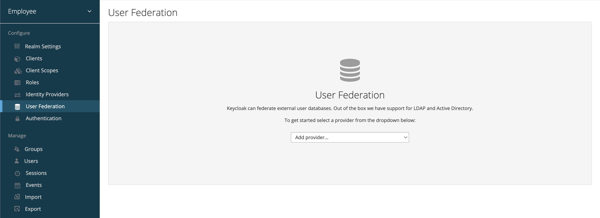
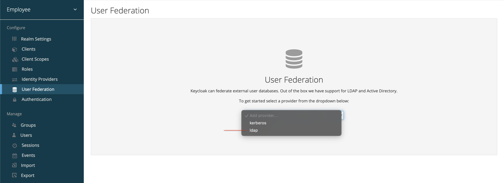

# Settings

## About

The **User Federation Settings** page in Keycloak allows administrators to **configure how Keycloak connects to an external identity source**, such as LDAP or Active Directory. These settings determine how users are queried, authenticated, synchronized, and represented within Keycloak.

Each federation provider added to a realm has its own set of configuration options grouped by purpose - **connection settings, synchronization settings, edit mode, mappers, and advanced options**.

<figure><figcaption></figcaption></figure>

## Providers

In Keycloak, **Federation Providers** are external identity systems that Keycloak can connect to in order to **authenticate users and fetch user data**. This allows Keycloak to delegate user storage and validation to systems like **LDAP**, **Active Directory**, or **Kerberos**, instead of managing users solely within its internal database.

<figure><figcaption></figcaption></figure>

### Available Providers in Keycloak

#### 1. **LDAP Provider**

The **LDAP provider** is the most commonly used User Federation provider. It allows Keycloak to connect to any LDAPv3-compatible directory, including:

* OpenLDAP
* 389 Directory Server
* Microsoft Active Directory (in LDAP-compatible mode)
* Apache Directory Server

**Key Capabilities:**

* Read users from LDAP
* Sync user attributes (name, email, department, etc.)
* Authenticate against LDAP credentials
* Map LDAP groups to Keycloak groups
* Optional write-back to LDAP (if enabled)

**Use Cases:**

* Internal SSO for enterprise apps
* Reusing corporate LDAP as source of truth
* Hybrid identity setups (e.g., Keycloak + LDAP + OIDC)

#### 2. **Kerberos Provider**

The **Kerberos provider** integrates Keycloak with a Kerberos-based authentication infrastructure, commonly used in environments like:

* Microsoft Active Directory (Kerberos protocol layer)
* MIT Kerberos
* Heimdal Kerberos

**Key Capabilities:**

* Support for **SPNEGO (Smart SSO) / GSSAPI** — allows **browser-based SSO** using Windows credentials
* Authenticate users using their **Kerberos tickets** without needing to type credentials manually
* Works well in domain-joined enterprise networks

**Use Cases:**

* Seamless SSO in **Windows-based environments** (e.g., auto-login with Active Directory credentials)
* High-security enterprise environments where **Kerberos is mandated**
* Legacy systems using Kerberos tickets for access control

**Notes:**

* Requires domain-joined machines and correct DNS setup.
* Keycloak must have a valid service account with Kerberos credentials.
* Not used for user storage — only for **authentication**.
* Often used alongside LDAP for full user resolution.

### General Notes on Federation Providers

* **Ordering Matters**: If multiple providers are configured, Keycloak queries them in the order they appear.
* **Search Behavior**: During login or sync, Keycloak will check each provider for the username match.
* **Provider Visibility**: You can enable or disable a provider without deleting it.
* **Provider Type & SPI**: All providers implement Keycloak’s **User Storage SPI**.

### Typical Architecture with Providers

A realm may include:

* **LDAP provider** → To source user attributes and credentials
* **Kerberos provider** → To authenticate users silently (via tickets)
* **Local users** → For service accounts, admins, or fallback login

Each user is associated with a specific storage provider internally using a **federation link**.
