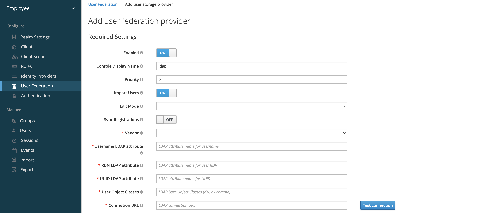

# Provider - LDAP

<figure><figcaption></figcaption></figure>

## Required Settings

<table data-header-hidden data-full-width="true"><thead><tr><th width="193.06072998046875"></th><th width="188.6632080078125"></th><th></th></tr></thead><tbody><tr><td><strong>Setting</strong></td><td><strong>Type</strong></td><td><strong>Description</strong></td></tr><tr><td><strong>Enabled</strong></td><td>Boolean (checkbox)</td><td>Enables or disables the LDAP provider. Disabling retains the config but stops user federation.</td></tr><tr><td><strong>Console Display Name</strong></td><td>String</td><td>Label shown in the Admin Console to represent this provider. Useful when you have multiple providers.</td></tr><tr><td><strong>Priority</strong></td><td>Integer</td><td>Determines the order in which providers are queried. Lower number = higher priority.</td></tr><tr><td><strong>Import Users</strong></td><td>Boolean (checkbox)</td><td>When enabled, users are copied into Keycloak's internal DB on first login or sync. This enables faster lookup but creates a shadow copy.</td></tr><tr><td><strong>Edit Mode</strong></td><td>Enum (<code>READ_ONLY</code>, <code>WRITABLE</code>, <code>UNSYNCED</code>)</td><td>Controls how Keycloak interacts with LDAP data. Use <code>READ_ONLY</code> to protect LDAP, <code>WRITABLE</code> to allow changes, or <code>UNSYNCED</code> for one-time import.</td></tr><tr><td><strong>Sync Registrations</strong></td><td>Boolean</td><td>If enabled, users created in Keycloak will also be written back to LDAP. Works only if Edit Mode is <code>WRITABLE</code>.</td></tr><tr><td><strong>Vendor</strong></td><td>Dropdown (<code>Other</code>, <code>Active Directory</code>, etc.)</td><td>Applies vendor-specific defaults and schema adjustments. Choosing "Active Directory" enables special handling like UPNs, nested groups, etc.</td></tr><tr><td><strong>Username LDAP attribute</strong></td><td>String</td><td>LDAP attribute used as the Keycloak <code>username</code>. Common: <code>uid</code> or <code>sAMAccountName</code> for AD.</td></tr><tr><td><strong>RDN LDAP attribute</strong></td><td>String</td><td>Used in the Relative Distinguished Name. Typically same as <code>uid</code> or <code>cn</code>.</td></tr><tr><td><strong>UUID LDAP attribute</strong></td><td>String</td><td>Unique identifier used to track LDAP entries in Keycloak. Common: <code>entryUUID</code> (OpenLDAP), <code>objectGUID</code> (AD).</td></tr><tr><td><strong>User Object Classes</strong></td><td>Comma-separated list</td><td>Filters objects returned by LDAP. Default: <code>inetOrgPerson, organizationalPerson</code>. Must match your LDAP schema.</td></tr><tr><td><strong>Connection URL</strong></td><td>String (URL)</td><td>LDAP server URL (e.g., <code>ldap://localhost:389</code> or <code>ldaps://ldap.example.com:636</code>).</td></tr><tr><td><strong>Users DN</strong></td><td>String (DN)</td><td>Base DN under which user entries exist. Example: <code>ou=People,dc=corp,dc=example,dc=com</code>.</td></tr><tr><td><strong>Custom User LDAP Filter</strong></td><td>String (LDAP filter)</td><td>Optional filter (e.g., <code>(employeeType=active)</code>) to further narrow user search scope.</td></tr><tr><td><strong>Search Scope</strong></td><td>Enum (<code>One Level</code>, <code>Subtree</code>)</td><td>Defines how deeply LDAP should search under <code>Users DN</code>. <code>Subtree</code> is more thorough.</td></tr><tr><td><strong>Bind Type</strong></td><td>Enum (<code>simple</code>, <code>none</code>)</td><td>Determines how Keycloak connects to LDAP. <code>simple</code> uses Bind DN and password; <code>none</code> is anonymous bind (not recommended).</td></tr><tr><td><strong>Bind DN</strong></td><td>String (DN)</td><td>Admin or service account DN used to connect to LDAP (e.g., <code>cn=admin,dc=corp,dc=com</code>).</td></tr><tr><td><strong>Bind Credential</strong></td><td>Password</td><td>Password for the Bind DN. Should be strong and kept secure (or loaded from Vault/KeyStore in prod).</td></tr></tbody></table>

## Advanced Settings

<table data-header-hidden data-full-width="true"><thead><tr><th width="205.36541748046875"></th><th width="147.80902099609375"></th><th></th></tr></thead><tbody><tr><td><strong>Setting</strong></td><td><strong>Type</strong></td><td><strong>Description</strong></td></tr><tr><td><strong>Enable StartTLS</strong></td><td>Boolean</td><td>Upgrades LDAP connection from plain to TLS. Useful when LDAP server supports StartTLS over port 389.</td></tr><tr><td><strong>Enable the LDAPv3 Password Modify Extended Operation</strong></td><td>Boolean</td><td>Enables use of LDAP's standard password modification extension (<code>1.3.6.1.4.1.4203.1.11.1</code>). Required for some password policies.</td></tr><tr><td><strong>Validate Password Policy</strong></td><td>Boolean</td><td>When enabled, Keycloak validates passwords against the LDAP server’s password rules (like min length, complexity).</td></tr><tr><td><strong>Trust Email</strong></td><td>Boolean</td><td>If enabled, Keycloak will trust <code>mail</code> attribute from LDAP as a verified email (bypasses confirmation step).</td></tr><tr><td><strong>Use Truststore SPI</strong></td><td>String</td><td>Specifies the SPI used for truststore configuration when using LDAPS (e.g., <code>file</code>, <code>keystore</code>, <code>vault</code>).</td></tr><tr><td><strong>Connection Timeout</strong></td><td>Integer (ms)</td><td>Timeout in milliseconds for opening LDAP connections. Prevents Keycloak from hanging if LDAP is slow.</td></tr><tr><td><strong>Read Timeout</strong></td><td>Integer (ms)</td><td>Timeout for reading responses from LDAP. Applies to search and bind operations.</td></tr><tr><td><strong>Pagination</strong></td><td>Boolean</td><td>Enables LDAP paging for large directories. Should be enabled when user count exceeds server page size (e.g., 1000 entries).</td></tr></tbody></table>

## Connection Pooling

<table data-header-hidden data-full-width="true"><thead><tr><th width="255.68402099609375"></th><th width="155.59552001953125"></th><th></th></tr></thead><tbody><tr><td><strong>Setting</strong></td><td><strong>Type</strong></td><td><strong>Description</strong></td></tr><tr><td><strong>Connection Pooling</strong></td><td>Boolean</td><td>Reuses LDAP connections for efficiency and performance. Must be enabled for high-load environments.</td></tr><tr><td><strong>Connection Pooling Authentication</strong></td><td>String</td><td>Method used for authentication within pooled connections. Common: <code>simple</code>.</td></tr><tr><td><strong>Connection Pool Debug Level</strong></td><td>Integer</td><td>Logging level for LDAP connection pool events. Higher = more verbose logs. Useful for diagnostics.</td></tr><tr><td><strong>Connection Pool Initial Size</strong></td><td>Integer</td><td>Number of connections created when the pool initializes.</td></tr><tr><td><strong>Connection Pool Maximum Size</strong></td><td>Integer</td><td>Maximum number of pooled connections allowed.</td></tr><tr><td><strong>Connection Pool Preferred Size</strong></td><td>Integer</td><td>Preferred number of connections kept open (idle pool size).</td></tr><tr><td><strong>Connection Pool Protocol</strong></td><td>String</td><td>Protocol used within the pool: <code>plain</code>, <code>ssl</code>, or <code>startTLS</code>. Must match your LDAP configuration.</td></tr><tr><td><strong>Connection Pool Timeout</strong></td><td>Integer (ms)</td><td>Time in milliseconds before idle connections are closed.</td></tr></tbody></table>

## Kerberos Integration

<table data-header-hidden data-full-width="true"><thead><tr><th width="248.0477294921875"></th><th width="103.55120849609375"></th><th></th></tr></thead><tbody><tr><td><strong>Setting</strong></td><td><strong>Type</strong></td><td><strong>Description</strong></td></tr><tr><td><strong>Allow Kerberos authentication</strong></td><td>Boolean</td><td>Enables support for Kerberos/SPNEGO login. Allows Windows domain users to log in without typing credentials.</td></tr><tr><td><strong>Use Kerberos For Password Authentication</strong></td><td>Boolean</td><td>Allows Keycloak to validate password credentials using Kerberos rather than LDAP bind. Used when Kerberos is the real authentication backend behind LDAP.</td></tr></tbody></table>

## Sync Settings

<table data-header-hidden data-full-width="true"><thead><tr><th width="244.49127197265625"></th><th width="150.42620849609375"></th><th></th></tr></thead><tbody><tr><td><strong>Setting</strong></td><td><strong>Type</strong></td><td><strong>Description</strong></td></tr><tr><td><strong>Batch Size</strong></td><td>Integer</td><td>Maximum number of users retrieved in a single sync query. Helps manage memory and control sync load.</td></tr><tr><td><strong>Periodic Full Sync</strong></td><td>Cron string</td><td>Defines schedule for full user sync (e.g., <code>0 */12 * * *</code> for every 12 hours).</td></tr><tr><td><strong>Periodic Changed Users Sync</strong></td><td>Cron string</td><td>Schedule for incremental sync based on last update timestamps (if supported by LDAP). Reduces sync time.</td></tr></tbody></table>

## Cache Settings

<table data-header-hidden data-full-width="true"><thead><tr><th width="124.93145751953125"></th><th></th><th></th></tr></thead><tbody><tr><td><strong>Setting</strong></td><td><strong>Type</strong></td><td><strong>Description</strong></td></tr><tr><td><strong>Cache Policy</strong></td><td>Enum (<code>DEFAULT</code>, <code>EVICT_DAILY</code>, <code>EVICT_WEEKLY</code>, <code>NO_CACHE</code>)</td><td>Controls how Keycloak caches user info from LDAP. <code>DEFAULT</code> uses in-memory cache. <code>NO_CACHE</code> disables all LDAP caching. Other options periodically evict and refresh users.</td></tr></tbody></table>

