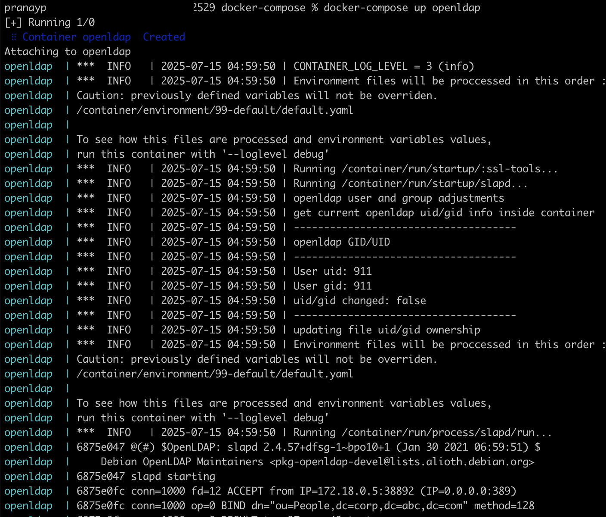
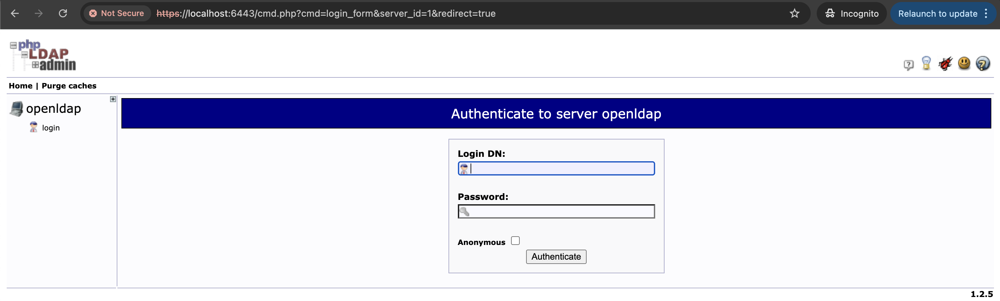
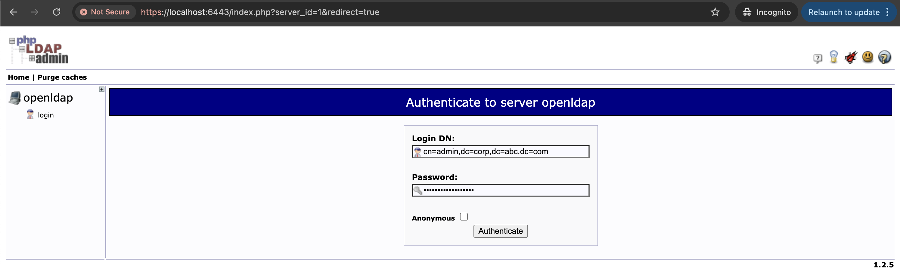
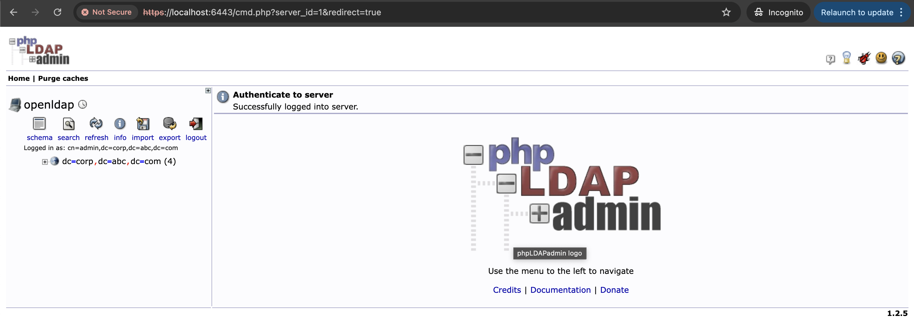
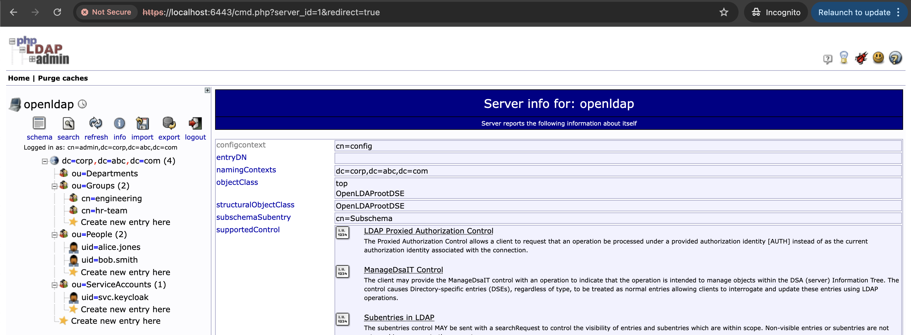

# Local LDAP Setup

## About

Setting up a **local LDAP server** is essential for learning, testing integrations, or developing features dependent on centralized directory services. This setup mimics real-world LDAP deployments and allows experimentation with authentication, user federation (e.g., in Keycloak), and automation.

For simplicity and repeatability, we use **Docker** to spin up:

* An **OpenLDAP server** using the `osixia/openldap` image
* A **GUI client** (`phpLDAPadmin`) to manage the directory visually

## Prerequisites

* Docker and Docker Compose installed
* Basic knowledge of LDAP terminology (DN, OU, CN, etc.)
* Familiarity with command-line operations

### Technology Stack

<table><thead><tr><th width="290.43658447265625">Component</th><th>Description</th></tr></thead><tbody><tr><td><strong>OpenLDAP</strong></td><td>Lightweight directory server implementation</td></tr><tr><td><strong>phpLDAPadmin</strong></td><td>Web UI for LDAP directory management</td></tr><tr><td><strong>Docker</strong></td><td>Containerized setup for isolated testing</td></tr></tbody></table>

## Folder Structure

Create a folder named `local-ldap-setup`:

```bash
mkdir local-ldap-setup && cd local-ldap-setup
```

Create the following files:

```
.
├── docker-compose.yml
└── ldap-bootstrap/seed-data.ldif
```

### `docker-compose.yml`

The `docker-compose.yml` file is a configuration file used by Docker Compose to **define and run multi-container Docker applications** — in this case, an LDAP server and a GUI admin interface.

#### **What it does in this setup**

* **Defines two services:**
  * `openldap`: Starts the OpenLDAP directory server
  * `phpldapadmin`: Starts a web-based GUI to interact with the LDAP directory
* **Sets environment variables:**
  * `LDAP_DOMAIN`, `LDAP_ORGANISATION`, and `LDAP_ADMIN_PASSWORD` define the base configuration for the OpenLDAP server.
* **Exposes ports:**
  * Port `389`: for standard LDAP communication
  * Port `636`: for LDAPS (secure LDAP, optional)
  * Port `6443`: to access phpLDAPadmin via a browser over HTTPS
* **Mounts seed data:**
  * Maps the local file `seed-data.ldif` into the container so it can be auto-imported at startup to bootstrap the directory with users, groups, and OUs.

This file enables you to **spin up a complete LDAP environment with a single command**:

```bash
docker-compose up -d
```

### `seed-data.ldif`

The `seed-data.ldif` file serves as a **bootstrap initializer** for your LDAP directory. It defines a realistic, structured set of directory entries that simulate how an enterprise LDAP setup might look. This includes:

* **Organizational Units (OUs)** for different categories of entries
* **Users** across departments
* **Groups** for access control
* **Service accounts** for system integrations (e.g., Keycloak)

When this file is mounted in the Docker Compose setup, the OpenLDAP container reads and loads its contents at startup — allowing your directory to come pre-populated with meaningful data.

#### 1. **Organizational Units (OUs)**

Organizational Units help **categorize and separate types of directory entries**. This keeps the directory clean and enables easier access control, delegation, and search filters.

```ldif
dn: ou=People,dc=corp,dc=acme,dc=com
objectClass: organizationalUnit
ou: People
```

* `ou=People`: Stores human user accounts like employees.
* `ou=Groups`: Stores role-based groups (engineering, HR, etc.).
* `ou=Departments`: Placeholder for defining department-based entries (can be linked via `departmentNumber`).
* `ou=ServiceAccounts`: Stores machine or integration accounts used by applications.

These OUs mirror common real-world enterprise directory layouts.

#### 2. **User Entries**

Each user is an `inetOrgPerson` object — a standard LDAP object class for representing people. It includes attributes like `cn`, `sn`, `uid`, `mail`, and `userPassword`.

**Example:**

```ldif
dn: uid=alice.jones,ou=People,dc=corp,dc=acme,dc=com
objectClass: inetOrgPerson
cn: Alice Jones
sn: Jones
uid: alice.jones
mail: alice.jones@corp.acme.com
userPassword: Password@123
departmentNumber: ENG
title: Senior Software Engineer
```

* **UID**: Unique identifier within the directory.
* **departmentNumber**: Common attribute used for department-level filtering.
* **title**: Useful for role-based access, UI display, or hierarchy mapping.

This structure makes it easy to:

* Filter users by department
* Assign access based on job title
* Identify users with consistent naming conventions

#### 3. **Group Entries**

Groups are created using the `groupOfNames` object class, which references user DNs via the `member` attribute.

```ldif
dn: cn=engineering,ou=Groups,dc=corp,dc=abc,dc=com
objectClass: groupOfNames
cn: engineering
member: uid=alice.jones,ou=People,dc=corp,dc=abc,dc=com
```

* `cn=engineering`: Group name
* `member`: References full DN of user(s)

These groups support:

* **Role-based access control (RBAC)** in external apps
* **LDAP queries for access policies** (`memberOf` attributes, filters)

You can associate users with multiple groups for layered access.

#### 4. **Service Account**

Service accounts are special user entries used by applications (e.g., Keycloak) to connect to the LDAP server.

```ldif
dn: uid=svc.keycloak,ou=ServiceAccounts,dc=corp,dc=abc,dc=com
objectClass: inetOrgPerson
cn: Keycloak Service Account
sn: Service
uid: svc.keycloak
mail: svc.keycloak@corp.abc.com
userPassword: Keycloak@2024
```

* Located under `ou=ServiceAccounts`
* Follows naming convention `svc.<application>`
* Can be granted read-only or scoped privileges

These accounts enable:

* Application integration without using human credentials
* Logging and auditing by account identity
* Password rotation automation via DevOps pipelines


Note: OpenLDAP in this Docker image automatically applies LDIF files found in the bootstrap path during first-time container initialization.


## Docker Compose File&#x20;

#### docker-compose.yml



```yaml
version: '3.8'

services:
  openldap:
    image: osixia/openldap:1.5.0
    container_name: openldap
    command: --copy-service
    environment:
      LDAP_ORGANISATION: "Abc Solutions Pvt Ltd"
      LDAP_DOMAIN: "corp.abc.com"
      LDAP_ADMIN_PASSWORD: "StrongAdminPass123"
    ports:
      - "389:389"
      - "636:636"
    volumes:
      - ./ldap-bootstrap/seed-data.ldif:/container/service/slapd/assets/config/bootstrap/ldif/50-bootstrap.ldif

  phpldapadmin:
    image: osixia/phpldapadmin:0.9.0
    container_name: phpldapadmin
    environment:
      PHPLDAPADMIN_LDAP_HOSTS: openldap
    ports:
      - "6443:443"
    depends_on:
      - openldap
```


This will start OpenLDAP on port 389 and phpLDAPadmin UI on [https://localhost:6443](https://localhost:6443).

* `corp.abc.com` is used as a **subdomain-style domain** which mimics real enterprise usage.
* Organization name `Abc Solutions Pvt Ltd` reflects a real company format.
* Admin password is set to a strong placeholder (`StrongAdminPass123`). You should secure this in `.env` or a secrets manager in a real setup.



Always make sure our **LDIF entries use the same base DN** that matches our `LDAP_DOMAIN` setting — otherwise, the directory won’t accept them during bootstrapping or imports.

If we change `LDAP_DOMAIN`, also update all `dn:` entries in your LDIF files accordingly.

If our domain is `corp.abc.com`, our full Distinguished Names (DNs) in the LDAP tree will look like:

*   Base DN:

    ```
    dc=corp,dc=abc,dc=com
    ```
*   A user:

    ```
    uid=john.doe,ou=People,dc=corp,dc=abc,dc=com
    ```
*   A group:

    ```
    cn=admins,ou=Groups,dc=corp,dc=abc,dc=com
    ```


<figure><figcaption></figcaption></figure>

## Initial Directory Seed (`seed-data.ldif`)

```ldif
# Organizational Units
dn: ou=People,dc=corp,dc=abc,dc=com
objectClass: organizationalUnit
ou: People

dn: ou=Groups,dc=corp,dc=abc,dc=com
objectClass: organizationalUnit
ou: Groups

dn: ou=Departments,dc=corp,dc=abc,dc=com
objectClass: organizationalUnit
ou: Departments

dn: ou=ServiceAccounts,dc=corp,dc=abc,dc=com
objectClass: organizationalUnit
ou: ServiceAccounts

# Sample user in Engineering
dn: uid=alice.jones,ou=People,dc=corp,dc=abc,dc=com
objectClass: inetOrgPerson
cn: Alice Jones
sn: Jones
uid: alice.jones
mail: alice.jones@corp.abc.com
userPassword: Password@123
departmentNumber: ENG
title: Senior Software Engineer

# Sample user in HR
dn: uid=bob.smith,ou=People,dc=corp,dc=abc,dc=com
objectClass: inetOrgPerson
cn: Bob Smith
sn: Smith
uid: bob.smith
mail: bob.smith@corp.abc.com
userPassword: Password@123
departmentNumber: HR
title: HR Manager

# Sample group for engineers
dn: cn=engineering,ou=Groups,dc=corp,dc=abc,dc=com
objectClass: groupOfNames
cn: engineering
member: uid=alice.jones,ou=People,dc=corp,dc=abc,dc=com

# Sample group for HR
dn: cn=hr-team,ou=Groups,dc=corp,dc=abc,dc=com
objectClass: groupOfNames
cn: hr-team
member: uid=bob.smith,ou=People,dc=corp,dc=abc,dc=com

# Service account
dn: uid=svc.keycloak,ou=ServiceAccounts,dc=corp,dc=abc,dc=com
objectClass: inetOrgPerson
cn: Keycloak Service Account
sn: Service
uid: svc.keycloak
mail: svc.keycloak@corp.abc.com
userPassword: Keycloak@2024

```

## Start the Containers

```bash
docker-compose up -d
```

Check logs:

```bash
docker logs -f openldap
```

## Access phpLDAPadmin UI

Open your browser and visit:

```
https://localhost:6443
```

Login DN:\
`cn=admin,dc=example,dc=com`

Password:\
`admin`

Once logged in:

* Browse entries
* Add more users/groups via GUI
* Edit attributes

## Verifying LDAP Server Using ldapsearch

Install LDAP utilities if not already:

```bash
sudo apt install ldap-utils  # Debian/Ubuntu
```

Example command:

```bash
ldapsearch -x -H ldap://localhost -D "cn=admin,dc=example,dc=com" -w admin -b "dc=example,dc=com"
```

Search for user:

```bash
ldapsearch -x -b "dc=example,dc=com" "(uid=john.doe)"
```

## Based on local LDAP setup

### Keycloak LDAP Configuration

<table data-header-hidden data-full-width="true"><thead><tr><th width="257.4375"></th><th></th></tr></thead><tbody><tr><td><strong>Field</strong></td><td><strong>Value</strong></td></tr><tr><td><strong>Edit Mode</strong></td><td><code>READ_ONLY</code> or <code>IMPORT</code> <em>(choose based on use case)</em></td></tr><tr><td><strong>Vendor</strong></td><td><code>Other</code></td></tr><tr><td><strong>Connection URL</strong></td><td><code>ldap://localhost:389</code></td></tr><tr><td><strong>Bind DN</strong></td><td><code>cn=admin,dc=corp,dc=abc,dc=com</code></td></tr><tr><td><strong>Bind Credential</strong></td><td><code>StrongAdminPass123</code> <em>(or whatever you used in docker-compose)</em></td></tr><tr><td><strong>Users DN</strong></td><td><code>ou=People,dc=corp,dc=abc,dc=com</code></td></tr><tr><td><strong>Username LDAP attribute</strong></td><td><code>uid</code></td></tr><tr><td><strong>RDN LDAP attribute</strong></td><td><code>uid</code></td></tr><tr><td><strong>UUID LDAP attribute</strong></td><td><code>entryUUID</code></td></tr><tr><td><strong>User Object Classes</strong></td><td><code>inetOrgPerson</code></td></tr><tr><td><strong>Search Scope</strong></td><td><code>One Level</code> or <code>Subtree</code> <em>(Subtree recommended)</em></td></tr><tr><td><strong>Pagination</strong></td><td><code>ON</code></td></tr><tr><td><strong>Sync Registrations</strong></td><td><code>OFF</code> (or <code>ON</code> if you want new Keycloak users written to LDAP)</td></tr><tr><td><strong>Allow Kerberos Authentication</strong></td><td><code>OFF</code> <em>(unless you’re integrating with AD or SASL/Kerberos)</em></td></tr><tr><td><strong>Batch Size For LDAP Queries</strong></td><td><code>1000</code> <em>(default)</em></td></tr></tbody></table>

### Keycloak Group Mapper Configuration

If we're syncing groups from LDAP as well (e.g., `cn=engineering`, `cn=hr-team`):

<table data-header-hidden data-full-width="true"><thead><tr><th width="308.68402099609375"></th><th></th></tr></thead><tbody><tr><td><strong>Field</strong></td><td><strong>Value</strong></td></tr><tr><td><strong>Mapper Type</strong></td><td><code>Group LDAP Mapper</code></td></tr><tr><td><strong>Name</strong></td><td><code>LDAP Groups Mapper</code></td></tr><tr><td><strong>LDAP Groups DN</strong></td><td><code>ou=Groups,dc=corp,dc=abc,dc=com</code></td></tr><tr><td><strong>Group Name LDAP Attribute</strong></td><td><code>cn</code></td></tr><tr><td><strong>Group Object Classes</strong></td><td><code>groupOfNames</code></td></tr><tr><td><strong>Membership LDAP Attribute</strong></td><td><code>member</code></td></tr><tr><td><strong>Membership Attribute Type</strong></td><td><code>DN</code></td></tr><tr><td><strong>User Groups Retrieve Strategy</strong></td><td><code>LOAD_GROUPS_BY_MEMBER_ATTRIBUTE</code></td></tr><tr><td><strong>Mapped Group Attributes</strong></td><td>Leave blank or include additional group info like <code>description</code></td></tr><tr><td><strong>Mode</strong></td><td><code>READ_ONLY</code></td></tr></tbody></table>

### Keycloak Test LDAP Sync

Once configured:

1. Navigate to **User Federation** → `ldap` → **Synchronize all users**
2. Check the **Users** tab → `alice.jones` and `bob.smith` should appear.
3. Navigate to **Groups** (if group mapper is configured) → `engineering`, `hr-team` should be available.

### phpLDAPadmin Login Details

<table data-header-hidden><thead><tr><th width="207.69793701171875"></th><th></th></tr></thead><tbody><tr><td><strong>Field</strong></td><td><strong>Value</strong></td></tr><tr><td><strong>Login URL</strong></td><td><code>https://localhost:6443</code></td></tr><tr><td><strong>Login DN (username)</strong></td><td><code>cn=admin,dc=corp,dc=abc,dc=com</code></td></tr><tr><td><strong>Password</strong></td><td><code>StrongAdminPass123</code> <em>(as defined in <code>LDAP_ADMIN_PASSWORD</code>)</em></td></tr></tbody></table>

> We may get a browser warning because the container uses a **self-signed TLS certificate**. We can safely proceed for local use.


* **Bind DN Format**: The full distinguished name (`cn=admin,dc=corp,dc=abc,dc=com`) is required — **not just `admin`**.
* **Default login user is `cn=admin`**, which has full access to the directory unless restricted via ACL.
* phpLDAPadmin does **not support plain HTTP**, it runs on `HTTPS` (port `6443`) by default.
* We can add other admin or read-only users via `seed-data.ldif` or phpLDAPadmin interface later if needed.


<figure><figcaption></figcaption></figure>

<figure><figcaption></figcaption></figure>

<figure><figcaption></figcaption></figure>

Verify seeded data for `People`, `Groups`, `Departments`, and `ServiceAccounts` &#x20;

<figure><figcaption></figcaption></figure>
