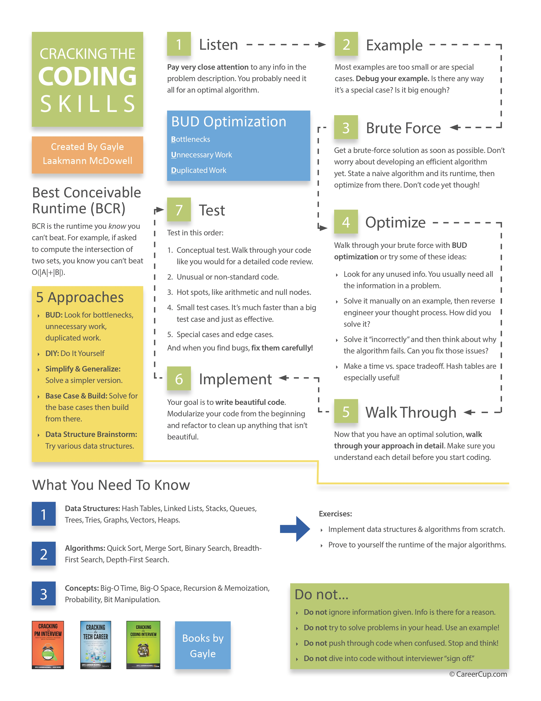

# Flowchart - How to Solve Coding Problem?

## About

Reference - [https://www.crackingthecodinginterview.com/](https://www.crackingthecodinginterview.com/)

<figure><figcaption></figcaption></figure>

## Example 1

### **Problem**

Given an array of distinct integer values, count the number of pairs of integers that have difference k. For example, given the array { 1, 7, 5, 9, 2, 12, 3} and the difference k = 2, there are four pairs with difference as 2 i.e. (1, 3), (3, 5), (5, 7), (7, 9).

### **Step 1: Understand the Problem**

We need to count **distinct pairs** `(a, b)` in an array such that:

∣a−b∣=k

Given:

* An **array of distinct integers**.
* An **integer k (positive difference)**.
* We count **unordered pairs** (e.g., `(1,3)` is the same as `(3,1)`).

### **Step 2: Explore Examples**

Example:

```java
Input:  { 1, 7, 5, 9, 2, 12, 3 }, k = 2
Output: 4
```

Valid pairs: `(1,3)`, `(3,5)`, `(5,7)`, `(7,9)`

Edge cases:

* **Empty array?** → Return `0`
* **Single element?** → Return `0`
* **No valid pairs?** → Return `0`
* **Negative k?** → Not allowed (problem states "difference k")
* **Already sorted?** → Optimize accordingly

### **Step 3: Brute Force Approach**

A naïve solution checks **every pair** `(i, j)`:

```java
for (int i = 0; i < arr.length; i++) {
    for (int j = i + 1; j < arr.length; j++) {
        if (Math.abs(arr[i] - arr[j]) == k) {
            count++;
        }
    }
}
```

**Time Complexity:**

* **O(N²)** (Nested loop) – Too slow for large inputs.

### **Step 4: Optimize**

We can use a **HashSet** to check for pairs in **O(N)** time.

#### **Optimized Approach:**

1. **Insert all numbers into a HashSet** (O(N) time)
2. **For each number x, check if (x + k) exists in the set**
   * `(x, x+k)` is a valid pair
   * No need to check both `(x, x-k)` since it’s already handled by previous elements

**Time Complexity:** O(N)\
**Space Complexity:** O(N)

### **Step 5: Write Clean Code**

```java
import java.util.HashSet;

public class PairDifference {
    public static int countPairsWithDifference(int[] arr, int k) {
        if (arr == null || arr.length == 0 || k < 0) return 0;

        HashSet<Integer> set = new HashSet<>();
        int count = 0;

        // Store all numbers in HashSet
        for (int num : arr) {
            set.add(num);
        }

        // Check for (num + k) in HashSet
        for (int num : arr) {
            if (set.contains(num + k)) {
                count++;
            }
        }

        return count;
    }

    public static void main(String[] args) {
        int[] arr = {1, 7, 5, 9, 2, 12, 3};
        int k = 2;
        System.out.println(countPairsWithDifference(arr, k)); // Output: 4
    }
}
```

### **Step 6: Test the Solution**

✔ **Base case:** `[] → 0`\
✔ **Single element:** `[5] → 0`\
✔ **No valid pairs:** `[10, 20, 30]` with `k = 5 → 0`\
✔ **Large input:** Handles efficiently in O(N)


