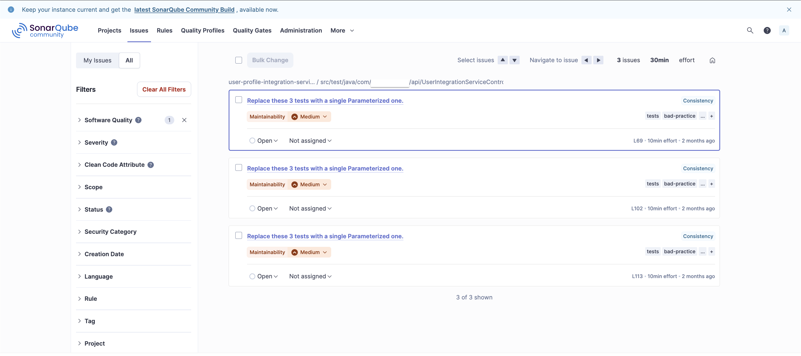
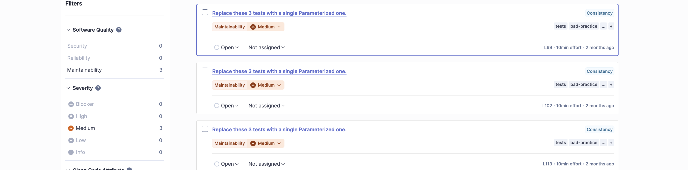
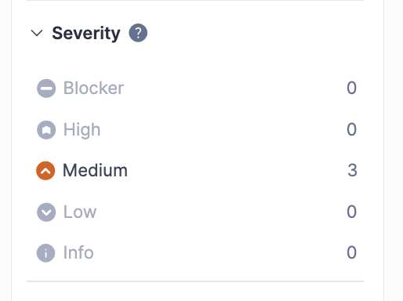
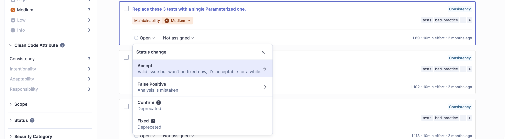

# Issue Model (Severity & Types)

## About&#x20;

SonarQube’s issue model is the **foundation of all quality analysis, ratings, and gates**. Every result you see in the console is derived from a single concept: an **Issue**.

An issue represents a **rule violation at a specific code location**, enriched with metadata that allows SonarQube to **classify risk, prioritize work, and track quality over time**.

## What is an Issue in SonarQube ?

In SonarQube, an **issue** is a detected violation of a **rule** applied to a specific **location in code**.

Each issue has:

* A rule that was violated
* A type (what kind of problem it is)
* A severity (how serious SonarQube considers it)
* A status and resolution
* A location (file, line, sometimes flow)
* A scope (new code vs overall code)

In the UI, issues are not just findings; they are **workflow items** meant to be reviewed, triaged, fixed, or consciously accepted.

<figure><figcaption></figcaption></figure>

## Issue Types in SonarQube

SonarQube groups issues into **four distinct types**. These are not interchangeable and each carries different expectations.

#### Bugs

Bugs represent **code that is very likely incorrect** and may lead to runtime errors or wrong behavior.

Typical characteristics:

* Deterministic failures
* Logic errors
* Null dereferences
* Incorrect condition handling

In the SonarQube UI:

* Bugs are shown as a distinct category in the Issues view
* They contribute directly to **Reliability Rating**
* High-severity bugs strongly affect Quality Gates

Interpretation:\
If SonarQube marks something as a Bug, it is asserting that **correctness is compromised**, not merely style or maintainability.

#### Vulnerabilities

Vulnerabilities represent **exploitable security weaknesses**.

Key properties:

* An attacker can benefit from them
* They violate confidentiality, integrity, or availability
* They usually require immediate attention

In the UI:

* Vulnerabilities appear separately from Bugs
* They impact the **Security Rating**
* Even a small number of vulnerabilities can fail a Quality Gate

Important nuance:\
SonarQube vulnerabilities are **high-confidence security issues**, not speculative risks.

#### Code Smells

Code Smells represent **maintainability issues**, not immediate failures.

Typical examples:

* Complex methods
* Duplicated logic
* Poor naming
* Excessive coupling

In the UI:

* Code Smells usually dominate the issue count
* They contribute to **Maintainability Rating**
* They are measured in terms of **technical debt**

Critical understanding:\
A large number of code smells does not mean the system is broken, but it does mean **future change will be costly and risky**.

#### Security Hotspots

Security Hotspots represent **security-sensitive code that requires human review**.

Key distinction:

* SonarQube does not claim the code is insecure
* It flags places where **security decisions exist**

Examples:

* Cryptography usage
* Authentication logic
* Deserialization
* External command execution

In the UI:

* Security Hotspots appear in a separate section
* They require manual review and status change
* They do not fail Quality Gates by default

Hotspots exist because **intent cannot be inferred automatically**.

## Issue Types vs Software Quality Domains

#### Legacy terminology (still used internally)

Internally, SonarQube still classifies issues as:

* Bug
* Vulnerability
* Code Smell
* Security Hotspot

#### What the UI shows today

In the **current SonarQube UI**, issue types are **presented as Software Quality domains**:

<figure><figcaption></figcaption></figure>

| Software Quality (UI) | Internal Issue Type |
| --------------------- | ------------------- |
| Reliability           | Bug                 |
| Security              | Vulnerability       |
| Maintainability       | Code Smell          |
| Security Hotspot      | Security Hotspot    |

#### Reliability

Reliability issues indicate **defects that can cause incorrect behavior or runtime failures**.

Characteristics:

* High confidence of incorrect execution
* Deterministic failures
* Direct impact on correctness

In ratings and gates:

* Reliability rating is derived from these issues
* Even a few high-severity reliability issues can fail a gate

#### Security

Security issues represent **confirmed exploitable weaknesses**.

Characteristics:

* Attacker benefit is clear
* Confidentiality, integrity, or availability is compromised
* Requires immediate attention

In the UI:

* Appears under Security
* Affects Security rating directly
* Typically weighted heavily in Quality Gates

#### Maintainability

Maintainability issues represent **code smells**.

Characteristics:

* No immediate functional failure
* Increased cost of change
* Higher future defect risk

In your screenshot:

* “Replace these 3 tests with a single Parameterized one.”
* Maintainability – Medium
* 10min effort per issue

Maintainability is measured using **technical debt**, not raw issue count.

#### Security Hotspots

Security Hotspots are **review-required security-sensitive code locations**.

Key properties:

* Not automatically considered vulnerabilities
* Require human validation
* Must be reviewed and marked safe or unsafe

In the UI:

* Appear in a separate Hotspots view
* Tracked as “Reviewed / To Review”
* Do not fail Quality Gates by default

## Severity Levels in SonarQube

Each issue also has a **Severity**, which expresses **potential impact**, not effort.

<figure><figcaption></figcaption></figure>

Typical severities (exact names depend on profile):

* Blocker
* High
* Medium
* Low
* Info

Important characteristics:

* Severity is assigned by the rule
* It can be overridden in Quality Profiles
* Severity does not change automatically based on code context

## Issue Lifecycle in the UI

An issue in SonarQube moves through states:

* Open
* Confirmed
* Resolved
* Closed

Additionally, issues can be:

* Marked as False Positive
* Accepted as Won’t Fix

These actions are visible in the UI and become part of the project’s quality history.

This reinforces that SonarQube is not just a scanner; it is a **quality management system**.

<figure><figcaption></figcaption></figure>

## New Code vs Overall Code

A defining aspect of SonarQube’s issue model is **time awareness**.

Issues are evaluated differently depending on whether they appear:

* On New Code
* On Overall Code

In the UI:

* New Code issues are highlighted
* Quality Gates almost always focus on New Code
* Legacy issues can exist without blocking delivery

This allows teams to **improve quality incrementally**, not rewrite history.
