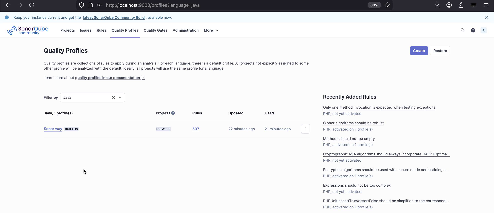
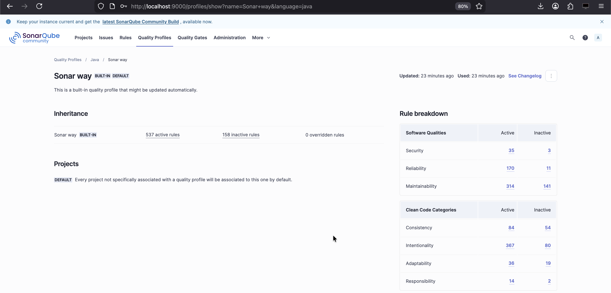
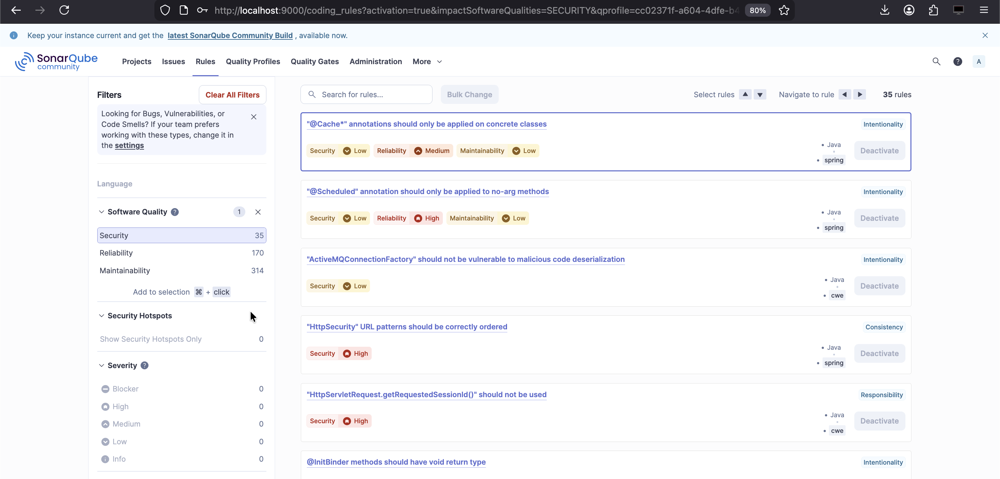

# Quality Gates & Profiles

## About

Quality Gates and Quality Profiles are the **decision and enforcement layer** of SonarQube.\
If issues answer _“what is wrong?”_, gates and profiles answer _“is this acceptable?”_ and _“according to which rules?”_.

SonarQube deliberately separates these two concerns.

## What a Quality Gate Is ?

A **Quality Gate** is a **pass/fail policy** applied to a project after analysis.

It answers one question:

> Can this code move forward?

A Quality Gate evaluates a **set of conditions** against analysis results and produces a single outcome:

* Passed
* Failed

This outcome is what you see:

* On the project list
* On the project overview
* In CI/CD pipelines

A Quality Gate does **not define what issues exist**.\
It only evaluates **metrics produced by analysis**.

<figure><figcaption></figcaption></figure>

## What a Quality Gate Evaluates ?

A Quality Gate is built from **conditions**, each of which compares:

* A **metric**
* Against a **threshold**
* Optionally scoped to **New Code**

Common metrics include:

* Reliability rating
* Security rating
* Maintainability rating
* Number of issues by severity
* Coverage
* Duplications
* Security hotspots reviewed

Each condition is binary:

* Condition met → OK
* Condition violated → Gate fails

One failed condition fails the entire gate.

## New Code Focus (Critical Concept)

Modern SonarQube Quality Gates are **new-code-first by design**.

New Code typically means:

* Code added or changed after a reference point
* Usually last version, last X days, or branch baseline

Why this matters:

* Legacy issues do not block delivery
* Teams improve quality incrementally
* SonarQube avoids “rewrite the world” pressure

In practice:

* You may have legacy issues
* But zero new critical issues
* And still pass the gate

This is intentional.

## What a Quality Profile Is ?

A **Quality Profile** defines:

> Which rules are applied during analysis, and how severe they are.

A Quality Profile is:

* Language-specific
* A collection of enabled rules
* With configured severities and parameters

Profiles answer:

* What is considered a Bug?
* What is considered a Maintainability issue?
* How strict are we?

Profiles directly determine:

* Which issues are raised
* Their severities
* Their estimated effort

<figure><figcaption></figcaption></figure>

<figure><figcaption></figcaption></figure>

<figure><figcaption></figcaption></figure>

## Quality Profiles and Languages

Each language has its own Quality Profile:

* Java
* YAML
* JavaScript
* SQL
* etc.

A project can have:

* One profile per language
* Automatically applied based on detected files

This is why:

* Java rules don’t apply to YAML
* YAML rules don’t affect Java metrics

## Relationship Between Profiles and Gates

This relationship is crucial:

* **Quality Profile** → creates issues
* **Quality Gate** → evaluates results

They are deliberately decoupled.

This allows:

* Same rules, different enforcement levels
* Same gate, different profiles
* Gradual tightening of standards

Example:

* Profile raises many maintainability issues
* Gate only fails on critical reliability or security issues

This separation is one of SonarQube’s strongest design decisions.

## Default Behavior and Customization

Out of the box:

* SonarQube provides default profiles
* Default Quality Gate focuses on New Code
* Conservative thresholds are used

In real teams:

* Profiles are usually customized
* Gates are gradually tightened
* Different gates may exist for different projects

But best practice is:

* Few gates
* Consistent enforcement
* Clear expectations

## Quality Gates as Cultural Tools

Quality Gates are not just technical controls.

They influence:

* Developer behavior
* Review discipline
* Definition of “done”
* Release confidence

Overly strict gates:

* Cause bypassing
* Reduce trust in the tool

Overly loose gates:

* Make SonarQube irrelevant

Effective gates enforce **minimum standards**, not perfection.

### Common Misconceptions

* Gates do not find issues
* Profiles do not decide pass/fail
* Ratings are not simple issue counts
* Severity does not equal fix effort

Understanding these distinctions avoids most SonarQube misuse.
