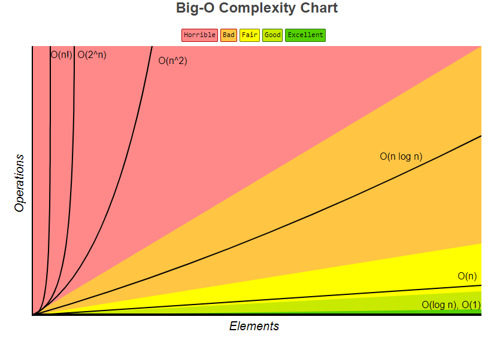

# Big O Notation

## About

In computer science, complexity is a measure of the resources required for an algorithm to solve a problem. The two most commonly analyzed types of complexity are:

1. **Time Complexity**: How the runtime of an algorithm increases with the size of the input.
2. **Space Complexity**: How the memory usage of an algorithm increases with the size of the input.

Both time and space complexity are often expressed using Big O notation, which describes the upper bound of an algorithm's growth rate.

<figure><figcaption></figcaption></figure>

### Comparing Different Complexities

The following table compares the growth of various time complexities with different input sizes n:

<table data-header-hidden data-full-width="true"><thead><tr><th width="139"></th><th></th><th></th><th></th><th></th><th></th><th></th><th></th></tr></thead><tbody><tr><td>n</td><td>O(1)</td><td>O(log n)</td><td>O(n)</td><td>O(n log n)</td><td>O(n²)</td><td>O(n³)</td><td>O(2ⁿ)</td></tr><tr><td>1</td><td>1</td><td>0</td><td>1</td><td>0</td><td>1</td><td>1</td><td>2</td></tr><tr><td>10</td><td>1</td><td>1</td><td>10</td><td>10</td><td>100</td><td>1000</td><td>1024</td></tr><tr><td>100</td><td>1</td><td>2</td><td>100</td><td>200</td><td>10,000</td><td>1,000,000</td><td>1.27e30</td></tr><tr><td>1,000</td><td>1</td><td>3</td><td>1,000</td><td>3,000</td><td>1,000,000</td><td>1.0e9</td><td>1.07e301</td></tr><tr><td>10,000</td><td>1</td><td>4</td><td>10,000</td><td>40,000</td><td>1.0e8</td><td>1.0e12</td><td>-</td></tr><tr><td>100,000</td><td>1</td><td>5</td><td>100,000</td><td>500,000</td><td>1.0e10</td><td>1.0e15</td><td>-</td></tr><tr><td>1,000,000</td><td>1</td><td>6</td><td>1,000,000</td><td>6,000,000</td><td>1.0e12</td><td>1.0e18</td><td>-</td></tr></tbody></table>


## Time Complexity

### Constant Time - O(1)

An algorithm runs in constant time if its runtime does not change with the input size.&#x20;

Example: **Accessing an array element by index**.

```java
int getElement(int[] arr, int index) {
    return arr[index]; // O(1)
}
```

### Logarithmic Time - O(log n)

An algorithm runs in logarithmic time if its runtime grows logarithmically with the input size. These algorithms reduce the problem size by a fraction (typically half) at each step. This means that as the input size increases, the number of steps needed grows logarithmically rather than linearly.&#x20;

**What is the base of log used here ?**

All logarithmic functions with different bases can be represented as O(log(n)) in Big O notation.

<figure><figcaption></figcaption></figure>

Example: **Binary search**.

```java
int binarySearch(int[] arr, int target) {
    int left = 0, right = arr.length - 1;
    while (left <= right) {
        int mid = left + (right - left) / 2;
        if (arr[mid] == target) return mid;
        if (arr[mid] < target) left = mid + 1;
        else right = mid - 1;
    }
    return -1; // O(log n)
}
```


**Logarithmic Growth**

For an array of size n, the number of times you can halve the array before you are left with a single element is log⁡2(n). This is why the time complexity of binary search is O(log n).

* For n=16, the steps are:
  * Step 1: 16 elements
  * Step 2: 8 elements
  * Step 3: 4 elements
  * Step 4: 2 elements
  * Step 5: 1 element
  * Total steps: 5 (which is approximately log⁡2(16))


### Linear Time - O(n)

An algorithm runs in linear time if its runtime grows linearly with the input size.&#x20;

Example: **Finding the maximum element in an array.**

```java
int findMax(int[] arr) {
    int max = arr[0];
    for (int i = 1; i < arr.length; i++) {
        if (arr[i] > max) {
            max = arr[i];
        }
    }
    return max; // O(n)
}
```

### Linearithmic Time - O(n log n)

An algorithm runs in linearithmic time if its runtime grows in proportion to nlog⁡n. It describes algorithms whose running time grows linearly with the size of the input 𝑛 n but also includes an additional logarithmic factor

Example: **Efficient sorting algorithms like Merge Sort and Quick Sort.**

```java
void mergeSort(int[] arr, int left, int right) {
    if (left < right) {
        int mid = (left + right) / 2;
        mergeSort(arr, left, mid);
        mergeSort(arr, mid + 1, right);
        merge(arr, left, mid, right);
    }
}

void merge(int[] arr, int left, int mid, int right) {
    // Merging logic
} // O(n log n)
```


**Linearithmic Growth**

For an array of size n, the total time to sort the array is the number of levels of division (logarithmic) multiplied by the time to process each level (linear).

* **Levels of Division**: log⁡n
* **Processing Each Level**: n
* **Total Time Complexity**: nlog⁡n


### Quadratic Time - O(n²)

An algorithm runs in quadratic time if its runtime grows proportionally to the square of the input size.&#x20;

Example: **Simple sorting algorithms like Bubble Sort, Selection Sort.**

```java
void bubbleSort(int[] arr) {
    int n = arr.length;
    for (int i = 0; i < n - 1; i++) {
        for (int j = 0; j < n - 1 - i; j++) {
            if (arr[j] > arr[j + 1]) {
                int temp = arr[j];
                arr[j] = arr[j + 1];
                arr[j + 1] = temp;
            }
        }
    } // O(n²)
}
```

### Cubic Time - O(n³)

An algorithm runs in cubic time if its runtime grows proportionally to the cube of the input size. Example: Certain dynamic programming algorithms.

```java
void exampleCubic(int n) {
    for (int i = 0; i < n; i++) {
        for (int j = 0; j < n; j++) {
            for (int k = 0; k < n; k++) {
                // Some operations
            }
        }
    } // O(n³)
}
```

### Exponential Time - O(2ⁿ)

An algorithm runs in exponential time if its runtime doubles with each additional input element. Example: Solving the traveling salesman problem using brute force.

```java
int tsp(int[][] graph, boolean[] visited, int currPos, int n, int count, int cost, int ans) {
    if (count == n && graph[currPos][0] > 0) {
        return Math.min(ans, cost + graph[currPos][0]);
    }
    for (int i = 0; i < n; i++) {
        if (!visited[i] && graph[currPos][i] > 0) {
            visited[i] = true;
            ans = tsp(graph, visited, i, n, count + 1, cost + graph[currPos][i], ans);
            visited[i] = false;
        }
    }
    return ans; // O(2ⁿ)
}
```

## Space Complexity

### Constant Space - O(1)

An algorithm uses constant space if the amount of memory it requires does not change with the input size. Example: Swapping two variables.

```java
void swap(int[] arr, int i, int j) {
    int temp = arr[i];
    arr[i] = arr[j];
    arr[j] = temp; // O(1)
}
```

### Linear Space - O(n)

An algorithm uses linear space if the amount of memory it requires grows linearly with the input size. Example: Creating a copy of an array.

```java
int[] copyArray(int[] arr) {
    int[] copy = new int[arr.length];
    for (int i = 0; i < arr.length; i++) {
        copy[i] = arr[i];
    }
    return copy; // O(n)
}
```

### Quadratic Space - O(n²)

An algorithm uses quadratic space if the amount of memory it requires grows proportionally to the square of the input size. Example: Creating a 2D array.

```java
int[][] create2DArray(int n) {
    int[][] array = new int[n][n];
    // Initialize array
    return array; // O(n²)
}
```

### Logarithmic Space - O(log n)

An algorithm uses logarithmic space if the amount of memory it requires grows logarithmically with the input size. Example: Recursive algorithms that divide the problem in half at each step.

```java
void recursiveLogarithmic(int n) {
    if (n <= 1) return;
    recursiveLogarithmic(n / 2);
} // O(log n)
```


## Comparison

### Searching Algorithms

<figure><figcaption></figcaption></figure>

### Data Structure Operations

<figure><figcaption></figcaption></figure>

### Array Sorting Algorithms

<figure><figcaption></figcaption></figure>
