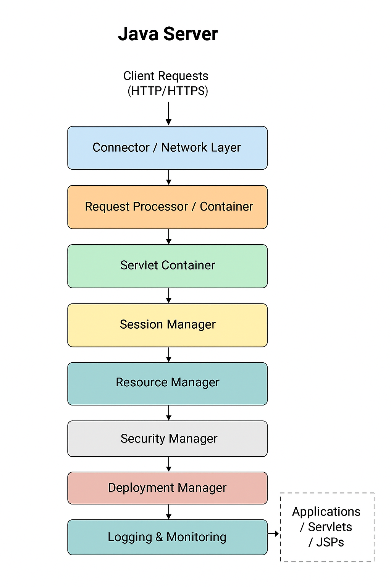

# Java Servers

## About

Java servers are software platforms designed to host, manage, and execute Java-based applications. They provide the runtime environment and necessary services to process client requests, manage resources, and deliver dynamic content over networks, typically using protocols like HTTP and HTTPS.

Serving as the backbone of many enterprise, web, and cloud applications, Java servers handle everything from simple web page delivery to complex business logic execution and transaction management. They bridge the gap between client applications (such as browsers or mobile apps) and backend systems like databases and services.

Java servers come in various forms from lightweight servlet containers focused on handling HTTP requests to full-featured application servers that support the entire Java Enterprise Edition (Jakarta EE) stack. This versatility makes them foundational to Java’s widespread adoption in building scalable, secure, and maintainable applications.

Understanding Java servers is essential for developers, system architects, and DevOps engineers to design, deploy, and maintain robust Java applications efficiently.

## Architecture

The architecture of a Java server defines how its various components work together to provide a stable, efficient, and scalable environment for running Java applications. It outlines the structure, interactions, and lifecycle management of requests and resources within the server.

At its core, a Java server architecture balances **handling client requests**, **managing application execution**, and **resource allocation** all while ensuring security, concurrency, and reliability.

This architectural design enables the server to:

* Receive and process multiple simultaneous client requests
* Manage lifecycle events of Java components like servlets and Enterprise JavaBeans (EJBs)
* Maintain session and state information across requests
* Efficiently allocate resources such as threads, database connections, and caches
* Provide extensibility for additional services such as security, logging, and monitoring

Understanding the architecture is vital for grasping how Java servers handle complex workloads and maintain high performance in production environments.

### Core Components

<figure><figcaption></figcaption></figure>

**1. Connector / Network Layer**\
The Connector acts as the server’s gateway to the outside world. It listens on designated network ports (such as 80 for HTTP or 443 for HTTPS) and manages incoming client connections using low-level protocols like TCP/IP.\
It’s responsible for decoding network requests into a format the server understands and ensuring secure communication channels, including SSL/TLS termination. Efficient handling here is critical for server responsiveness and scalability, as it deals directly with the raw network traffic.

**2. Request Processor / Container**\
This is the central engine of the server where the core business logic is triggered. Upon receiving a request from the connector, the Request Processor interprets it, determines the target resource (such as a servlet or JSP), and invokes the appropriate application component.\
It manages the entire lifecycle of request processing including pre-processing filters, actual component invocation, and post-processing. This layer is also responsible for managing concurrency and ensuring thread-safe execution of requests.

**3. Servlet Container**\
The Servlet Container is a specialized sub-component that manages the lifecycle of servlets and JSPs the backbone of Java web applications. It handles servlet instantiation, initialization, request servicing via the `service()` method, and eventual destruction.\
It provides APIs to manage request and response objects, session tracking, and servlet context, enabling developers to focus on application logic rather than infrastructure. Additionally, it ensures thread safety by managing concurrent request execution, typically by allocating a separate thread for each request.

**4. Session Manager**\
Web applications are inherently stateless, so the Session Manager is crucial for maintaining stateful interactions with clients across multiple requests. It tracks session identifiers (via cookies or URL rewriting), stores session data, and manages session timeouts and persistence strategies.\
Advanced implementations support clustering and replication to maintain session consistency in distributed environments, enabling failover and load balancing without loss of user state.

**5. Resource Manager**\
Efficient resource management is essential for maintaining server performance and stability under load. The Resource Manager handles allocation and pooling of critical resources such as threads, database connections, file handles, and memory caches.\
By pooling these resources and reusing them across requests, the server minimizes expensive creation and destruction overheads, thus improving throughput and reducing latency. It also monitors resource usage to prevent leaks and ensure graceful degradation under high load.

**6. Security Manager**\
This component enforces security policies for the server and hosted applications. It handles authentication mechanisms (basic, digest, OAuth, etc.), authorization checks based on user roles and permissions, and manages SSL/TLS encryption settings.\
It protects sensitive resources by preventing unauthorized access and may also integrate with external identity providers or security frameworks. Security Manager ensures that security constraints defined in deployment descriptors or annotations are consistently enforced during request processing.

**7. Logging and Monitoring**\
Comprehensive logging and monitoring provide visibility into server operations and health. This component collects logs related to server events, request processing, errors, and security audits.\
It supports integration with monitoring tools and management frameworks (like JMX) to expose runtime metrics such as thread usage, memory consumption, response times, and throughput. These insights are vital for troubleshooting, capacity planning, and ensuring SLA compliance.

**8. Deployment Manager**\
The Deployment Manager oversees the lifecycle of applications deployed on the server. It handles the installation, configuration, updating, and removal of web applications or enterprise components without requiring server restarts (hot deployment).\
It also manages deployment descriptors, resource references, and environment settings, ensuring that applications are correctly initialized and integrated with server services. Robust deployment management improves developer productivity and reduces downtime during application updates.


**EJB** has historically been a core part of the **Java EE (now Jakarta EE)** platform, providing a component model for building modular, transactional, and distributed business logic within Java servers (application servers).

* In traditional Java EE architecture, EJBs are key server-side components that handle business logic, transactions, security, and remote method invocation.
* Many classic application servers like WildFly/JBoss, WebLogic, and WebSphere provided full EJB support.

**Current Status of EJB**

* EJB has become less popular over time due to its complexity, heavy configuration, and steep learning curve.
* Modern Java development trends have shifted towards lighter, more flexible frameworks like Spring, MicroProfile, and Jakarta EE CDI (Contexts and Dependency Injection).
* As of Jakarta EE 9 and beyond, EJB is still supported but considered legacy in many cases, with the community encouraging alternatives for new projects.
* The specification itself has evolved, and some features have been deprecated or moved to other Jakarta EE components.


### Request Processing Flow

The **Request Processing Flow** describes the step-by-step journey a client’s request takes from arrival at the Java server to the generation and delivery of the response. Understanding this flow is crucial for grasping how Java servers handle concurrency, routing, and resource management efficiently.

**1. Client Sends Request**\
A client (usually a web browser or application) sends an HTTP/HTTPS request to the server’s IP address and port. This request contains the target URL, headers, cookies, and optionally body data (for POST, PUT requests).

**2. Network Layer / Connector Receives Request**\
The server’s Connector listens on the configured ports and accepts the incoming TCP connection. It parses the raw network data into a standardized HTTP request object that the server can process. If SSL/TLS is enabled, decryption occurs here.

**3. Request Dispatch to Request Processor**\
The Connector forwards the parsed request to the Request Processor or Container component responsible for handling application logic.

**4. Request Mapping and Routing**\
The Request Processor examines the URL and HTTP method to determine the appropriate target component:

* Servlets or JSPs for web applications
* Filters or interceptors for pre-processing (e.g., authentication, logging)
* REST endpoints if using frameworks like JAX-RS or Spring MVC

**5. Lifecycle Invocation**\
The targeted servlet or component’s lifecycle methods are invoked:

* Initialization if not already initialized
* `service()` method to handle the request
* `doGet()`, `doPost()`, or other HTTP-specific methods as applicable

**6. Session Management**\
If the request is associated with a user session, the Session Manager retrieves or creates the session context to maintain user state.

**7. Resource Access and Business Logic Execution**\
The servlet or component executes application-specific logic, such as database queries, computations, or calling backend services. It uses resources managed by the Resource Manager for efficient operation.

**8. Response Construction**\
The application builds the HTTP response, including status code, headers, and body content (HTML, JSON, XML, etc.).

**9. Response Dispatch to Client**\
The server sends the response back through the Connector, which formats the data into network packets and delivers it over the TCP connection to the client.

**10. Cleanup and Thread Release**\
After the response is sent, the server releases threads and resources allocated for processing the request, preparing to handle new incoming requests.

## Where Does Developer Business Logic Reside?

1. **Servlets, JSPs, and Java Classes**

* Business logic often lives inside **Servlets**, **JSPs**, or other Java classes packaged within a web application (WAR file) or enterprise application (EAR file).
* The **Servlet Container** manages the lifecycle of these components—instantiating them, handling requests, and calling their methods.

2. **Enterprise JavaBeans (EJBs) or CDI Beans**

* In full-fledged application servers (like WildFly or WebLogic), business logic may reside inside **EJBs** or **CDI (Contexts and Dependency Injection) beans** that provide services such as transactions, security, and concurrency management.
* These components are managed by the **Application Server’s container**, which handles lifecycle, dependency injection, and resource management.

3. **Framework-Managed Components**

* Modern applications often use frameworks like **Spring**, where business logic is implemented in Spring-managed beans or controllers. These frameworks run inside the server or embedded container and integrate with the server’s request processing.

4. **Deployment Units**

* The developer’s code is packaged as **WAR (Web ARchive)**, **EAR (Enterprise ARchive)**, or **Fat JAR** files and deployed to the server. The server loads these artifacts and wires their components into the runtime environment.


In essence, **the Java server provides the runtime environment and manages the lifecycle of our business logic components**, but the actual logic lives inside the applications we deploy and develop.


## Importance of Java Servers

Java servers play a pivotal role in modern application development and deployment, serving as the backbone for delivering reliable, scalable, and secure services. Their importance spans across various dimensions:

#### 1. **Facilitating Enterprise-Grade Applications**

Java servers provide robust support for enterprise-level features such as transaction management, distributed computing, messaging, and security. This makes them indispensable for building complex business applications that require high reliability and scalability.

#### 2. **Standardized Environment**

They offer a standardized and consistent runtime environment adhering to specifications like Jakarta EE (formerly Java EE), enabling developers to write portable applications that can run on different servers without modification.

#### 3. **Efficient Request Handling**

By managing concurrent client requests through thread pools and connection management, Java servers ensure efficient utilization of system resources while maintaining responsiveness even under high loads.

#### 4. **Security Management**

Built-in security frameworks within Java servers simplify the implementation of authentication, authorization, encryption, and auditing, helping safeguard applications against threats and vulnerabilities.

#### 5. **Simplifying Development and Deployment**

Java servers streamline the deployment process by supporting standard packaging formats (WAR, EAR) and providing hot deployment capabilities, reducing downtime and accelerating development cycles.

#### 6. **Extensibility and Integration**

They facilitate integration with databases, messaging systems, web services, and other middleware, while also allowing extension through modules and plugins, thus supporting diverse application requirements.

#### 7. **Supporting Modern Architectures**

With evolving trends such as microservices, cloud-native applications, and containerization, Java servers have adapted to support embedded server models, RESTful services, and seamless cloud deployments.

#### 8. **Community and Ecosystem**

A rich ecosystem and active community around Java servers ensure ongoing improvements, security updates, and a wealth of tools and resources for developers and administrators.

## Features and Responsibilities

<table data-header-hidden data-full-width="true"><thead><tr><th width="258.828125"></th><th></th></tr></thead><tbody><tr><td><strong>Feature / Responsibility</strong></td><td><strong>Description</strong></td></tr><tr><td><strong>Request Handling</strong></td><td>Accepts, processes, and responds to client requests (HTTP, HTTPS, etc.)</td></tr><tr><td><strong>Servlet Lifecycle Management</strong></td><td>Manages creation, initialization, execution, and destruction of servlets</td></tr><tr><td><strong>Session Management</strong></td><td>Maintains user sessions across multiple requests to enable stateful interactions</td></tr><tr><td><strong>Resource Management</strong></td><td>Efficiently allocates and pools resources like threads, database connections, and memory caches</td></tr><tr><td><strong>Security Management</strong></td><td>Handles authentication, authorization, SSL/TLS encryption, and enforces security policies</td></tr><tr><td><strong>Deployment Management</strong></td><td>Supports deploying, undeploying, and hot-reloading applications without downtime</td></tr><tr><td><strong>Concurrency Handling</strong></td><td>Manages multiple simultaneous client requests using thread pools and synchronization</td></tr><tr><td><strong>Logging and Monitoring</strong></td><td>Captures server events, errors, and metrics; integrates with monitoring tools</td></tr><tr><td><strong>Configuration Management</strong></td><td>Allows configuration of server settings, applications, resources, and environment parameters</td></tr><tr><td><strong>Scalability &#x26; Load Balancing</strong></td><td>Supports clustering, load balancing, and failover to handle high traffic and ensure availability</td></tr><tr><td><strong>Extensibility</strong></td><td>Provides hooks and APIs for adding custom modules, filters, and services</td></tr><tr><td><strong>Protocol Support</strong></td><td>Supports various protocols beyond HTTP(S), such as AJP, WebSocket, and more</td></tr></tbody></table>

## Types of Java Server

Java servers come in various forms, each designed to serve specific purposes within application architectures. Understanding these types helps in selecting the right server based on application needs.

#### 1. **Application Servers**

* Full-featured servers that implement the complete Java Enterprise Edition (Jakarta EE) specifications.
* Provide services like transaction management, messaging, persistence (JPA), security, and web components.
* Suitable for large-scale, enterprise-level applications requiring complex business logic and integration.
* **Examples:** WildFly (JBoss), WebLogic, WebSphere, GlassFish.

#### 2. **Web Servers**

* Handle HTTP requests, serving static content like HTML, CSS, JavaScript, and images.
* Typically do not process Java servlets or Java EE components but can act as a front-end proxy to application servers.
* Often used for load balancing, SSL termination, and caching.
* **Examples:** Apache HTTP Server, Nginx (commonly paired with Java servers).

#### 3. **Servlet Containers (Web Containers)**

* Specialized servers focused on managing the lifecycle and execution of Java servlets and JavaServer Pages (JSP).
* Provide HTTP request handling, session management, and servlet API implementations.
* Often form the core of web application deployments.
* **Examples:** Apache Tomcat, Jetty, Resin.

#### 4. **Embedded Servers**

* Lightweight server instances embedded directly within Java applications.
* Enable self-contained applications that run without requiring an external server installation.
* Popular in microservices and Spring Boot applications for rapid development and deployment.
* **Examples:** Embedded Tomcat, Embedded Jetty, Undertow

## Popular Java Server Implementations

Java has a rich ecosystem of server implementations catering to various needs, from lightweight servlet containers to full-featured application servers. Below are some widely used Java servers:

#### 1. **Apache Tomcat**

* A lightweight and widely adopted servlet container.
* Implements the Java Servlet, JSP, and WebSocket specifications.
* Often used for web applications that don’t require full Java EE features.
* Supports embedded and standalone deployments.

#### 2. **Jetty**

* An open-source servlet container and HTTP server.
* Known for its small footprint and high performance.
* Commonly embedded in applications and frameworks, especially for microservices.
* Supports asynchronous request processing and WebSocket.

#### 3. **WildFly (formerly JBoss AS)**

* A full Java EE application server implementing the complete Jakarta EE stack.
* Provides enterprise features like EJB, JMS, JPA, security, and clustering.
* Highly modular and configurable with a flexible management interface.

#### 4. **Oracle WebLogic Server**

* A commercial, enterprise-grade Java EE server.
* Offers comprehensive support for Java EE, web services, and cloud deployments.
* Known for scalability, reliability, and extensive management tools.

#### 5. **IBM WebSphere Application Server**

* A robust, enterprise-class Java EE server by IBM.
* Supports large-scale applications with advanced clustering, security, and integration features.
* Offers deep integration with IBM middleware and mainframe systems.

## Future Trends in Java Servers

The Java server landscape continues to evolve rapidly, adapting to modern development practices, cloud adoption, and performance demands. Here are some key trends shaping the future of Java servers:

#### 1. **Microservices and Modular Architectures**

Java servers are increasingly optimized to support microservices, allowing applications to be broken down into small, independently deployable components. Lightweight, modular servers and frameworks enable faster development and scalability.

#### 2. **Embedded Servers and Self-Contained Applications**

Embedded servlet containers, such as those used in Spring Boot, allow developers to package applications with their own server runtime, simplifying deployment and promoting containerization and DevOps practices.

#### 3. **Cloud-Native and Containerization Support**

Java servers are being designed to run seamlessly in containerized environments like Docker and orchestrated platforms such as Kubernetes. This includes support for dynamic scaling, health checks, and stateless operations.

#### 4. **Reactive and Event-Driven Programming**

To handle increasing concurrency demands and improve resource utilization, Java servers are adopting reactive programming models and event-driven architectures. Frameworks like Project Reactor and Vert.x facilitate this shift.

#### 5. **Serverless Architectures**

While not servers in the traditional sense, serverless platforms are influencing Java application design. Java servers and frameworks are adapting to support stateless, event-driven functions executed on-demand in cloud environments.

#### 6. **Improved Performance and Resource Efficiency**

Ongoing enhancements in JVM optimizations, native image compilation (e.g., GraalVM), and efficient threading models help Java servers reduce startup times and memory footprints, benefiting cloud deployments and microservices.

#### 7. **Enhanced Security Features**

With evolving security threats, Java servers integrate stronger security mechanisms, such as improved identity federation, zero-trust models, and built-in support for modern authentication protocols (OAuth2, OpenID Connect).
