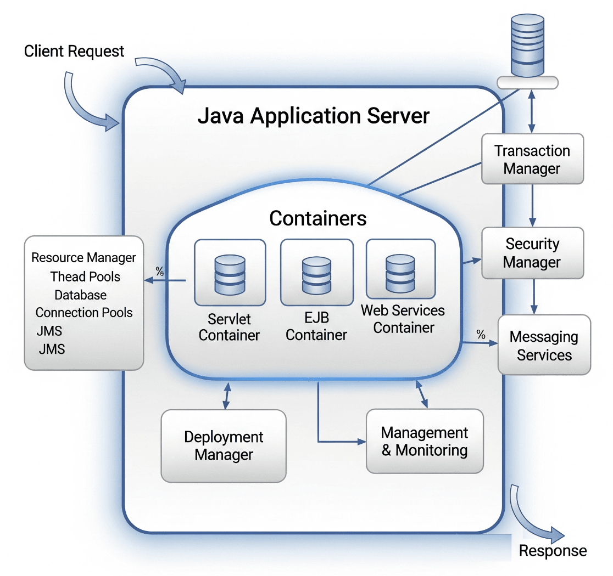

# Application Server

## About

An **Application Server** is a software framework that provides an environment to run and manage Java enterprise applications. It offers a comprehensive set of services and APIs that support the development, deployment, and execution of scalable, secure, and transactional applications.

Unlike simple web servers or servlet containers, application servers implement full Java Enterprise Edition (Jakarta EE) specifications. This includes support for components such as Enterprise JavaBeans (EJB), Java Persistence API (JPA), Java Message Service (JMS), and distributed transactions, among others.

Application servers manage the entire lifecycle of applications, handling aspects like resource pooling, security enforcement, transaction management, and messaging. This makes them ideal for complex, multi-tiered business applications that require robustness, scalability, and integration with enterprise systems.

Because they abstract much of the low-level infrastructure management, application servers enable developers to focus more on business logic rather than boilerplate plumbing. As a result, they have become a cornerstone technology in enterprise Java development.

## Architecture

The architecture of a Java application server is designed to provide a robust and scalable environment that supports enterprise-level applications. It typically consists of several interconnected components, each responsible for specific services and functionalities:

<figure><figcaption></figcaption></figure>

#### 1. **Containers**

Application servers include multiple types of containers that manage different Java components:

* **Servlet Container:** Manages servlets and JSPs, handling HTTP requests and responses.
* **EJB Container:** Manages Enterprise JavaBeans, providing services like transactions, security, and concurrency.
* **Web Services Container:** Handles SOAP and RESTful web services deployment and execution.

#### 2. **Resource Management**

The server manages critical resources such as thread pools, database connections (via connection pools), JMS connections, and caching. Efficient resource management ensures optimal performance and scalability.

#### 3. **Transaction Manager**

Manages distributed transactions across multiple resources, ensuring atomicity, consistency, isolation, and durability (ACID properties). This is vital for business-critical operations involving databases and messaging.

#### 4. **Security Manager**

Handles authentication and authorization, enforcing security policies at the application and component levels. Integrates with enterprise security frameworks and protocols.

#### 5. **Deployment Manager**

Oversees the deployment, undeployment, and lifecycle management of applications and modules, supporting hot deployment to minimize downtime.

#### 6. **Messaging Services**

Supports asynchronous communication through Java Message Service (JMS), allowing applications to send and receive messages reliably.

#### 7. **Management and Monitoring**

Provides administrative consoles, APIs (such as JMX), and tools for monitoring application performance, server health, and resource utilization.

This layered and modular architecture enables application servers to handle complex business logic, maintain high availability, and provide seamless integration with enterprise systems.

## Features & Responsibilities

Java Application Servers offer a rich set of features that support the development, deployment, and management of enterprise-grade applications. Their key responsibilities include:

<table data-header-hidden data-full-width="true"><thead><tr><th width="220.23046875"></th><th></th></tr></thead><tbody><tr><td><strong>Feature / Responsibility</strong></td><td><strong>Description</strong></td></tr><tr><td><strong>Component Management</strong></td><td>Manages lifecycle of Java EE components such as servlets, EJBs, web services, and more.</td></tr><tr><td><strong>Transaction Management</strong></td><td>Ensures reliable distributed transactions with support for ACID properties across multiple resources.</td></tr><tr><td><strong>Security</strong></td><td>Provides authentication, authorization, and secure communication mechanisms to protect applications.</td></tr><tr><td><strong>Resource Pooling</strong></td><td>Efficiently manages resources like database connections, thread pools, and JMS connections.</td></tr><tr><td><strong>Messaging Support</strong></td><td>Implements Java Message Service (JMS) for asynchronous communication and integration.</td></tr><tr><td><strong>Load Balancing &#x26; Clustering</strong></td><td>Supports scalability and high availability through clustering and load balancing features.</td></tr><tr><td><strong>Deployment &#x26; Hot-Deployment</strong></td><td>Allows deployment, updating, and redeployment of applications without server downtime.</td></tr><tr><td><strong>Monitoring &#x26; Management</strong></td><td>Offers administrative consoles, APIs (e.g., JMX), and tools for server and application monitoring.</td></tr><tr><td><strong>Integration Services</strong></td><td>Facilitates integration with databases, web services, and enterprise systems.</td></tr><tr><td><strong>Standard Compliance</strong></td><td>Implements Jakarta EE specifications ensuring portability and interoperability.</td></tr></tbody></table>

## Popular Java Application Servers

Several robust and widely-used Java application servers are available, each offering unique features and strengths. Here are some of the most popular:

#### 1. **WildFly (formerly JBoss Application Server)**

* An open-source application server known for its lightweight footprint and modular architecture.
* Supports full Jakarta EE specifications and offers fast startup times.
* Popular choice for developers seeking flexibility and community-driven development.

#### 2. **Oracle WebLogic Server**

* A commercial, enterprise-grade application server widely used in large organizations.
* Provides extensive clustering, high availability, and advanced security features.
* Well-integrated with Oracle database and middleware products.

#### 3. **IBM WebSphere Application Server**

* Enterprise-class application server designed for mission-critical workloads.
* Offers strong support for scalability, reliability, and security.
* Includes advanced performance tuning and management tools.

#### 4. **GlassFish**

* The reference implementation of Jakarta EE (formerly Java EE).
* Open-source and often used for development, testing, and as a learning platform.
* Supports rapid development but less common in production compared to others.

## Use Case

Java application servers are designed to support complex, scalable, and secure enterprise applications across various industries. Here are some common scenarios where application servers play a crucial role:

#### 1. **Enterprise Business Applications**

Large organizations use application servers to run mission-critical applications such as customer relationship management (CRM), enterprise resource planning (ERP), and supply chain management systems. Application servers provide the necessary infrastructure for transaction management, security, and scalability.

#### 2. **Distributed Systems**

In multi-tier architectures, application servers act as the middle tier, handling business logic between the client and backend databases or services. They manage communication, session state, and integration with other systems.

#### 3. **Web-Based Applications**

Application servers host web applications that serve dynamic content, supporting features like session management, user authentication, and form processing.

#### 4. **Microservices and Cloud Deployments**

Modern application servers support containerization and cloud-native architectures, allowing enterprises to deploy microservices with scalability and resilience.

#### 5. **Integration Platforms**

Application servers often serve as integration hubs, connecting different enterprise systems, messaging services, and databases, ensuring seamless data flow and process coordination.
