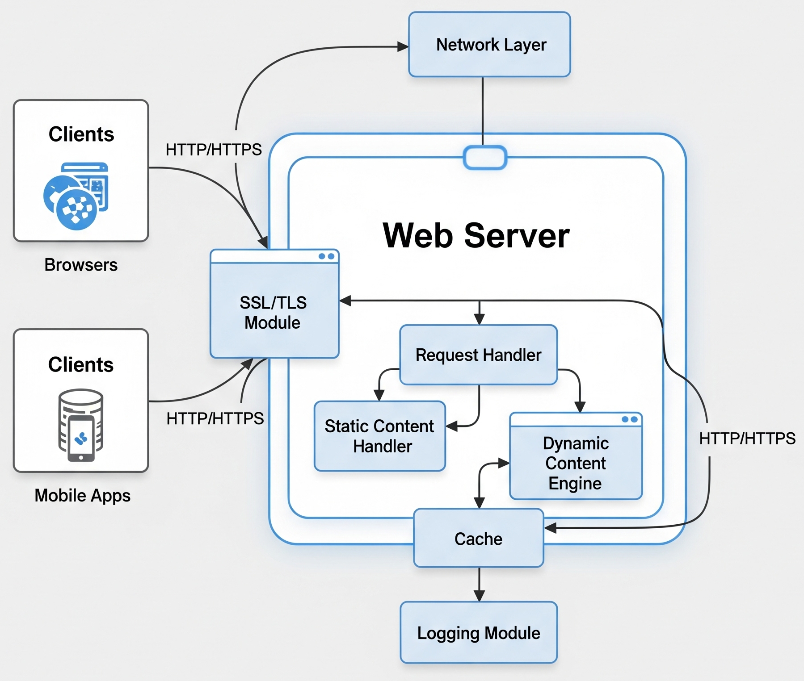

# Web Server

## About

A web server is a software component that delivers static data like images, files, and text in response to client requests. Whereas, an application server adds business logic to compute the web server's response. Web server contains only web or servlet container. It can be used for servlet, jsp, struts, jsf etc. It can't be used for EJB.

For example, browser and web server communicate as follows:

1. The browser uses the URL to find the server’s IP address
2. The browser sends an HTTP request for information
3. The web server communicates with a database server to find the relevant data
4. The web server returns static content such as HTML pages, images, videos, or files in an HTTP response to the browser
5. The browser then displays the information


The terms "Web Server" and "Application Server" are often used interchangeably, but they serve distinct purposes.

* **Key Differences**:
  * **Web Server**: Primarily serves HTTP content and is optimized for handling static content. It may support dynamic content through plugins or scripting languages like Perl, PHP, ASP, or JSP.
  * **Application Server**: Includes all features of a Web Server but extends functionality to support additional protocols such as RMI/RPC. It provides comprehensive support for dynamic content generation and includes advanced services like connection pooling, object pooling, transactions, and messaging.
* **Integration and Usage**:
  * Most application servers integrate a web server component, allowing them to handle both static and dynamic content efficiently.
  * In production environments, web servers often act as reverse proxies to application servers. They serve static content directly and transparently forward requests for dynamic content to the application server, leveraging their respective strengths in content handling.


## Can Web Server handle dynamic content?

Modern web servers can handle dynamic content to some extent, but their primary role traditionally revolves around serving static content.

1. **Static vs Dynamic Content**: Web servers like Apache HTTP Server or Nginx are designed to efficiently serve static content such as HTML files, images, CSS, and JavaScript files. This content doesn't change based on user requests and can be served directly from disk.
2. **Dynamic Content Handling**: While web servers themselves focus on static content, they can integrate with application servers or runtime environments (like servlet containers such as Apache Tomcat or application servers like WildFly) to handle dynamic content. These application servers execute server-side programs (e.g., Java servlets, PHP scripts) to generate dynamic responses based on user input, database queries, or other computations.
3. **Reverse Proxy and Load Balancing**: Web servers can also act as reverse proxies or load balancers, forwarding requests to multiple application servers based on various criteria (like load balancing algorithms or URL patterns). This setup allows web servers to distribute dynamic content generation tasks efficiently among multiple backend servers.
4. **Performance Considerations**: While web servers can handle dynamic content through integration with application servers or via reverse proxy setups, the performance and scalability of handling dynamic content may benefit from using specialized application servers designed for such tasks.

## Architecture

The architecture of a web server is designed to efficiently handle and respond to HTTP requests from clients. At its core, a web server listens for incoming requests, processes them, and delivers the requested resources, such as static files or forwarded dynamic content.

Web servers are typically built with modular components that work together to manage network connections, interpret HTTP protocols, serve content, and maintain performance under high loads. Their architecture emphasizes scalability, concurrency, and security to ensure reliable web service delivery.

Understanding the architectural layout of web servers helps in configuring them effectively, optimizing performance, and integrating them with other layers like application servers or content delivery networks (CDNs).

<figure><figcaption></figcaption></figure>

### Components

A typical web server architecture consists of several key components that collaborate to efficiently handle client requests and deliver content. Understanding each component’s role provides insight into how web servers achieve performance, reliability, and security.

#### 1. **Listener / Network Interface**

The listener is the entry point of the web server. It continuously monitors designated network ports (typically 80 for HTTP and 443 for HTTPS) for incoming client connections. Once a connection request arrives, the listener establishes a socket connection between the client and server, enabling further communication. This component must efficiently handle a potentially large number of simultaneous connection requests, often using asynchronous or non-blocking I/O to maintain scalability.

#### 2. **Request Parser**

After a connection is established, the request parser reads the incoming HTTP request from the client. It analyzes the request line to identify the HTTP method (GET, POST, PUT, DELETE, etc.), parses headers (such as Host, User-Agent, Cookies), and extracts the requested URI and any query parameters. Accurate parsing is critical for correct request handling and security enforcement.

#### 3. **Request Processor**

The request processor interprets the parsed request to decide how to fulfill it. For static content, it routes the request to the static content handler. For dynamic content, it may forward the request to backend servers or application servers (e.g., Java application servers or servlet containers). This component also handles URL rewriting, redirection, and applies server configuration rules such as access restrictions or caching policies.

#### 4. **Static Content Handler**

This component directly accesses server file systems or caches to retrieve static resources like HTML files, images, CSS stylesheets, and JavaScript files. It serves these resources to the client with appropriate HTTP headers to support caching, compression, and content-type specifications. Efficient static content handling is vital for reducing server load and improving user experience.

#### 5. **Proxy / Forwarder**

For requests that require dynamic processing, such as executing server-side scripts or Java applications, the proxy component forwards these requests to backend servers. It manages communication between the client and backend, including forwarding the request, receiving the response, and relaying it back. It may also perform load balancing, SSL termination, or caching of responses to optimize performance.

#### 6. **Connection Manager**

The connection manager oversees all active client connections. It maintains connection states, supports persistent connections (keep-alive) to reduce latency, enforces timeout policies to free idle connections, and manages the number of concurrent connections to prevent resource exhaustion. Proper connection management is key to maximizing throughput and server stability.

#### 7. **Security Module**

Security is paramount in web server operations. This module manages SSL/TLS protocols to encrypt data in transit, authenticates users or clients when required, and authorizes access to protected resources. It also implements filtering rules to block malicious traffic, prevent common attacks like cross-site scripting (XSS) or SQL injection, and integrates with external security systems or identity providers.

#### 8. **Logging and Monitoring**

This component records detailed logs of client requests, server responses, errors, and performance metrics. Logs aid in diagnosing issues, auditing user activity, and analyzing usage patterns. Monitoring tools integrated with the server provide real-time insights into server health, resource utilization, and traffic trends, enabling proactive management and capacity planning.

### Request Processing Flow

The request processing flow in a web server describes the sequence of steps taken to handle a client’s HTTP request from arrival to response delivery. Understanding this flow helps in optimizing server performance and troubleshooting issues.

1. **Client Sends Request**\
   A client, typically a web browser or API consumer, sends an HTTP request to the web server, specifying the resource it wants to access.
2. **Listener Accepts Connection**\
   The web server’s listener component accepts the incoming connection on the appropriate port and establishes a communication channel.
3. **Request Parsing**\
   The server reads the HTTP request message and parses it to extract the method, URI, headers, and any body content.
4. **Request Handling Decision**\
   Based on server configuration and request details, the server decides whether to serve the request directly (static content) or forward it to a backend server or application server for dynamic content processing.
5. **Static Content Serving (if applicable)**\
   If the request targets static resources, the static content handler retrieves the requested files from the server’s storage and sends them to the client with appropriate headers.
6. **Request Forwarding (if applicable)**\
   For dynamic content, the server forwards the request to a backend service or application server, such as a Java servlet container. It waits for the backend to process the request and send back a response.
7. **Response Generation**\
   The server or backend generates an HTTP response, including status codes, headers, and the message body (such as HTML content, JSON data, or files).
8. **Response Transmission**\
   The server sends the response back through the established connection to the client.
9. **Connection Management**\
   Depending on the HTTP protocol version and connection settings, the server either closes the connection or keeps it alive for further requests.
10. **Logging and Monitoring**\
    The server logs the transaction details for auditing, troubleshooting, and analytics purposes.

This flow ensures that requests are processed efficiently and securely, enabling web servers to handle high volumes of traffic with minimal latency.

## How Web Servers Work with Clients and Application Servers ?

<figure><figcaption></figcaption></figure>

### **Components**

1. **Client**: This could be a web browser or any other client application that initiates HTTP requests to the web server.
2. **Web Server**: Handles incoming HTTP requests from clients. It serves static content directly (like HTML pages, images) and may delegate dynamic content requests to the application server.
3. **Application Server**: Executes server-side programs or scripts (such as servlets, JSPs, PHP scripts) to generate dynamic content based on the client's request. It interacts with databases or other backend services to process data and business logic.

### **Interaction Flow**

* **Client to Web Server**: The client initiates an HTTP request (e.g., GET /index.html) to the web server.
* **Web Server**: The web server receives the request and checks if the requested resource is static (like HTML, images). If it's static, the web server directly serves it back to the client. If the request requires dynamic content (e.g., data from a database), the web server forwards the request to the application server.
* **Application Server**: Upon receiving a request from the web server, the application server executes server-side programs to generate the dynamic content. This could involve querying databases, performing calculations, or executing business logic.
* **Response to Web Server**: Once the application server has generated the dynamic content, it sends the response back to the web server.
* **Web Server to Client**: Finally, the web server forwards the dynamic content received from the application server as an HTTP response back to the client.

## Features & Responsibilities

<table data-header-hidden data-full-width="true"><thead><tr><th width="223.3515625"></th><th></th></tr></thead><tbody><tr><td><strong>Feature / Responsibility</strong></td><td><strong>Description</strong></td></tr><tr><td><strong>HTTP Protocol Handling</strong></td><td>Supports HTTP/HTTPS protocols to communicate with clients, including parsing requests and forming responses.</td></tr><tr><td><strong>Static Content Serving</strong></td><td>Efficiently serves static resources like HTML, images, CSS, and JavaScript files directly to clients.</td></tr><tr><td><strong>Request Forwarding / Proxying</strong></td><td>Forwards dynamic requests to backend servers or application servers for processing and relays responses back.</td></tr><tr><td><strong>Connection Management</strong></td><td>Manages client connections, including persistent connections (keep-alive), timeouts, and concurrency limits.</td></tr><tr><td><strong>Load Balancing</strong></td><td>Distributes incoming requests across multiple backend servers to optimize resource use and availability.</td></tr><tr><td><strong>SSL/TLS Support</strong></td><td>Handles encryption and decryption of data for secure communication using SSL/TLS protocols.</td></tr><tr><td><strong>Authentication &#x26; Authorization</strong></td><td>Implements mechanisms to verify user identity and control access to protected resources.</td></tr><tr><td><strong>Caching</strong></td><td>Stores frequently requested resources temporarily to improve response times and reduce server load.</td></tr><tr><td><strong>URL Rewriting and Redirection</strong></td><td>Modifies incoming request URLs or redirects clients to different resources as per configuration rules.</td></tr><tr><td><strong>Logging &#x26; Monitoring</strong></td><td>Records request/response data, errors, and performance metrics to aid in diagnostics and analysis.</td></tr><tr><td><strong>Compression</strong></td><td>Compresses responses (e.g., gzip) to reduce bandwidth usage and speed up content delivery.</td></tr><tr><td><strong>Security Filtering</strong></td><td>Applies filters and rules to block malicious traffic and protect against common web attacks.</td></tr></tbody></table>

## Popular Web Servers

Several web servers have gained widespread adoption due to their performance, flexibility, and community support. Here are some of the most popular:

#### 1. **Apache HTTP Server**

* One of the oldest and most widely used web servers worldwide.
* Highly configurable with a rich ecosystem of modules supporting authentication, URL rewriting, caching, and more.
* Supports both static content delivery and acting as a reverse proxy to application servers.

#### 2. **Nginx**

* Known for its high performance, low resource consumption, and scalability.
* Often used as a reverse proxy, load balancer, and HTTP cache.
* Popular for serving static content quickly and handling many concurrent connections efficiently.

#### 3. **Microsoft Internet Information Services (IIS)**

* Web server developed by Microsoft, integrated with Windows Server.
* Supports HTTP/HTTPS, FTP, and other protocols.
* Well-suited for hosting ASP.NET applications and integrates tightly with Microsoft ecosystems.

#### 4. **LiteSpeed Web Server**

* Commercial web server optimized for speed and scalability.
* Compatible with Apache configurations and offers built-in caching and security features.
* Often used for high-traffic websites requiring efficient handling of concurrent requests.

#### 5. **Caddy**

* Modern, easy-to-configure web server with automatic HTTPS using Let's Encrypt.
* Emphasizes simplicity and security with a clean configuration model.
* Suitable for small to medium web applications.

## Use Cases

Web servers are essential components in virtually all web architectures, serving a variety of purposes across different scenarios:

#### 1. **Serving Static Websites**

Web servers efficiently deliver static content such as HTML pages, images, CSS, and JavaScript files to browsers, enabling fast and reliable website access.

#### 2. **Reverse Proxying and Load Balancing**

They act as intermediaries that forward client requests to backend application servers, distributing traffic evenly to improve scalability and availability.

#### 3. **SSL/TLS Termination**

Web servers handle encryption and decryption of HTTPS traffic, offloading this resource-intensive task from backend servers.

#### 4. **Content Caching**

By caching frequently requested resources, web servers reduce latency and backend load, improving user experience and server efficiency.

#### 5. **Security Enforcement**

Web servers implement access controls, authentication, and filtering to protect web applications from unauthorized access and attacks.

#### 6. **API Gateway Frontend**

In microservices architectures, web servers often serve as gateways that route API requests to appropriate backend services, handling tasks like rate limiting and request validation.
