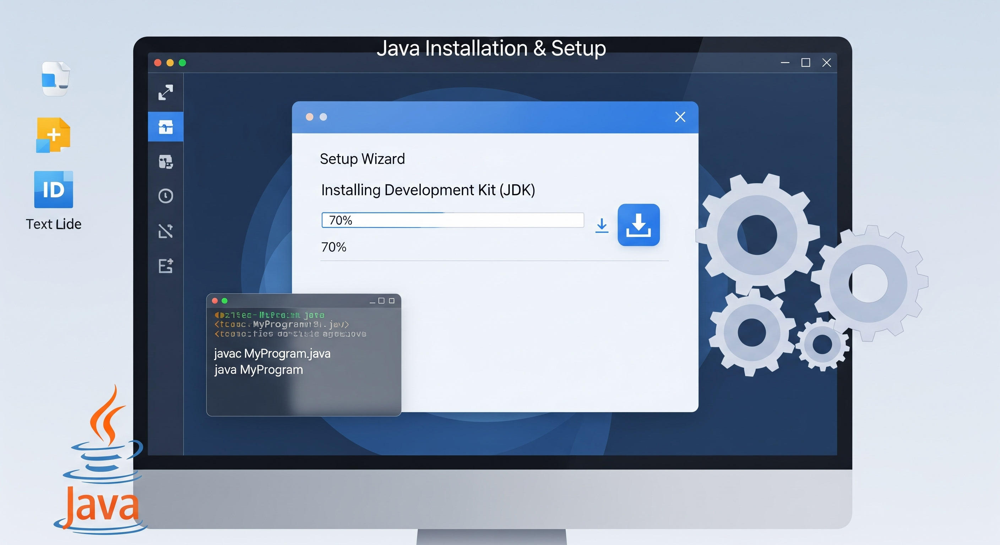

# Installation & Setup

## **About**

Setting up Java is the first and most critical step for any developer embarking on the Java journey. Whether we are building enterprise-scale applications, writing backend services, or experimenting with command-line utilities, a well-configured Java environment ensures everything runs reliably, efficiently, and securely.

This section provides a comprehensive guide to installing Java on various platforms, understanding the different Java distributions available, and configuring our environment properly. It bridges the gap between downloading the JDK and getting our development environment ready for real-world coding.

<figure><figcaption></figcaption></figure>

## **Why It Matters**

Think of the Java Development Kit (JDK) as the **engine** of our Java vehicle. Without installing it correctly and tuning the right configurations, our journey won’t start — or worse, might behave unpredictably.

A clean setup helps ensure:

* Reliable compilation and execution of code
* Compatibility with tools like Maven, Gradle, and IDEs (like IntelliJ or Eclipse)
* Access to the latest features and performance improvements
* Avoidance of cryptic runtime issues caused by misconfigured environments
