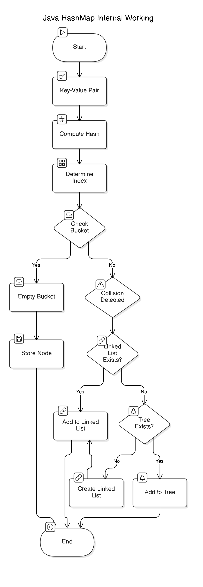

# HashMap

## **About**

`HashMap` is a part of the `java.util` package and is used to store key-value pairs. It is based on **hashing** and provides constant-time performance for basic operations like insertion, deletion, and lookup under ideal conditions.

* Keys are unique, while values can be duplicated.
* Allows `null` as a key (only one `null` key is allowed) and multiple `null` values.
* It is unsynchronized and not thread-safe by default.

## **Features**

1. **Key-Value Mapping**: Stores data as key-value pairs where the key is unique.
2. **Fast Access**: O(1) average time complexity for most operations.
3. **Dynamic Resizing**: Automatically resizes when the number of entries exceeds the load factor.
4. **Allows Null**: Accepts one `null` key and multiple `null` values.
5. **Order**: Does not guarantee any order of keys or values.
6. **Non-Synchronized**: Use `Collections.synchronizedMap()` for thread-safe operations or `ConcurrentHashMap` for better performance.
7. **Customizable Hashing**: Custom objects can be used as keys by overriding `hashCode()` and `equals()`.

## Internal Working

Java's HashMap works on the principle of hashing and uses an array of linked lists (buckets) to store key-value pairs. When a key is inserted, its hash code is computed and mapped to an index in the internal array. If multiple keys hash to the same index (collision), entries are stored in a linked list (Java 7) or balanced tree (TreeNode) if collisions exceed a threshold (Java 8+). get() and put() operations ideally run in O(1) time but degrade to O(log n) in worst cases. Resizing occurs when the load factor (default 0.75) is exceeded, doubling the bucket array size and rehashing entries.

<div align="center"><figure><figcaption></figcaption></figure></div>

### **Data Structure**

Internally, `HashMap` maintains an **array of buckets**, where each bucket is either:

* A **Linked List** (for low collisions).
* A **Red-Black Tree** (when many keys collide, improving worst-case performance).

The **array index** for storing elements is determined using the **hash function**.

```java
// Internal structure of HashMap
transient Node<K,V>[] table;
```

Each bucket is an instance of **Node\<K, V>**, defined as:

```java
static class Node<K,V> implements Map.Entry<K,V> {
    final int hash;   // Precomputed hash value of the key
    final K key;      // Key
    V value;          // Associated value
    Node<K,V> next;   // Next node in the linked list (for collisions)
}
```

### **Hashing**

When a key-value pair is inserted, the key’s `hashCode()` method generates an integer **hash code**.\
The hash code is then compressed into a **bucket index** using this formula:

index=hash & (capacity−1)

* `hash` is the computed hash of the key (after applying `hashCode()` and additional processing).
* `capacity` is the size of the internal bucket array (default: `16`).
* Bitwise AND (`&`) with (`capacity - 1`) ensures fast index computation while distributing entries evenly across the array.
* This approach works efficiently because HashMap always maintains capacity as a power of 2, ensuring that `capacity - 1` is a bitmask (all 1s in binary).
* Instead of using modulo (`%`) i.e. % capacity, which involves division (expensive), `HashMap` uses the faster bitwise AND (`&`) operation.
* This is based on the property that: `x % 2^n = x & (2^n−1)`.Thus, for power-of-2 capacities, `hash & (capacity - 1)` is functionally equivalent to `hash % capacity`, but much faster.
*   Why `capacity - 1`?

    Java always keeps `capacity` as a power of 2 (e.g., 16, 32, 64, etc.).\
    When you subtract `1` from a power of 2, you get a bitmask with all bits set to `1`.

<table data-header-hidden><thead><tr><th width="132"></th><th width="176"></th><th width="156"></th><th></th></tr></thead><tbody><tr><td>Capacity (<code>2^n</code>)</td><td>Binary (<code>capacity</code>)</td><td><code>capacity - 1</code></td><td>Binary (<code>capacity - 1</code>)</td></tr><tr><td>8 (<code>2^3</code>)</td><td><code>0000 1000</code> (8)</td><td>7</td><td><code>0000 0111</code> (7)</td></tr><tr><td>16 (<code>2^4</code>)</td><td><code>0001 0000</code> (16)</td><td>15</td><td><code>0000 1111</code> (15)</td></tr><tr><td>32 (<code>2^5</code>)</td><td><code>0010 0000</code> (32)</td><td>31</td><td><code>0001 1111</code> (31)</td></tr></tbody></table>

* Since `capacity - 1` has all lower bits set to 1, performing bitwise AND (`&`) with `hash` extracts only the lower bits.
* This is equivalent to `hash % capacity` but much faster because division (`%`) is slow compared to bitwise operations.


#### **Example: HashMap Index Calculation**

Let's say we have a **key** with `hashCode = 10`, and the `HashMap` has a **capacity of 8\`**.

**Step 1: Compute Index Using Bitwise AND**

```java
int hash = 10;             // Example hash code (1010 in binary)
int capacity = 8;          // Power of 2
int index = hash & (capacity - 1);  // Equivalent to hash % capacity

System.out.println("Bucket Index: " + index);
```

**Step 2: Binary Breakdown**

```
hashCode  =  10  =  1010 (binary)
capacity  =   8  =  1000 (binary)
capacity-1 =  7  =  0111 (binary)
----------------------------------
Bitwise AND: 1010  (10)
           & 0111  ( 7)
           ----------------
             0010  ( 2)
```

**Result: The bucket index is `2`**


### **Buckets**

* Each bucket in the array stores a linked list or a balanced binary tree (Java 8+).
* If two keys hash to the same index, they are stored in the same bucket, forming a **collision chain**. Note that two different keys could have the same hash code, as there may be an infinite number of keys and a finite number of integers.

### **Collision Handling**

* **Separate Chaining**: Colliding keys are stored as nodes in a linked list within the same bucket.
* **Treeify (Java 8+)**: When a bucket's size exceeds a threshold (default: 8), the list is converted into a red-black tree for faster lookup.


**Treeification in Java 8+**

* **Why Treeify?** To improve lookup time in case of many collisions. A linked list traversal is O(n), while a red-black tree lookup is O(log n).
* **How Treeify Works:**
  * When the number of nodes in a bucket exceeds a threshold (`TREEIFY_THRESHOLD = 8`), the linked list is converted into a red-black tree.
  * If the size of the bucket reduces (due to deletions), the tree is converted back to a linked list.


### **Load Factor and Resizing**

*   **Load Factor:** The ratio of the number of elements to the capacity of the bucket array.

    ```java
    loadFactor = size / capacity
    ```

    * Default load factor: 0.75.
    * When the load factor exceeds this value, resizing is triggered.
* **Resizing Process:**
  1. Create a new array with double the capacity.
  2. Rehash all entries from the old array to the new one.
  3. This ensures even distribution across buckets.

### **Operations**

#### **Insertion**

1. Compute the hash code of the key using `hashCode()`.
2. Calculate the index using the hash code and the bucket array size.
3. If no entry exists at the index, the new key-value pair is added.
4. If a collision occurs:
   * Traverse the bucket’s linked list or tree to check if the key already exists.
   * If the key exists, update its value.
   * Otherwise, append a new node to the list (or add it to the tree).

#### **Retrieval**

1. Compute the hash code of the key and calculate the bucket index.
2. Traverse the linked list or tree at the calculated index to find the node with the matching key.
3. Return the value associated with the key, or `null` if not found.

#### **Resizing**

* When the `HashMap` exceeds its **load factor** (default: 0.75), the bucket array is resized to double its previous size.
* All existing entries are rehashed and redistributed into the new array.
  * This is an expensive operation, as it involves recomputing indices for all keys.

## **Key Methods**

<table data-header-hidden><thead><tr><th width="292"></th><th></th></tr></thead><tbody><tr><td><strong>Method</strong></td><td><strong>Description</strong></td></tr><tr><td><code>put(K key, V value)</code></td><td>Associates the specified value with the specified key.</td></tr><tr><td><code>get(Object key)</code></td><td>Returns the value associated with the key or <code>null</code> if the key is not present.</td></tr><tr><td><code>remove(Object key)</code></td><td>Removes the key-value pair for the specified key.</td></tr><tr><td><code>containsKey(Object key)</code></td><td>Checks if the map contains the specified key.</td></tr><tr><td><code>containsValue(Object value)</code></td><td>Checks if the map contains the specified value.</td></tr><tr><td><code>keySet()</code></td><td>Returns a <code>Set</code> view of the keys contained in the map.</td></tr><tr><td><code>values()</code></td><td>Returns a <code>Collection</code> view of the values.</td></tr><tr><td><code>entrySet()</code></td><td>Returns a <code>Set</code> view of the key-value pairs.</td></tr><tr><td><code>size()</code></td><td>Returns the number of key-value mappings in the map.</td></tr><tr><td><code>isEmpty()</code></td><td>Checks if the map is empty.</td></tr><tr><td><code>clear()</code></td><td>Removes all key-value pairs.</td></tr></tbody></table>

## **Big-O for Operations**

* **Java 7 & Before** → Worst case O(n) due to linked list collisions.
* **Java 8+ (Tree Buckets)** → Worst case **O(log n)** (not O(n) anymore) when many collisions happen.

<table data-header-hidden><thead><tr><th></th><th width="142"></th><th></th></tr></thead><tbody><tr><td><strong>Operation</strong></td><td><strong>Average Case</strong></td><td><strong>Worst Case (Java 8+)</strong></td></tr><tr><td><strong>Get/Put (No Collision)</strong></td><td><strong>O(1)</strong></td><td><strong>O(log n)</strong> (with tree-based bucket)</td></tr><tr><td><strong>Remove</strong></td><td><strong>O(1)</strong></td><td><strong>O(log n)</strong></td></tr><tr><td><strong>Contains Key/Value</strong></td><td><strong>O(1)</strong></td><td><strong>O(log n)</strong></td></tr><tr><td><strong>Iteration</strong></td><td><strong>O(n)</strong></td><td><strong>O(n)</strong></td></tr></tbody></table>

## **Limitations**

* Not thread-safe (use `ConcurrentHashMap` for thread safety).
* Performance degrades with a poor hash function or excessive collisions.
* Resizing can be computationally expensive.

## **Real-World Usage**

* **Caching Systems**: Store frequently accessed data for quick retrieval.
* **Configuration Maps**: Store application settings as key-value pairs.
* **Data Deduplication**: Quickly identify duplicates in large datasets.

## **Examples**

### **1. Basic Operations**

```java
import java.util.HashMap;

public class HashMapExample {
    public static void main(String[] args) {
        HashMap<Integer, String> map = new HashMap<>();

        // Adding elements
        map.put(1, "Alice");
        map.put(2, "Bob");
        map.put(3, "Charlie");
        System.out.println(map); // Output: {1=Alice, 2=Bob, 3=Charlie}

        // Accessing elements
        System.out.println("Value for key 2: " + map.get(2)); // Output: Value for key 2: Bob

        // Check presence of key or value
        System.out.println("Contains key 3: " + map.containsKey(3)); // Output: Contains key 3: true
        System.out.println("Contains value 'Bob': " + map.containsValue("Bob")); // Output: Contains value 'Bob': true

        // Removing an element
        map.remove(1);
        System.out.println(map); // Output: {2=Bob, 3=Charlie}
    }
}
```

### **2. Iteration**

```java
import java.util.HashMap;
import java.util.Map;

public class IterationExample {
    public static void main(String[] args) {
        HashMap<String, Integer> map = new HashMap<>();
        map.put("Apple", 3);
        map.put("Banana", 5);
        map.put("Cherry", 2);

        // Iterating using entrySet
        for (Map.Entry<String, Integer> entry : map.entrySet()) {
            System.out.println(entry.getKey() + " -> " + entry.getValue());
            // Output:
            // Apple -> 3
            // Banana -> 5
            // Cherry -> 2
        }

        // Iterating using keySet
        for (String key : map.keySet()) {
            System.out.println("Key: " + key + ", Value: " + map.get(key));
            // Output:
            // Key: Apple, Value: 3
            // Key: Banana, Value: 5
            // Key: Cherry, Value: 2
        }
    }
}
```

### **3. Handling Null Keys and Values**

```java
import java.util.HashMap;

public class NullHandlingExample {
    public static void main(String[] args) {
        HashMap<String, String> map = new HashMap<>();
        map.put(null, "NullKey"); // Adding a null key
        map.put("Test", null);   // Adding a null value
        System.out.println(map); // Output: {null=NullKey, Test=null}
    }
}
```

### **4. Custom Key with Overridden `hashCode()` and `equals()`**

```java
import java.util.HashMap;
import java.util.Objects;

class Employee {
    int id;
    String name;

    Employee(int id, String name) {
        this.id = id;
        this.name = name;
    }

    @Override
    public int hashCode() {
        return Objects.hash(id, name);
    }

    @Override
    public boolean equals(Object o) {
        if (this == o) return true;
        if (o == null || getClass() != o.getClass()) return false;
        Employee employee = (Employee) o;
        return id == employee.id && Objects.equals(name, employee.name);
    }

    @Override
    public String toString() {
        return "Employee{id=" + id + ", name='" + name + "'}";
    }
}

public class CustomKeyExample {
    public static void main(String[] args) {
        HashMap<Employee, String> map = new HashMap<>();
        map.put(new Employee(1, "Alice"), "HR");
        map.put(new Employee(2, "Bob"), "Finance");
        System.out.println(map);
        // Output: {Employee{id=1, name='Alice'}=HR, Employee{id=2, name='Bob'}=Finance}
    }
}
```


