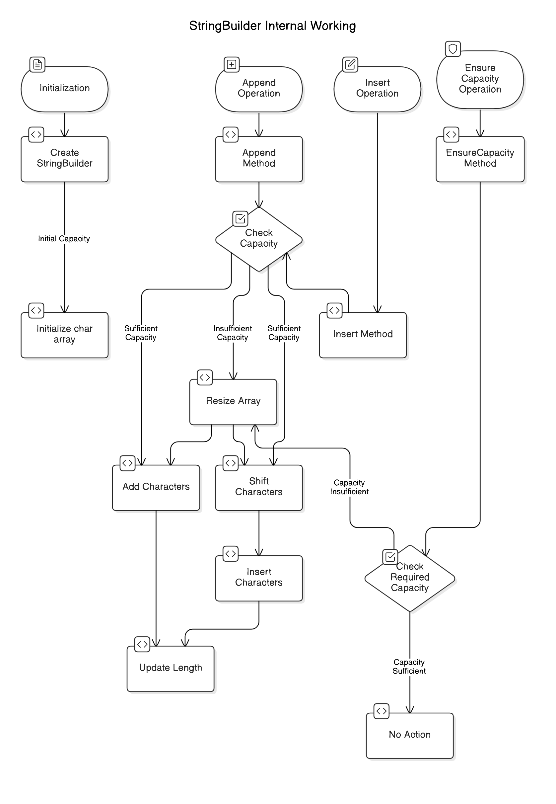

# StringBuilder

## Description

`StringBuilder` was introduced in Java 5. It is similar to `StringBuffer`, but it is not synchronized, which means it is not thread-safe. This lack of synchronization makes `StringBuilder` generally faster than `StringBuffer` but not suitable for concurrent use in multithreaded environments.

`StringBuilder` class in Java are mutable and designed for string manipulation. They provide methods to modify the contents of the string without creating new string objects, which can lead to better performance compared to using regular `String` objects for string manipulation.

```java
StringBuilder sb = new StringBuilder("Hello");
sb.append(" World");
String result = sb.toString(); // result is "Hello World"
```

## Methods Available in StringBuilder

<table data-header-hidden data-full-width="true"><thead><tr><th></th><th></th><th width="344"></th><th></th></tr></thead><tbody><tr><td><strong>Method</strong></td><td><strong>Description</strong></td><td><strong>Example</strong></td><td><strong>Output</strong></td></tr><tr><td><code>append(String s)</code></td><td>Adds <code>s</code> at the end of the current <code>StringBuilder</code></td><td><code>sb.append("Hello")</code></td><td><code>"Hello"</code></td></tr><tr><td><code>insert(int offset, String s)</code></td><td>Inserts <code>s</code> at the given index <code>offset</code></td><td><code>sb.insert(1, "abc")</code> (on <code>"xyz"</code>)</td><td><code>"xabcyz"</code></td></tr><tr><td><code>replace(int start, int end, String s)</code></td><td>Replaces characters between <code>start</code> and <code>end</code> with <code>s</code></td><td><code>sb.replace(1, 3, "abc")</code> (on <code>"xyz"</code>)</td><td><code>"xabcz"</code></td></tr><tr><td><code>delete(int start, int end)</code></td><td>Removes characters between <code>start</code> and <code>end</code></td><td><code>sb.delete(1, 3)</code> (on <code>"Hello"</code>)</td><td><code>"Ho"</code></td></tr><tr><td><code>deleteCharAt(int index)</code></td><td>Removes the character at <code>index</code></td><td><code>sb.deleteCharAt(2)</code> (on <code>"Hello"</code>)</td><td><code>"Helo"</code></td></tr><tr><td><code>reverse()</code></td><td>Reverses the <code>StringBuilder</code> content</td><td><code>sb.reverse()</code> (on <code>"abc"</code>)</td><td><code>"cba"</code></td></tr><tr><td><code>length()</code></td><td>Returns the number of characters in <code>StringBuilder</code></td><td><code>sb.length()</code> (on <code>"Hello"</code>)</td><td><code>5</code></td></tr><tr><td><code>charAt(int index)</code></td><td>Returns the character at <code>index</code></td><td><code>sb.charAt(1)</code> (on <code>"Hello"</code>)</td><td><code>'e'</code></td></tr><tr><td><code>setCharAt(int index, char ch)</code></td><td>Modifies the character at <code>index</code></td><td><code>sb.setCharAt(1, 'A')</code> (on <code>"Hello"</code>)</td><td><code>"HAllo"</code></td></tr><tr><td><code>substring(int start)</code></td><td>Returns substring from <code>start</code> to end</td><td><code>sb.substring(1)</code> (on <code>"Hello"</code>)</td><td><code>"ello"</code></td></tr><tr><td><code>substring(int start, int end)</code></td><td>Returns substring from <code>start</code> to <code>end-1</code></td><td><code>sb.substring(1, 3)</code> (on <code>"Hello"</code>)</td><td><code>"el"</code></td></tr><tr><td><code>toString()</code></td><td>Converts <code>StringBuilder</code> to a <code>String</code></td><td><code>sb.toString()</code> (on <code>"Hello"</code>)</td><td><code>"Hello"</code></td></tr><tr><td><code>capacity()</code></td><td>Returns current capacity of <code>StringBuilder</code></td><td><code>sb.capacity()</code></td><td><code>Default: 16, expands dynamically</code></td></tr><tr><td><code>ensureCapacity(int minCapacity)</code></td><td>Ensures at least <code>minCapacity</code>, expanding if needed</td><td><code>sb.ensureCapacity(50)</code></td><td><code>Capacity grows if &#x3C; 50</code></td></tr><tr><td><code>trimToSize()</code></td><td>Reduces the capacity to match the length</td><td><code>sb.trimToSize()</code></td><td><code>Capacity reduces</code></td></tr></tbody></table>

## Internal Working

Internally it uses a resizable array to store the characters of the string. When we append or modify the contents of the string using methods like `append()`, `insert()`, `delete()`, etc., they directly modify the internal character array of the object without creating new string objects. This allows for efficient string manipulation, especially when dealing with large strings or performing many concatenation operations.

<figure><figcaption></figcaption></figure>

## Not Using String Pool

Unlike regular `String` objects, `StringBuilder` do not use the string pool for storing string literals. When we create a `StringBuilder` object and append or modify its contents, new character arrays may be created dynamically to accommodate the changes, but these arrays are not stored in the string pool. This behavior is different from regular `String` objects, which may use the string pool for storing string literals to optimize memory usage.


## Using `String` (Concatenation)  vs Using `StringBuilder`

### Issue with using `String`

```java
String joinWords(String[] words) {
    String sentence = "";  // Starts with an empty string
    for (String w: words) {
        sentence = sentence + w;  // Creates a new String object in every iteration
    }
    return sentence;
}
```

**What's happening internally?**

* Since **`String` is immutable**, `sentence = sentence + w;` creates a **new `String` object** each time.
* Suppose we have `n` words, the number of `String` objects created will be **O(n)**.
* But since Java needs to copy the previous string content **each time**, the **total character copies performed** sum up to **O(n²)**.

### **Why `StringBuilder` is Better?**

```java
String joinWords(String[] words) {
    StringBuilder sentence = new StringBuilder();  // Mutable, resizable buffer
    for (String w: words) {
        sentence.append(w);  // Efficiently appends to the same object
    }
    return sentence.toString();
}
```

**How `StringBuilder` improves performance**

* `StringBuilder` uses an **internal character array** and grows dynamically.
* Instead of **creating new objects**, it **modifies the same array**.
* **Appending is O(1) amortized**, so the **total complexity is O(n)** instead of **O(n²)**.

