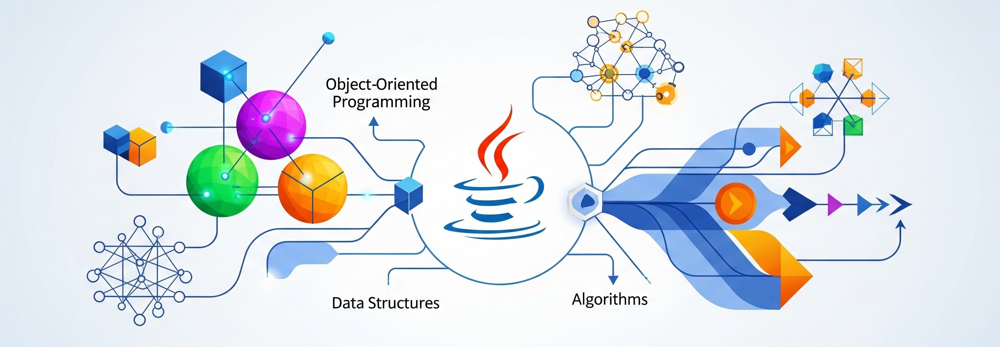

# Java Concepts

## About

This section focuses on the important ideas and features that every Java developer should understand. These concepts go beyond just writing simple Java code - they help you write **better**, **cleaner**, and **more efficient** programs.

This section explains how Java works under the hood, how modern Java features are used in real projects, and how to think in terms of good design and structure.

<figure><figcaption></figcaption></figure>

## **Why Understanding the Concepts is Important**

1. **Stronger Foundation**\
   Concepts are the **roots of the language**. Without knowing them, it's easy to write code that works—but hard to write code that scales, performs well, and is easy to maintain.
2. **Real-world Relevance**\
   Most modern Java projects, frameworks, and tools **rely heavily** on these concepts. Understanding them helps you use Java effectively in real applications.
3. **Interview-Ready Knowledge**\
   These are the topics that often appear in **technical interviews**, **code assessments**, and **design discussions**.
4. **Clean, Reliable Code**\
   Concepts like generics, annotations, and functional programming help write code that's **type-safe**, **modular**, and **expressive**.
5. **Foundation for Advanced Java**\
   Advanced topics like Spring Framework, Java EE, or reactive programming are built on top of these core ideas.
