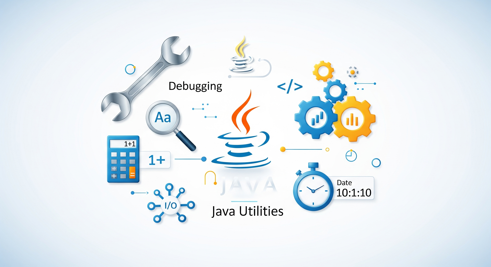

# Utilities

## About

**Java Utilities** encompass a diverse set of general-purpose tools and helper features provided by the Java platform. These are not tied to any specific domain or framework, but instead solve common programming problems encountered in everyday development - such as handling dates, collections, formatting, parsing, validation, and concurrency.

Java’s strength lies in its rich standard library, and utilities are the part that developers interact with most frequently - in both simple scripts and enterprise-grade applications.

These utilities enable developers to:

* Write cleaner and more concise code
* Handle edge cases reliably
* Focus on application logic instead of low-level implementation

Rather than thinking in terms of packages, this section organizes utilities by purpose and function - such as date/time handling, formatting, validation, and lightweight helpers.

<figure><figcaption></figcaption></figure>

## **Why Learning Java Utilities Matters**

#### 1. **Essential for Production-Ready Code**

While language syntax and object-oriented principles form the foundation, utility classes are what make a real-world application robust. Features like `Optional`, `Formatter`, `UUID`, and `DateTimeFormatter` are cornerstones of modern Java programming.

#### 2. **Fewer Bugs, Less Boilerplate**

Java utilities are:

* Pre-tested, reliable, and efficient
* Designed to reduce common pitfalls
* Well-documented and widely adopted

Using utilities like `Objects.requireNonNull()`, `Collections.unmodifiableList()`, or `AtomicInteger` reduces the chance of subtle bugs and edge-case failures.

#### 3. **Improves Code Readability and Maintainability**

Java’s utility APIs follow consistent naming and design principles. This means:

* our code is easier for others to understand
* We write less custom code
* Maintenance cost is reduced over time

#### 4. **A Bridge Between Core and Advanced Topics**

Java utilities also serve as **entry points into more advanced topics**:

* Working with `java.time` leads to better understanding of time zones and scheduling
* Using `CompletableFuture` and `ExecutorService` opens the door to concurrency
* Familiarity with `Predicate`, `Function`, and `Stream` utilities helps with functional programming
