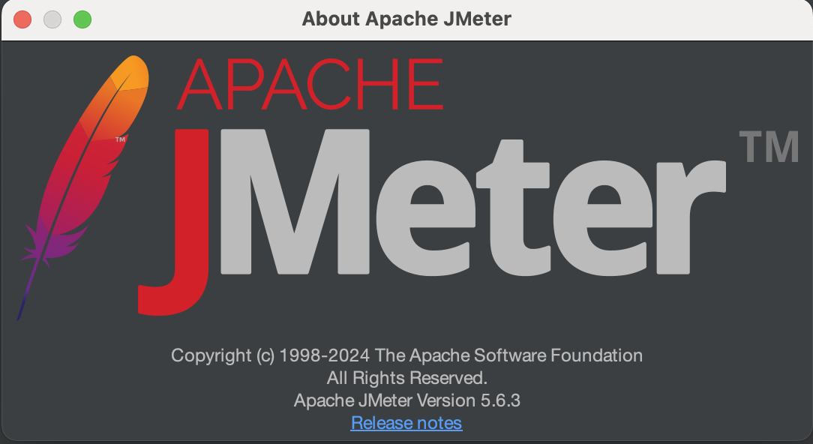
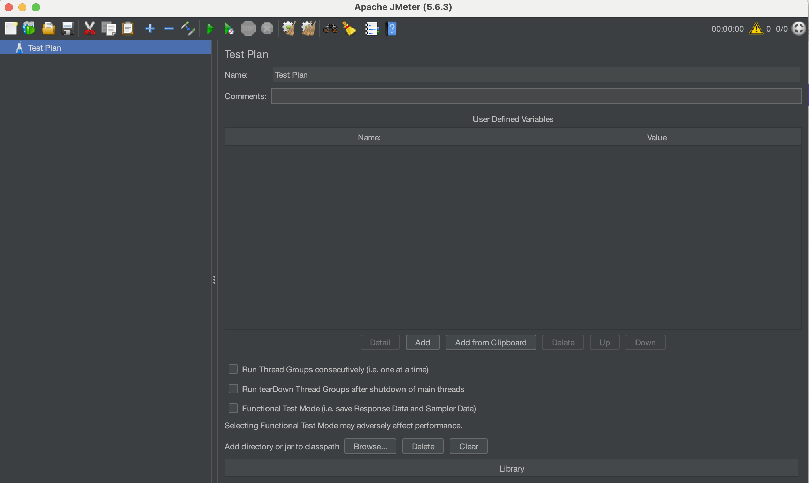

# Apache JMeter

## About

Apache JMeter is an open-source tool designed to test the performance and load of web applications and other services. It is widely used for simulating heavy loads on servers, networks, or objects to analyze performance and measure system behavior under stress.&#x20;

* **Purpose**: Originally designed for testing web applications, it now also supports testing of a variety of protocols including HTTP, FTP, TCP, JDBC, JMS, and more.
* **Platform**: Built on Java, JMeter is platform-independent and can run on any OS with a Java Runtime Environment (JRE).

<figure><figcaption></figcaption></figure>

## Installation (On Mac)

### **1. Install Java (Prerequisite)**

JMeter requires Java (at least JDK 8 or later). MacOS usually comes with a version of Java preinstalled, but you can check and install the latest version if needed.

#### **Check Java Installation**

Open terminal and run:

```bash
java -version
```

If Java is installed, it will show the version. If not, install it.

#### **Install Java (if not already installed)**

Use Homebrew (recommended):

```bash
brew install openjdk
```

Once installed, set up the environment variables:

```bash
echo 'export PATH="/usr/local/opt/openjdk/bin:$PATH"' >> ~/.zshrc
source ~/.zshrc
```

Verify installation:

```bash
java -version
```

### **2. Download Apache JMeter**

1. Visit the [Apache JMeter website](https://jmeter.apache.org/).
2. Click on the **"Download"** menu and choose the latest **.tgz** binary version for JMeter.
   * Direct link for binaries: [JMeter Download](https://jmeter.apache.org/download_jmeter.cgi).

Alternatively, we can use the terminal curl command

```bash
curl -O https://dlcdn.apache.org//jmeter/binaries/apache-jmeter-{VERSION}.tgz
```

Replace `{VERSION}` with the latest version number, e.g., `5.6.2`.

### **3. Extract the JMeter Archive**

Navigate to the folder where the `.tgz` file is downloaded and extract it:

```bash
tar -xvzf apache-jmeter-{VERSION}.tgz
```

This will create a folder named `apache-jmeter-{VERSION}`.

### **4. Run Apache JMeter**

1.  Navigate to the JMeter directory:

    ```bash
    cd apache-jmeter-{VERSION}/bin
    ```
2.  Launch JMeter:

    ```bash
    ./jmeter
    ```

JMeter will launch the graphical user interface (GUI) on Mac.

### **5. (Optional) Add JMeter to PATH**

To simplify running JMeter from anywhere in the terminal, we can add it to our system's PATH:

1.  Open `.zshrc` file in a text editor:

    ```bash
    nano ~/.zshrc
    ```
2.  Add the following line:

    ```bash
    export PATH="$PATH:/path/to/apache-jmeter-{VERSION}/bin"
    ```

    Replace `/path/to/apache-jmeter-{VERSION}` with the actual path to your extracted JMeter folder.
3.  Save the file and reload the shell configuration:

    ```bash
    source ~/.zshrc
    ```

Now we can simply type `jmeter` in the terminal to launch JMeter.

### **6. Verify Installation**

Run the following command in terminal to verify JMeter is installed:

```bash
jmeter -v
```

This should display the JMeter version.

<figure><figcaption></figcaption></figure>

## **Key Features**

### **Protocol Support**

* HTTP, HTTPS (web applications)
* FTP (file transfers)
* JDBC (database testing)
* LDAP (directory services)
* JMS (Java Messaging Services)
* TCP/IP, SMTP, POP3, IMAP (mail servers)
* SOAP/REST Web Services, MQTT (IoT testing)

### **Test Types**

* **Load Testing**: Simulating concurrent users to analyze system capacity.
* **Stress Testing**: Testing the system under extreme conditions.
* **Performance Testing**: Measuring response times and resource utilization.
* **Regression Testing**: Repeating tests to verify system stability after changes.

### **Extensibility**

* Supports plugins to enhance functionality.
* Allows scripting via BeanShell, JSR223 (Groovy), and Java for advanced customization.

### **Graphical Interface**

* A user-friendly GUI makes it easy to design and debug test plans.
* Provides rich reporting features (graphs, tables, and dashboards).

### **Distributed Testing**

* Supports testing across multiple systems to simulate large-scale load scenarios.

### **Real-Time Monitoring**

* Monitors resource usage (CPU, memory) during tests.
* Collects system performance metrics using listeners.

### **Integration**

* Works with CI/CD tools like Jenkins, Maven, and Docker for automated testing pipelines.

## **Components**

### **Test Plan**

* Blueprint for the testing process.
* Contains test elements like Thread Groups, Samplers, and Listeners.

### **Thread Group**

* Simulates multiple users by creating threads.
* Configurable parameters include the number of threads (users), ramp-up time, and loop count.

### **Samplers**

* Generate requests to servers.
* Types include HTTP Request, FTP Request, JDBC Request, SOAP/XML-RPC Request, and more.

### **Controllers**

* Logic Controllers: Define the flow of test execution (e.g., If, Loop, Switch).
* Test Fragment: Reusable pieces of a test plan.

### **Listeners**

* Collects test results and provides visual reports.
* Examples: Graph Results, Summary Report, Aggregate Report.

### **Assertions**

* Validates responses to ensure expected results (e.g., Response Code, Text Matching).

### **Timers**

* Adds delay between requests to mimic real-world scenarios.

### **Configuration Elements**

* Prepares configuration details (e.g., HTTP Request Defaults, User Defined Variables).

### **Pre-Processors and Post-Processors**

* Pre-Processors: Modify requests before they are sent (e.g., URL Rewrite).
* Post-Processors: Extract information from responses (e.g., Regular Expression Extractor).

## **Limitations**

1. **High Resource Usage**:
   * JMeter can consume significant memory and CPU when handling large tests.
   * Distributed testing is recommended for heavy loads.
2. **Lack of Browser-Based Testing**:
   * JMeter does not simulate browser behavior (e.g., rendering, JavaScript execution).
   * Use Selenium integration for this purpose.
3. **Steep Learning Curve**:
   * Advanced features require knowledge of scripting and performance testing concepts.
4. **Limited Real-World Simulation**:
   * Cannot perfectly mimic real user behavior without additional customization.

## **Real-World Examples**

1. **Load Testing a Website**:
   * Configure Thread Group for 100 users.
   * Use HTTP Sampler for GET and POST requests.
   * Add listeners for detailed metrics.
2. **Database Load Testing**:
   * Use JDBC Request to query the database.
   * Simulate concurrent database connections.
3. **API Testing**:
   * Parameterize API requests with CSV Data Config.
   * Validate responses using JSON Extractors and Assertions.
4. **Distributed Load Testing**:
   * Set up master-slave architecture to run tests across multiple systems.
