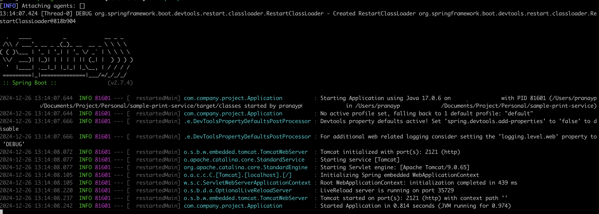
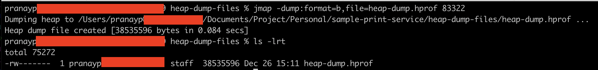

# jmap

## About

`jmap` is a JDK utility used to generate heap dumps or analyze memory usage in a Java application. A heap dump is a snapshot of the JVM's memory, including all objects and references at a specific point in time. It is essential for diagnosing memory leaks, `OutOfMemoryError`, or high memory usage.

## **Key Use Cases**

* Diagnosing memory leaks by analyzing objects and their references.
* Understanding the distribution of objects in memory.
* Debugging `OutOfMemoryError` issues.

## **Steps to Use jmap on Mac**

### **1. Find the Process ID (PID):**

* Use the `jps` command to locate your Spring Boot app’s PID:

```bash
jps
```

Output example:

<figure><figcaption></figcaption></figure>

Start the Java Application (here it is sample-print-service maven springboot application)

<figure><figcaption></figcaption></figure>

`jps` command output is below

<figure><figcaption></figcaption></figure>

Here, `83322` is the PID of our Springboot app.

### **2. Capture a Heap Dump:**

* Run the following `jmap` command to generate a heap dump:

```bash
jmap -dump:format=b,file=heap-dump.hprof 83322
```

* `format=b`: Specifies the binary format for the dump file.
* `file=heap-dump.hprof`: Specifies the file name for the heap dump.
* The `heap-dump.hprof` file will be saved in the current directory.

<figure><figcaption></figcaption></figure>



### **3. Analyze the Heap Dump:**

* Use tools like **Eclipse MAT (Memory Analyzer Tool)** or **VisualVM** to open and analyze the `heap-dump.hprof` file.
  * Look for objects with high retention, large collections, or unreferenced objects.
  * Detect memory leaks by identifying objects that cannot be garbage collected.


&#x20;We can get a summary of memory usage without creating a heap dump with jmap supported options

