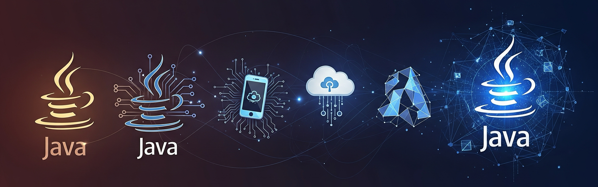

# Java Evolution

## About

Java has been one of the most widely used programming languages for over two decades. But it hasn’t remained static. It has continuously evolved - adding powerful features, improving performance, simplifying code, and keeping up with modern development needs. This journey of change is what we refer to as **Java Evolution**.

This section explores how Java has grown over time - from version to version - with a clear look at the **new features**, **enhancements**, and **philosophy** behind update.

<figure><figcaption></figcaption></figure>

## **Why Understand Java Evolution ?**

Understanding how Java has evolved helps us:

#### 1. **Stay Current with Modern Java**

Java today (Java 21 or 22+) is drastically different from Java 8 or earlier. New syntax (like `var`, records, switch expressions), improved APIs, performance enhancements, and better developer tooling mean we can write cleaner and more efficient code—**if we know what's available**.

#### 2. **Work Across Java Versions**

Many organizations still use older versions of Java, while others adopt newer releases rapidly. Knowing the **differences across versions** helps us debug issues, migrate code, and write version-compatible libraries.

#### 3. **Appreciate Java’s Design Philosophy**

Java’s evolution is **carefully curated**—changes are introduced through processes like JEPs (JDK Enhancement Proposals), with strong emphasis on **backward compatibility**, **readability**, and **safety**. By learning how features are introduced, we understand the rationale behind language design decisions.

#### 4. **Prepare for Interviews and Certification**

Whether we are preparing for a Java interview or a certification exam, questions often span multiple versions. A strong grasp of Java’s version-wise changes improves both our practical and theoretical understanding.
