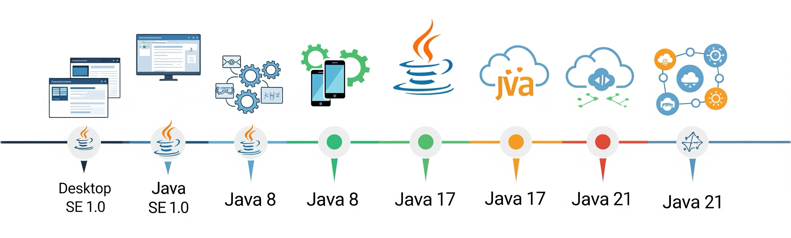

# Java Version History

## **About Java**

Java’s journey is a story of consistent improvement. From the early days of applets and servlets to modern constructs like records, virtual threads, and pattern matching, **each Java version brought new capabilities** that shaped how developers build software.

The **Java Version History** section gives us a **version-wise breakdown** of key features, changes, and enhancements — making it easier to track the evolution of the language and apply those changes in real-world code.

<figure><figcaption></figcaption></figure>
