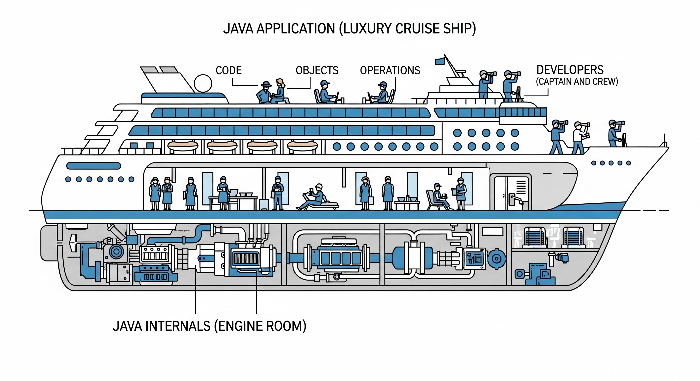

# Java Internals

## About

When we write and run Java code, what we see is the surface—classes, methods, loops, objects. But behind the scenes, there's a powerful engine making everything work: the Java runtime system. **Java Internals** refers to the _underlying components and mechanisms_ that make Java applications run reliably and efficiently on any platform.

Understanding Java Internals means knowing _how the JVM executes our code_, _how memory is managed_, _what happens during garbage collection_, and _how security and performance are controlled internally_. These internal details are often hidden, but they are critical to understanding why Java behaves the way it does—especially when applications grow in size or complexity.

## Java Internals as the Engine Room of a Ship

Imagine our Java application is a luxury cruise ship.

* The **passengers** are our code, objects, and operations.
* The **captain and crew** are the developers interacting with it.
* But deep below deck lies the **engine room**—the part most passengers never see, but without which the ship wouldn't even move.

Java Internals is that engine room. We can sail the ship without knowing how the engine works—but if we are building or maintaining the ship, or handling high-speed travel (i.e., performance-critical apps), we need to know exactly what's inside.

<figure><figcaption></figcaption></figure>

## Why Understanding Java Internals is Important ?

1. **Better Debugging and Troubleshooting**\
   Many bugs and performance bottlenecks can’t be solved by surface-level code inspection. Understanding internals like stack vs heap memory, garbage collection behavior, or class loading order helps diagnose root causes quickly.
2. **Writing High-Performance Code**\
   Internals knowledge helps you write code that's optimized for memory usage, startup time, or thread handling—important in large-scale systems.
3. **Tuning the JVM for Your Needs**\
   The JVM is tunable: memory limits, GC strategies, class loading behavior, JIT optimizations. But tuning blindly can make things worse. Internals understanding allows you to make informed adjustments.
4. **Security and Stability**\
   Many security models in Java (like bytecode verification, access control, classloader isolation) are part of the internals. This becomes essential when building secure platforms.
5. **Platform Independence Isn’t Free**\
   Java’s cross-platform nature is made possible by the JVM, classloader, and bytecode architecture. Knowing how this works helps you avoid performance or compatibility issues.
6. **Career Growth and Interviews**\
   Senior Java developer and architect roles often expect JVM knowledge. Interviewers love asking questions like: _What happens when you run a Java program?_, _How does garbage collection work?_, or _How is memory managed in Java?_
