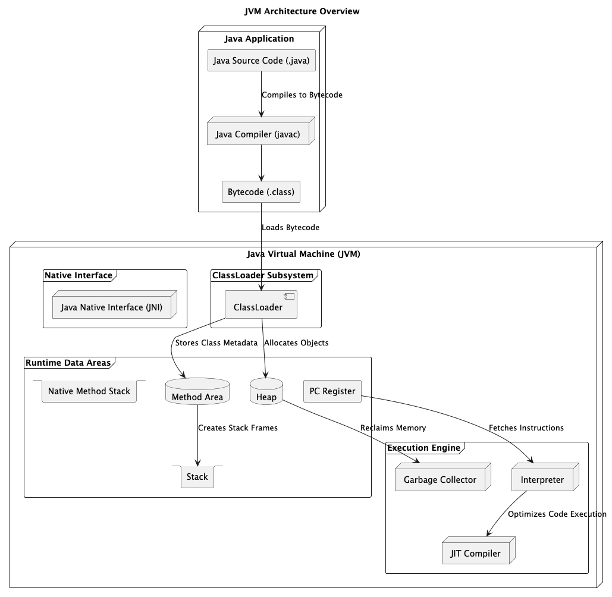

# Architecture

## About

The **Java Virtual Machine (JVM)** follows a well-structured architecture that enables Java programs to be executed efficiently. It consists of **various interconnected components**, each responsible for handling different aspects of execution, memory management, and performance optimization.

<figure><figcaption></figcaption></figure>

<table data-header-hidden><thead><tr><th width="286"></th><th></th></tr></thead><tbody><tr><td><strong>Component</strong></td><td><strong>Description</strong></td></tr><tr><td><strong>ClassLoader</strong></td><td>Loads Java bytecode into memory dynamically.</td></tr><tr><td><strong>Method Area</strong></td><td>Stores class metadata, constants, and static variables.</td></tr><tr><td><strong>Heap</strong></td><td>Stores all Java objects and instance variables.</td></tr><tr><td><strong>Stack</strong></td><td>Stores method execution frames and local variables.</td></tr><tr><td><strong>PC Register</strong></td><td>Stores the address of the next instruction.</td></tr><tr><td><strong>Native Method Stack</strong></td><td>Stores native method calls executed by JNI.</td></tr><tr><td><strong>Interpreter</strong></td><td>Reads and executes bytecode line-by-line.</td></tr><tr><td><strong>JIT Compiler</strong></td><td>Converts bytecode into optimized native machine code.</td></tr><tr><td><strong>Garbage Collector</strong></td><td>Reclaims unused memory automatically.</td></tr><tr><td><strong>JNI (Java Native Interface)</strong></td><td>Connects JVM with native code (C/C++).</td></tr></tbody></table>
