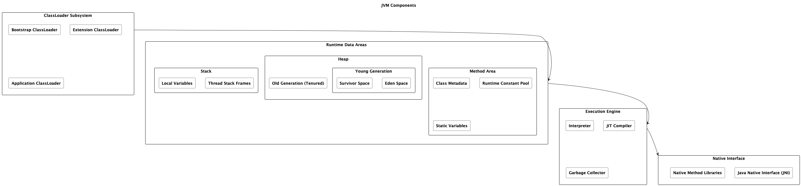

# Components

## About

The **Java Virtual Machine (JVM)** is the core of the Java ecosystem, responsible for executing Java applications. It abstracts hardware details and provides key features like **platform independence, memory management, security, and performance optimizations**.

The JVM consists of several **core components** that work together to execute Java programs efficiently. The primary components are:

1. **ClassLoader Subsystem** – Loads Java classes into memory.
2. **Runtime Data Areas (Memory)** – Manages various memory sections like heap, stack, and method area.
3. **Execution Engine** – Executes Java bytecode using an interpreter and Just-In-Time (JIT) compiler.
4. **Garbage Collector (GC)** – Automatically manages memory by reclaiming unused objects.
5. **Native Interface (JNI)** – Allows interaction with native libraries (C/C++).
6. **Java Security Manager (Deprecated in Java 17)** – Controlled access to system resources.

<figure><figcaption></figcaption></figure>

## **1. ClassLoader Subsystem (Class Loading Mechanism)**

The **ClassLoader** is responsible for **loading Java classes into JVM memory**. It ensures that Java programs can dynamically load and use classes at runtime.

### **How ClassLoader Works?**

1. **Loading** – Class files (`.class`) are read and loaded into memory.
2. **Linking**
   * **Verification** – Ensures bytecode follows JVM rules.
   * **Preparation** – Memory is allocated for static variables.
   * **Resolution** – Converts symbolic references to actual memory addresses.
3. **Initialization** – Executes static initializers and assigns values to static variables.

### **Types of ClassLoaders**

JVM uses a **hierarchical delegation model** with three main ClassLoaders:

| ClassLoader                 | Purpose                    | Loads Classes From                                      |
| --------------------------- | -------------------------- | ------------------------------------------------------- |
| **Bootstrap ClassLoader**   | Loads core Java classes    | `java.lang.*`, `java.util.*` (from `rt.jar` or `jmods`) |
| **Extension ClassLoader**   | Loads extension classes    | `lib/ext` directory                                     |
| **Application ClassLoader** | Loads user-defined classes | Classpath (`bin`, `jar` files)                          |

#### **Custom ClassLoaders**

Developers can create custom ClassLoaders to load classes dynamically, modify bytecode at runtime, or implement security policies.

**Example: Custom ClassLoader**

```java
public class CustomClassLoader extends ClassLoader {
    @Override
    public Class<?> loadClass(String name) throws ClassNotFoundException {
        System.out.println("Loading class: " + name);
        return super.loadClass(name);
    }
}
```

## **2. Runtime Data Areas (JVM Memory Model)**

The JVM manages memory through different regions, ensuring **efficient execution and garbage collection**.

### **JVM Memory Structure**

1. **Heap Memory** – Stores objects and class instances.
2. **Stack Memory** – Stores method call frames and local variables.
3. **Method Area** – Stores class metadata, constants, and static fields.
4. **PC Register** – Holds the address of the currently executing instruction.
5. **Native Method Stack** – Stores native method calls.

#### **Heap Memory (Object Storage)**

* Divided into **Young Generation** (Eden, Survivor spaces) and **Old Generation**.
* Garbage Collection runs frequently in the Young Generation.

#### **Stack Memory (Method Execution)**

* Stores **method execution frames**. Each method call creates a new frame.
* Contains **local variables, method parameters, and return values**.

#### **Method Area (Class Metadata)**

* Stores **class-level information** like method bytecode, static variables, and runtime constants.

## **3. Execution Engine (JVM Code Execution)**

The Execution Engine is responsible for **converting bytecode into machine code** and executing it.

### **Components of Execution Engine**

1. **Interpreter** – Reads and executes bytecode line by line.
2. **JIT (Just-In-Time) Compiler** – Translates bytecode into machine code for better performance.
3. **Garbage Collector (GC)** – Frees unused memory.
4. **Native Interface (JNI)** – Enables Java to call native C/C++ methods.

#### **JIT Compilation and Optimization**

* **HotSpot JIT Compiler** optimizes frequently executed methods.
* Uses techniques like **method inlining, loop unrolling, escape analysis** for better performance.

## **4. Garbage Collection (GC)**

Garbage Collection automatically removes unused objects from **Heap Memory**, preventing memory leaks.

### **Types of Garbage Collectors in Java**

<table><thead><tr><th width="299">Garbage Collector</th><th>Characteristics</th></tr></thead><tbody><tr><td><strong>Serial GC</strong></td><td>Simple, single-threaded (best for small apps)</td></tr><tr><td><strong>Parallel GC</strong></td><td>Multi-threaded GC for better performance</td></tr><tr><td><strong>CMS (Concurrent Mark-Sweep)</strong></td><td>Low-latency GC, runs alongside application</td></tr><tr><td><strong>G1 (Garbage First) GC</strong></td><td>Modern GC, balances performance and latency</td></tr><tr><td><strong>ZGC / Shenandoah</strong></td><td>Ultra-low latency GCs for large applications</td></tr></tbody></table>

#### **Garbage Collection Phases**

1. **Mark** – Identifies reachable objects.
2. **Sweep** – Removes unused objects.
3. **Compact** – Defragments memory for efficiency.

#### **Example: Forcing GC Manually**

```java
System.gc();  // Requests garbage collection
```

## **5. Java Native Interface (JNI)**

JNI allows Java programs to call **native (C/C++)** code.

#### **Why Use JNI?**

* **Access system resources** not available in Java.
* **Performance optimization** using native code.
* **Interoperability** with existing C/C++ libraries.

#### **Example: Calling C Code from Java**

```java
public class NativeExample {
    static {
        System.loadLibrary("nativeLib");
    }
    public native void nativeMethod();
}
```

#### **C Code Implementation**

```c
#include <jni.h>
#include <stdio.h>
JNIEXPORT void JNICALL Java_NativeExample_nativeMethod(JNIEnv *env, jobject obj) {
    printf("Hello from C!\n");
}
```

## **6. Java Security Manager (Deprecated in Java 17)**

The **Security Manager** provided a way to restrict access to system resources (file system, network, etc.).

#### **Security Features in JVM**

* **ClassLoader Security** – Prevents unauthorized bytecode execution.
* **Bytecode Verification** – Ensures code integrity before execution.
* **Cryptography API (JCA/JCE)** – Secure data encryption and hashing.
* **JAAS (Java Authentication and Authorization Service)** – Manages authentication.


Java 17 removed the Security Manager due to modern security best practices.


#### **Example: Using Security Manager**

```java
SecurityManager sm = System.getSecurityManager();
if (sm != null) {
    sm.checkRead("/restricted/file.txt");
}
```
