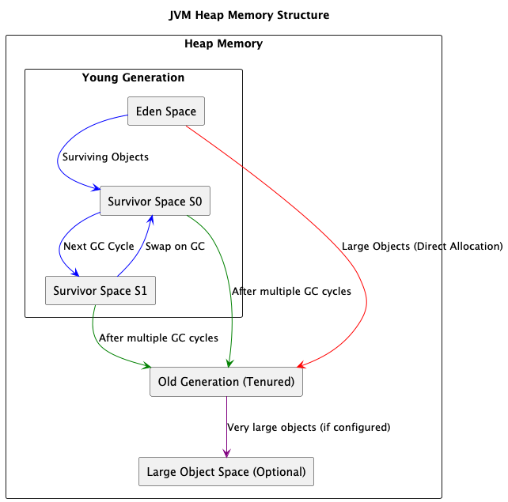
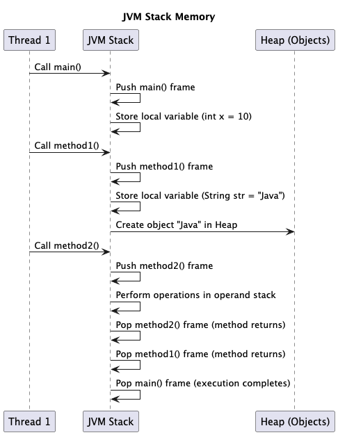

# Types of Memory

## About

The **Java Virtual Machine (JVM) memory structure** plays a crucial role in the performance and execution of Java applications. JVM memory is divided into different regions, each serving a specific purpose. Understanding these memory areas is essential for debugging memory leaks, optimizing performance, and configuring JVM memory settings effectively.

JVM memory is broadly categorized into two types:

1. **Heap Memory** → Stores objects and class instances.
2. **Non-Heap Memory** → Stores metadata, method area, and thread-related structures.

Each of these is further divided into sub-regions. Here’s a high-level breakdown:

<table><thead><tr><th width="189">Memory Type</th><th>Purpose</th></tr></thead><tbody><tr><td><strong>Heap Memory</strong></td><td>Stores Java objects and dynamically allocated data</td></tr><tr><td><strong>Stack Memory</strong></td><td>Stores method call frames, local variables, and execution state</td></tr><tr><td><strong>Metaspace</strong></td><td>Stores class metadata and method definitions (Java 8+)</td></tr><tr><td><strong>Code Cache</strong></td><td>Stores JIT-compiled code for optimized execution</td></tr><tr><td><strong>Native Memory</strong></td><td>Memory allocated outside JVM, used by OS, JNI, and threads</td></tr></tbody></table>

## Heap Memory

Heap memory is the **largest** and most **critical memory area** in the JVM. It is responsible for **storing Java objects** and is **shared across all threads**. The **Garbage Collector (GC)** manages heap memory by automatically reclaiming unused objects.

### **Characteristics of Heap Memory**

* Stores dynamically allocated objects.
* Shared among all application threads.
* Subject to automatic Garbage Collection.
* Can be tuned with JVM options (`-Xms`, `-Xmx`).

<figure><figcaption></figcaption></figure>

### **Heap Memory Structure**

JVM divides the **heap memory** into two major parts:

1. **Young Generation** (Short-lived objects)
2. **Old Generation (Tenured Generation)** (Long-lived objects)

Additionally, JVM may allocate a **small portion** for large objects in a separate regi

### **Young Generation (New Object Allocation)**

The **Young Generation** is where **new objects** are allocated. It is optimized for **fast allocation and collection** because most objects have **short lifetimes**.

#### **Sub-Divisions of Young Generation**

* **Eden Space**
  * All new objects are allocated here first.
  * When full, a **Minor GC** is triggered.
* **Survivor Spaces (S0 & S1)**
  * Objects surviving Minor GC are moved here.
  * Objects move between S0 and S1 in **subsequent GCs**.
  * If an object survives multiple GCs, it is promoted to the **Old Generation**.

#### **Garbage Collection in Young Generation**

* **Minor GC** occurs when Eden is full.
* **Short-lived objects are removed quickly**.
* Objects that survive a few GC cycles move to **Survivor Spaces**.
* If an object **survives a threshold number of GCs**, it is **promoted to the Old Generation**.

### **Old Generation (Long-Lived Objects)**

* Stores **long-lived** and **large objects**.
* Objects moved from **Survivor Spaces** after multiple GC cycles.
* Garbage Collection happens **less frequently** but takes longer (**Major GC / Full GC**).

#### **Major GC (Full GC)**

* Cleans up the **Old Generation**.
* Can **pause the application (Stop-The-World event)**.
* Uses different algorithms like **G1 GC, CMS, ZGC**.

### **Large Object Handling**

* Large objects **(e.g., large arrays, images, JSON data)** may bypass the **Young Generation** and go **directly to the Old Generation**.
* JVM uses **TLAB (Thread Local Allocation Buffer)** for quick allocation.

### **Heap Memory Tuning & Optimization**

Heap size can be **configured** using JVM options:

```sh
java -Xms512m -Xmx4G -XX:NewRatio=2 -XX:+UseG1GC
```

<table><thead><tr><th width="280">Option</th><th>Description</th></tr></thead><tbody><tr><td><code>-Xms512m</code></td><td>Initial heap size (512MB)</td></tr><tr><td><code>-Xmx4G</code></td><td>Maximum heap size (4GB)</td></tr><tr><td><code>-XX:NewRatio=2</code></td><td>Young:Old Generation ratio (1:2)</td></tr><tr><td><code>-XX:+UseG1GC</code></td><td>Use <strong>G1 Garbage Collector</strong></td></tr></tbody></table>

### **Common Heap Memory Issues**

#### **`OutOfMemoryError (OOM)`**

Occurs when **heap is full and GC fails to free memory**.

**Example:**

```java
import java.util.ArrayList;
import java.util.List;

public class OOMExample {
    public static void main(String[] args) {
        List<byte[]> list = new ArrayList<>();
        while (true) {
            list.add(new byte[10 * 1024 * 1024]); // Allocating 10MB repeatedly
        }
    }
}
```

**Throws `java.lang.OutOfMemoryError: Java heap space`**

#### **Memory Leak**

* **Objects remain referenced** even though they are no longer needed.
* Example: **Unclosed JDBC connections, static collections holding references**.

#### **High GC Pause Times**

* Full GC causes **long application pauses**.
* Solution: **Tune GC algorithms (Use G1/ZGC for low-latency apps).**

## Stack Memory (Thread Stack)

Stack Memory in JVM is a **small, fast, and temporary memory space** used for the execution of **methods, local variables, and function calls**. It is **thread-local**, meaning each thread gets its own **stack**.

### **Characteristics of Stack Memory**

* Stores **method calls, local variables, and references**.
* **Thread-specific** (each thread gets a separate stack).
* Follows **LIFO (Last In, First Out)** structure.
* **Automatically allocated and deallocated** when methods are called and return.
* **Faster than Heap Memory** since access is sequential.

<figure><figcaption></figcaption></figure>

### **Structure of Stack Memory**

Each thread has a **private stack**, which contains multiple **stack frames**. Each frame corresponds to an **active method call**.

#### **Stack Frame Structure**

Every method call creates a **new stack frame** consisting of:

<table data-header-hidden><thead><tr><th width="300"></th><th></th></tr></thead><tbody><tr><td><strong>Component</strong></td><td><strong>Purpose</strong></td></tr><tr><td>Local Variable Array</td><td>Stores <strong>primitive values</strong> and references to objects.</td></tr><tr><td>Operand Stack</td><td>Used for intermediate calculations and method execution.</td></tr><tr><td>Frame Data / Return Address</td><td>Stores method return address and other metadata.</td></tr></tbody></table>

#### **Stack Growth and Shrinking**

* When a **method is invoked**, a new **stack frame** is pushed onto the stack.
* When the method **returns**, the frame is popped and memory is **freed automatically**.

### **Stack Memory Usage in Method Execution**

#### **Example: How Stack Works**

```java
public class StackMemoryExample {
    public static void main(String[] args) {
        int result = add(5, 3);
        System.out.println("Result: " + result);
    }

    public static int add(int a, int b) {
        int sum = a + b;
        return sum;
    }
}
```

#### **Execution Flow in Stack Memory**

1. **`main()` method starts** → Pushes **stack frame** for `main()`.
2. **`add(5,3)` is called** → A new **stack frame** for `add()` is created.
3. **Local variables (`a`, `b`, `sum`) stored in stack frame**.
4. **Method `add()` returns** → Stack frame for `add()` is removed.
5. **Execution returns to `main()`**, and finally, the **stack frame for `main()` is removed** after execution completes.

### **Key Stack Memory Operations**

#### **1. Method Call Handling**

* Each **method call** creates a **new stack frame**.
* After execution, the frame is **popped** from the stack.
* JVM uses the **return address** stored in the frame to **resume execution**.

#### **2. Local Variable Storage**

* **Primitive variables (int, float, double, char, boolean)** are stored **directly in stack memory**.
* **Object references** are stored in stack, but the actual **object is in heap memory**.

**Example: Primitive vs Object Reference in Stack**

```java
public class StackExample {
    public static void main(String[] args) {
        int a = 10;  // Stored in stack
        String name = "Java";  // Reference stored in stack, object in heap
    }
}
```

| **Variable Type**                    | **Stored In**                 |
| ------------------------------------ | ----------------------------- |
| Primitive (int, char, float, etc.)   | Stack Memory                  |
| Reference Variables                  | Stack Memory (only reference) |
| Actual Objects (String, Array, etc.) | Heap Memory                   |

### **Stack Memory Management**

#### **Stack Memory Allocation**

*   Stack memory size is **fixed per thread** and can be adjusted using:

    ```sh
    java -Xss512k  # Set stack size to 512 KB
    ```
* Each thread gets its **own separate stack**.

#### **Stack Memory Deallocation**

* **Automatic deallocation** when a method **completes execution**.
* No need for **Garbage Collection**.


### Metaspace (Class Metadata)


### Code Cache


### Native Memory (OS Memory)

