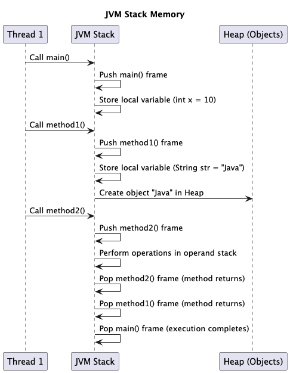

# Stack Memory


<figure><figcaption></figcaption></figure>

### **Stack Memory Usage in Method Execution**

#### **Example: How Stack Works**

```java
public class StackMemoryExample {
    public static void main(String[] args) {
        int result = add(5, 3);
        System.out.println("Result: " + result);
    }

    public static int add(int a, int b) {
        int sum = a + b;
        return sum;
    }
}
```

#### **Execution Flow in Stack Memory**

1. **`main()` method starts** → Pushes **stack frame** for `main()`.
2. **`add(5,3)` is called** → A new **stack frame** for `add()` is created.
3. **Local variables (`a`, `b`, `sum`) stored in stack frame**.
4. **Method `add()` returns** → Stack frame for `add()` is removed.
5. **Execution returns to `main()`**, and finally, the **stack frame for `main()` is removed** after execution completes.

### **Key Stack Memory Operations**

#### **1. Method Call Handling**

* Each **method call** creates a **new stack frame**.
* After execution, the frame is **popped** from the stack.
* JVM uses the **return address** stored in the frame to **resume execution**.

#### **2. Local Variable Storage**

* **Primitive variables (int, float, double, char, boolean)** are stored **directly in stack memory**.
* **Object references** are stored in stack, but the actual **object is in heap memory**.

**Example: Primitive vs Object Reference in Stack**

```java
public class StackExample {
    public static void main(String[] args) {
        int a = 10;  // Stored in stack
        String name = "Java";  // Reference stored in stack, object in heap
    }
}
```

| **Variable Type**                    | **Stored In**                 |
| ------------------------------------ | ----------------------------- |
| Primitive (int, char, float, etc.)   | Stack Memory                  |
| Reference Variables                  | Stack Memory (only reference) |
| Actual Objects (String, Array, etc.) | Heap Memory                   |

### **Stack Memory Management**

#### **Stack Memory Allocation**

*   Stack memory size is **fixed per thread** and can be adjusted using:

    ```sh
    java -Xss512k  # Set stack size to 512 KB
    ```
* Each thread gets its **own separate stack**.

#### **Stack Memory Deallocation**

* **Automatic deallocation** when a method **completes execution**.
* No need for **Garbage Collection**.

### **Common Stack Memory Issues**

#### **1. `StackOverflowError` (Infinite Recursion)**

If the **stack limit is exceeded**, JVM throws a **`StackOverflowError`**. This happens with **deep recursion** or **excessive method calls**.

**Example: StackOverflowError (Infinite Recursion)**

```java
public class StackOverflowExample {
    public static void recursiveMethod() {
        recursiveMethod(); // No termination condition
    }

    public static void main(String[] args) {
        recursiveMethod();
    }
}
```

#### **2. Large Local Variables & Deep Recursion**

* Large **arrays or deep recursion** can consume stack memory quickly.
* Use **iterative approaches instead of recursion**.

**Example: Large Local Variable Consuming Stack**

```java
public class LargeStackUsage {
    public static void largeMethod() {
        int[] largeArray = new int[100000]; // Large allocation
    }

    public static void main(String[] args) {
        largeMethod();
    }
}
```


