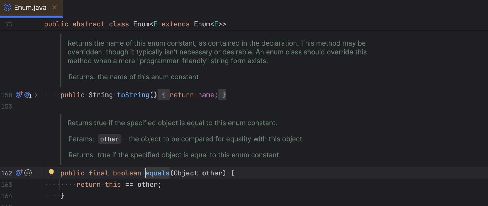

# Enum Comparison

## About

Enums in Java (`enum` keyword) are used to define a fixed set of constants that are type-safe and meaningful. They are widely used to represent states, categories, commands, HTTP statuses, and more.

When working with enums, **comparison** is a common operation — determining whether a given enum value matches a known constant (e.g., `status == Status.COMPLETED`). Choosing the correct comparison method is important for code clarity, correctness, and performance.

## **How Enum Comparison Works in Java**

In Java, **enums are reference types**, but they behave like singletons there is only one instance of each enum constant in the JVM per class loader.

This means:

* We can use the `==` operator to compare them
* We can also use `.equals()`, but it's not necessary
* Enum constants are final, static, and implicitly public

### **Preferred Way to Compare Enums: `==`**

```java
if (ex.getHttpStatus() == HttpStatus.NOT_FOUND) {
    // recommended
}
```

**Why `==` Works:**

* All enum constants are **interned** — meaning each constant is created once and shared
* `==` checks for **reference equality** (same memory location)
* Since enum constants are shared, reference equality is **guaranteed to work**
* It is **null-safe** when the enum constant is on the right-hand side

### **Using `.equals()` with Enums**

```java
if (ex.getHttpStatus().equals(HttpStatus.NOT_FOUND)) {
    // works, but not ideal
}
```

**Why It's Less Ideal:**

* `.equals()` checks logical equality (still compares memory for enums)
* Requires an **object to be non-null** on the left-hand side
* Throws a `NullPointerException` if `getHttpStatus()` returns `null`

### **Safer but Verbose: Calling `.equals()` from Constant**

```java
if (HttpStatus.NOT_FOUND.equals(ex.getHttpStatus())) {
    // safe, but less readable
}
```

* This avoids null pointer exceptions since `HttpStatus.NOT_FOUND` is never null
* However, it's not idiomatic Java for enums — `==` is cleaner

## **What Happens Internally**

Each enum constant is compiled into a static final field. The `==` operator checks if both operands point to the **same static field** in memory.

**Example:**

```java
public enum Status {
    NEW, IN_PROGRESS, COMPLETED
}

// Usage
Status a = Status.NEW;
Status b = Status.NEW;

System.out.println(a == b); // true (same reference)
System.out.println(a.equals(b)); // true
```

#### **Null Safety in Enum Comparison**

| Code                          | Behavior      |
| ----------------------------- | ------------- |
| `value == ENUM_CONSTANT`      | Null-safe     |
| `value.equals(ENUM_CONSTANT)` | Can throw NPE |
| `ENUM_CONSTANT.equals(value)` | Null-safe     |

When in doubt, prefer `==` or `ENUM_CONSTANT.equals(value)` if nullability is a concern.


**Avoid**

```java
if (status.name().equals("COMPLETED")) // avoid, string-based and error-prone
```

* Fragile — breaks if enum constant is renamed
* Less efficient — involves creating temporary strings
* Loses type-safety


## **Switching on Enums**

Enums can be used directly in `switch` statements. This is another efficient and clean way to compare enum values:

```java
switch (status) {
    case NEW:
        // handle new
        break;
    case COMPLETED:
        // handle completed
        break;
}
```

* Only works with enum values (not with other objects or strings)
* Automatically translates to a table-based jump for performance

## Do Enums Override `equals()` ?

No — enums **do not override** the `equals()` method.

They **inherit** it from the `java.lang.Enum` class, which in turn **does not override** `Object.equals()`.

So yes, enum equality still uses **reference equality**, just like `==`.


In regular classes, if we don’t override the `equals()` method, it defaults to `Object.equals()`, which checks **reference equality** (i.e., `this == obj`)


### What `equals()` Actually Does for Enums

If we look at the source code of `java.lang.Enum`, it does **not override `equals()`**.

<figure><figcaption></figcaption></figure>

Which means:

```java
enum1.equals(enum2)
```

is effectively:

```java
enum1 == enum2
```

Because `Object.equals(Object obj)` is defined like this:

```java
public boolean equals(Object obj) {
    return this == obj;
}
```

So when we write:

```java
HttpStatus.NOT_FOUND.equals(someStatus)
```

Behind the scenes, it's doing:

```java
HttpStatus.NOT_FOUND == someStatus
```

#### So Why Use `==` Then?

Even though `equals()` and `==` do the same thing for enums, `==` is:

* Shorter
* Cleaner
* Null-safe (as long as enum is on the right-hand side)
* Idiomatic (clearly expresses intent)

Which is why `==` is **preferred** when comparing enums.

### What If We Do Override `equals()`?

We can’t.\
In Java, enum types are implicitly declared `final`, and they already extend the abstract class `java.lang.Enum`. We **cannot extend** them further or override their methods like `equals()` or `hashCode()`.
